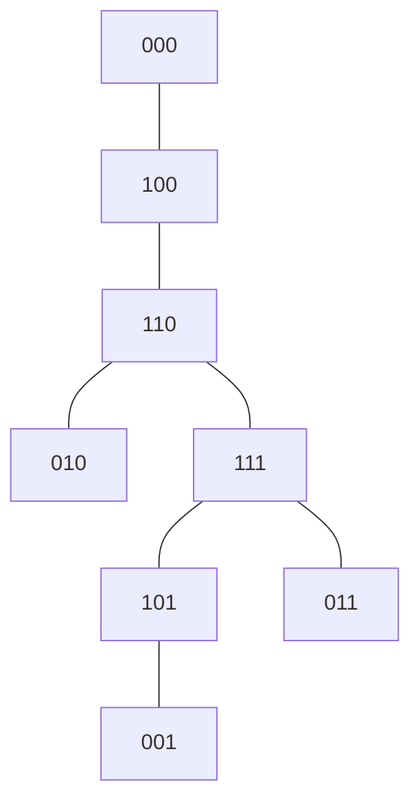

[[TOC]]

## 形式化题目

给定一个 $01$ 串 $s$（$|s| = n$），以及 $m = n+1$ 个环。游戏状态用 $01$ 串 $t$ 表示，$t_i = 1$ 表示第 $i$ 个环在“剑”上。

一步操作可以翻转 $t_i$，当且仅当

$$
t_1 t_2 \cdots t_{i-1} \;=\; s_{n-i+2} s_{n-i+3} \cdots s_n ,
$$

也就是 $t$ 的前 $i-1$ 位恰好等于 $s$ 的长度 $i-1$ 的**后缀**。特别地 $i=1$ 时前缀为空，第 $1$ 个环总能翻转。

求把 $t = 00\cdots0$ 变成 $t = 11\cdots1$ 的最少步数，对 $10^9+7$ 取模。$1 \leqslant n \leqslant 2000$。

> 注意题面里 $|s| = |t| - 1$，所以 $s$ 的长度是 $n$，环的数量是 $n+1$。样例 $1$ 中 $s = \texttt{011}$，环有 $4$ 个，$t$ 的状态串长度是 $4$。

## 正解

### 思路

#### 一、把游戏画成一张图

把每个状态 $t$ 看成点，能一步互相到达的状态之间连边。这张图有 $2^{n+1}$ 个点，题目要求的正是全 $0$ 点到全 $1$ 点的最短距离。$n \leqslant 2000$ 时状态数是指数级，不可能真的建图，必须先看这张图**长什么样**。

先算一下边数。第 $i$ 个环可以翻转，只与 $t$ 的前 $i-1$ 位有关，所以可以翻转的状态恰好有 $2^{m-i+1}$ 个，总边数

$$
E = \tfrac12 \sum_{i=1}^{m} 2^{m-i+1} = 2^{m} - 1 .
$$

点数 $V = 2^{m}$，于是 $E = V - 1$。再看连通性：$T_1$ 只有两个状态、一条边，显然连通；而下一节会证明 $T_k$ 是两份连通的 $T_{k-1}$ 用一条边连接而成，对 $k$ 归纳可知 $T_m$ 也连通。

**$V$ 个点、$V-1$ 条边、连通，所以这张图是一棵树。** 于是问题变成：在一棵隐式的树上，求两点距离；树上的距离就是路径长度，不需要任何最短路算法。

#### 二、树的递归结构

第 $i$ 个环的前置条件只用到 $t$ 的前 $i-1$ 位，所以前 $k$ 个环的翻转规则，只依赖 $s$ 的长度 $k-1$ 的后缀。记 $T_k$ 为「只考虑前 $k$ 个环」时的状态树（规则仍用整串 $s$，$s$ 的长度不够时前面补 $0$）。$T_k$ 有 $2^k$ 个点。

关键观察是 $T_k$ 与 $T_{k-1}$ 的关系。第 $k$ 个环的翻转规则只看前 $k-1$ 位，把 $T_{k-1}$ 的两份拷贝记为「第 $k$ 位为 $0$」和「第 $k$ 位为 $1$」：

- 两份拷贝各自内部的结构，恰好就是 $T_{k-1}$；
- 跨份边只有翻转第 $k$ 位这一种，它要求 $t_1 \cdots t_{k-1} = s$ 的长度 $k-1$ 后缀，所以全图**只有一条**这样的边，且两个端点在同一「位置」。

于是

$$
T_k \;=\; T_{k-1} \;\text{的两个副本} \;+\; \text{连接同一位置的那条边} .
$$

以 $s = \texttt{011}$ 为例，前三个环构成的 $T_3$ 如下（节点写成 $t_1 t_2 t_3$）：



图中最长的一条链是 $000 \to 100 \to 110 \to 111 \to 101 \to 001$（直径 $5$），另外 `010` 挂在 `110` 下、`011` 挂在 `111` 下。可以把它读成两份 $T_2$（`000,100,110,010` 与 `111,101,001,011`）用 `110 — 111` 这条边拼起来。本例中 $\operatorname{dist}_{T_3}(000,011) = 4$、$\operatorname{dist}_{T_3}(011,111) = 1$，而 $\operatorname{dist}_{T_3}(000,111) = 3$。

用 $s = \texttt{011}$ 验证这个递归：$T_3$ 内部的跨份边连接满足 $t_1 t_2 = \texttt{11}$ 的两个状态，即 `110` 与 `111`；整个 $T_4$ 的跨份边则连接 `0110` 与 `0111`（它要求 $t_1 t_2 t_3 = s = \texttt{011}$）。对照样例：第 $3$ 步后是 `1110`，此时不能直接翻第 $4$ 个环，于是第 $4$ 步在下方那份 $T_3$ 内部从 `1110` 走到桥头 `0110`，第 $5$ 步才翻第 $4$ 个环跨过桥变成 `0111`。

#### 三、答案的分解

全 $0$ 状态 $0^{n+1}$ 与全 $1$ 状态 $1^{n+1}$ 分别位于 $T_{n+1}$ 的两份 $T_n$ 拷贝中（因为第 $n+1$ 位一个是 $0$ 一个是 $1$）。树上的路径必须经过那条唯一的跨份边，因此

$$
\text{答案} \;=\; \underbrace{\operatorname{dist}_{T_n}\!\left(0^{n},\, s\right)}_{\text{低半部分走到桥头}} \;+\; 1 \;+\; \underbrace{\operatorname{dist}_{T_n}\!\left(s,\, 1^{n}\right)}_{\text{过桥后走到终点}} .
$$

其中「桥头」就是 $s$ 本身作为 $n$ 位状态（因为第 $n+1$ 个环的前置条件正是 $t_1 \cdots t_n = s$）。

#### 四、在 $T_k$ 上刻画「区间状态」

$T_k$ 上的目标状态 $0^k$、$1^k$ 与桥头 $s$ 都能用「$s$ 的一段子串」统一表示。定义

$$
W(k, p): \quad t_i = s_{p-k+i} \quad (i = 1, \dots, k),
$$

即取 $s$ 中**以位置 $p$ 结尾、长 $k$ 的那一段**，越界的位置按 $0$ 处理。那么

- $W(k,n) = s$ 的后 $k$ 位（桥头）；
- $0^k$ 可以看作 $p \leqslant 0$（整段越界）；
- $1^k$ 不是 $s$ 的子串，需要单独处理。

在 $T_k$ 中两点 $W(k,p_1), W(k,p_2)$ 的距离，可以递归到 $T_{k-1}$。按第 $k$ 位（也就是 $s_{p_1}$ 与 $s_{p_2}$）是否相同分类：

$$
G(k,p_1,p_2)=
\begin{cases}
G(k-1,\,p_1-1,\,p_2-1), & s_{p_1}=s_{p_2}\ \text{（同侧，直接下移）},\\[4pt]
G(k-1,\,p_1-1,\,n) + 1 + G(k-1,\,n,\,p_2-1), & s_{p_1}\ne s_{p_2}\ \text{（跨桥）}.
\end{cases}
$$

跨桥式子的含义是：从 $p_1$ 一侧出发，先走到本侧的桥头 $W(k-1,n)$，过桥 $1$ 步，再从另一侧桥头走到 $p_2$。

同理定义两个单点距离：

$$
A(k,p) = \operatorname{dist}_{T_k}\!\left(0^k,\, W(k,p)\right), \qquad
X(k,p) = \operatorname{dist}_{T_k}\!\left(W(k,p),\, 1^k\right).
$$

当 $s_p = 0$ 时 $W(k,p)$ 的第 $k$ 位是 $0$，落在「全 $0$ 那一侧」，只在 $T_{k-1}$ 内部走即可；当 $s_p = 1$ 时它落在另一侧，要先走到本侧桥头、过桥、再从 $T_{k-1}$ 的桥头走到 $0^{k-1}$：

$$
A(k,p)=
\begin{cases}
A(k-1,\,p-1), & s_p = 0,\\[4pt]
A(k-1,\,n) + 1 + G(k-1,\,p-1,\,n), & s_p = 1 .
\end{cases}
$$

$$
X(k,p)=
\begin{cases}
X(k-1,\,p-1), & s_p = 1,\\[4pt]
G(k-1,\,p-1,\,n) + 1 + X(k-1,\,n), & s_p = 0 .
\end{cases}
$$

最终答案

$$
A(n,n) + 1 + X(n,n) \pmod{10^9+7}.
$$

#### 五、状态数与实现

$G(k,p_1,p_2)$ 的直接记忆化看起来是 $O(n^3)$ 级别的状态，但利用上面三条递推可以证明实际只需要 $O(n^2)$ 个状态：

- 递归时层数 $k$ 每次减一；
- 只要「同侧」下降，$p_2 - p_1$ 不变；一旦跨桥，就会把一侧下标拉到 $n$，此后该侧不再变化。

$A, X$ 两条链在每一层只产生一个 $G(k-1,\cdot,n)$ 查询（固定一端为 $n$），这些查询再沿 $G$ 的递推向下展开，总量是 $O(n^2)$。

实现上把 $n$ 层状态分开存：先自上而下展开每层要用到的 $(p_1,p_2)$ 并排序去重，再自下而上按层递推数值；查询子层用二分。因为同一层内 $G$ 的转移只依赖更小的层，逐层递推不会出现循环依赖。

以 $s=\texttt{011}$（$n=3$）为例，$A(k,k)$ 与 $X(k,k)$ 的递推（脚本核算）：

| $k$ | 桥头 $W(k,n)$ | $A(k,k)$ | $X(k,k)$ |
|:--:|:--:|:--:|:--:|
| 0 | — | 0 | 0 |
| 1 | `1` | 0 | 1 |
| 2 | `11` | 3 | 1 |
| 3 | `011` | 4 | 1 |

核对：$\operatorname{dist}_{T_3}(000, \texttt{011}) = 4$，$\operatorname{dist}_{T_3}(\texttt{011}, 111) = 1$（`011` 的父节点正是 `111`，翻转第 $3$ 个环），于是 $A(3,3)+1+X(3,3) = 4+1+1 = 6$，与样例输出一致。

### 代码

```cpp
@include-code(./main.cpp, cpp)
```

### 复杂度

- 时间复杂度：$O(n^2 \log n)$（每层排序 + 每次查询二分），$n = 2000$ 时约 $2 \times 10^6$ 个状态，实测 $< 0.2$ s。
- 空间复杂度：$O(n^2)$。

## 暴力解法

### 思路

直接按定义建图：状态用 $n+1$ 位二进制表示，枚举每个状态、每个环判断前置条件，连边后从全 $0$ 状态 BFS 到全 $1$ 状态。状态数 $2^{n+1}$，只适用于 $n \leqslant 15$。

### 代码

```cpp
@include-code(./brute.cpp, cpp)
```

### 复杂度

时间与空间均为 $O(2^n)$。

### 瓶颈

状态数随 $n$ 指数增长，$n = 2000$ 完全无法承受。它同时也是验证正解的实验工具：小数据上正解与暴力必须逐位一致。

## 总结

这道题的背景是九连环，但真正要用的是三条结构观察，层层递进：

1. **状态图是树。** 数一数边：可翻转的状态恰有 $2^{m-i+1}$ 个，求和得 $E = 2^m - 1 = V - 1$，再加连通性，说明图就是树。于是「最少步数」就是树上两点距离。
2. **树可以递归。** 第 $k$ 个环只依赖前 $k-1$ 位，所以 $T_k$ 是两份 $T_{k-1}$ 加上一条唯一的跨份边。答案因此拆成 $A(n,n) + 1 + X(n,n)$。
3. **区间状态 + 树距离递推。** 用 $W(k,p)$（$s$ 上以 $p$ 结尾的长度 $k$ 子串）统一表示桥头、全 $0$ 与全 $1$，得到同侧下移 / 跨桥分解的三组递推，按层 DP 即可在 $O(n^2 \log n)$ 内求出答案。

把「游戏状态」翻译成「树上的点」是本题最关键的一步；一旦看出树的递归结构，剩下的只是把树上距离写成区间下标的递推。
