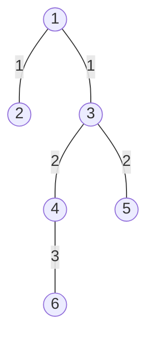

[[TOC]]

## 形式化题目

给定一棵有 $N$ 个结点、$N-1$ 条边的**带权树**（边权 $t$ 表示通行时间），以及一个长度为 $K$ 的结点序列

$$A_1, A_2, \dots, A_K \qquad (A_i \text{ 两两不同}).$$

树中任意两点 $u, v$ 之间路径唯一，记 $d(u,v)$ 为这条唯一路径上的边权之和，称它是 $u$ 到 $v$ 的时间花费。

对每个 $i \in [1, K]$，把 $A_i$ 从序列中删掉，令剩下的 $K-1$ 个结点保持原相对顺序构成新序列 $B$，求

$$S_i = \sum_{j=1}^{K-2} d(B_j, B_{j+1}),$$

即新序列中相邻两项的时间花费之和（$K = 2$ 时这个和为 $0$）。

要求输出 $S_1, S_2, \dots, S_K$。

## 暴力解法

### 思路

题面的定义本身就是一份算法，直接照抄即可：

1. 对每个要跳过的位置 $i$，把除 $A_i$ 之外的结点按原顺序抄进一个新序列；
2. 对新序列里每一对相邻结点 $(u, v)$，从 $u$ 出发对整棵树做一次 BFS，求出 $u$ 到所有点的距离，取其中 $v$ 的距离作为这一段的时间；
3. 把新序列所有相邻段的时间加起来，就是 $S_i$。

第 2 步之所以可以直接用 BFS 求距离，是因为树上两点之间的路径唯一：BFS 从 $u$ 扩散时一旦到达 $v$，走过的边权和就已经是全部可能中最小的，也就是 $d(u,v)$。

这个写法不做任何建模和优化，因此是可靠的对拍基线。用样例 1 手算一遍：跳过 2 时新序列是 $6,5,1$，两段分别是 $7$ 和 $3$，合计 $10$；跳过 1 时新序列是 $2,6,5$，两段分别是 $7$ 和 $7$，合计 $14$。

### 代码

@include-code(./brute.cpp, cpp)

### 复杂度

$K$ 个待跳过位置，每个位置要算 $K-1$ 段，每段一次 $O(N)$ 的 BFS，总时间复杂度

$$O(K^2 N),$$

空间复杂度 $O(N)$。$N = K = 10^5$ 时约 $10^{15}$ 次松弛，完全无法运行。

### 瓶颈

瓶颈不是某一步常数太大，而是**同一份信息被反复重算**：

设 $L_j = d(A_j, A_{j+1})$（$1 \leqslant j < K$）表示原线路第 $j$ 段的时间。删掉 $A_i$ 之后，新线路和原线路相比只有 $A_i$ 附近发生了变化：

- 离 $A_i$ 足够远的那些段 $L_j$（$j \notin \{i-1,\, i\}$）在新线路里**原封不动**地保留了下来；
- 只有 $A_i$ 左右两侧的至多两段被去掉，中间情况还补上一段 $d(A_{i-1}, A_{i+1})$。

也就是说 $S_i$ 与 $T$ 只差 $O(1)$ 个量。但暴力为每个 $i$ 都把剩下的 $K-2$ 段重新搜了一遍树，于是 $L_j$ 这个只由树和点对决定的量被计算了 $O(K)$ 次。

只要先把 $L_1, \dots, L_{K-1}$ 各算一次并累加出总时间，$S_i$ 就是一次 $O(1)$ 的加减。

## 正解

### 思路

#### 第一步：把 $S_i$ 写成总时间的一次增量

令原线路的总时间为

$$T = \sum_{j=1}^{K-1} L_j = \sum_{j=1}^{K-1} d(A_j, A_{j+1}).$$

删掉 $A_i$ 之后，新的相邻点对和原来相比只有三种可能：

| 位置 | 消失的段 | 新增的段 | $S_i$ |
| --- | --- | --- | --- |
| $i = 1$ | $L_1 = d(A_1,A_2)$ | 无 | $T - L_1$ |
| $1 < i < K$ | $L_{i-1} = d(A_{i-1},A_i)$、$L_i = d(A_i,A_{i+1})$ | $d(A_{i-1},A_{i+1})$ | $T - L_{i-1} - L_i + d(A_{i-1},A_{i+1})$ |
| $i = K$ | $L_{K-1} = d(A_{K-1},A_K)$ | 无 | $T - L_{K-1}$ |

中间那一行是全题的枢纽：本来线路走的是 $A_{i-1} \to A_i \to A_{i+1}$，删掉 $A_i$ 后就变成直接从 $A_{i-1}$ 走到 $A_{i+1}$；所以两段并成一段，总时间要**减掉这两段、再加上新的一段**。

这一步把“为每个 $i$ 重建序列并重新求和”的需求彻底消掉了，$S_i$ 只依赖 $T$、两个旧段和至多一个新段。

#### 第二步：用 LCA 在 $O(\log N)$ 内求出任意两点距离

剩下的事只有一件：把 $d(u,v)$ 求快。把树根固定为 $1$ 号结点，令

- `dist[x]`：根到 $x$ 的路径长度；
- `lca(u,v)`：$u$ 与 $v$ 的最近公共祖先。

则对任意两点有

$$d(u,v) = dist[u] + dist[v] - 2\,dist[\mathrm{lca}(u,v)].$$

**这个公式为什么成立？** 设 $w = \mathrm{lca}(u,v)$。$u$ 到根和 $v$ 到根的路径在 $w$ 以上完全重合，在 $w$ 以下互不相交；而 $u \to w \to v$ 正是 $u$ 到 $v$ 那条唯一路径。于是

$$dist[u] + dist[v] = \underbrace{(dist[w] + d(w,u))}_{dist[u]} + \underbrace{(dist[w] + d(w,v))}_{dist[v]} = 2\,dist[w] + d(u,v),$$

移项即得。所以求出 $dist$ 和 LCA 就够了。

#### 第三步：倍增求 LCA

$K$ 最大 $10^5$，总共约 $2K$ 次求距离，如果每次沿着树往上爬（链上最坏 $O(N)$），总复杂度会退化成 $O(NK)$。倍增法把单次询问降到 $O(\log N)$：

1. 先 BFS 一遍，得到每个点的 `depth[x]`、`dist[x]` 和父亲 `up[x][0]`。**用 BFS 而不是递归 DFS**，因为树可能是一条长 $10^5$ 的链，递归会爆栈。
2. 递推倍增表：`up[x][j]` 表示 $x$ 向上跳 $2^j$ 步到达的祖先，由 $x$ 跳 $2^{j-1}$ 步再跳 $2^{j-1}$ 步得到，即 `up[x][j] = up[up[x][j-1]][j-1]`。
3. 询问时先把较深的点向上提到同一深度；若两点已经相同，它就是 LCA。否则从大到小枚举 $j$，只要两个人的 $2^j$ 级祖先不同就一起上跳。循环结束时两人深度相同、自身不同、父亲相同，那个父亲就是 LCA。
4. 对根的 `up[1][0]` 设成它自己作为哨兵，这样任何一次跳跃都不会越出数组。

因为 $2^{20} > 10^5$，取 `LOG = 20` 即可。

#### 完整流程与样例推演

先用倍增算出原线路的每一段并求和得到 $T$，再按上表逐项加减输出。以样例 1 为例，树是

$2 \xleftarrow{1} 1 \xleftarrow{1} 3 \xrightarrow{2} 4 \xrightarrow{3} 6$，另外 $3 \xrightarrow{2} 5$，线路是 $2 \to 6 \to 5 \to 1$。

图中每个结点是景点，边上的数字是摆渡时间。原线路依次经过 $2 \to 6 \to 5 \to 1$，也就是在图上先走到 $4$、再走到 $6$，然后折返到 $3$、$5$，最后回到 $1$。

三段距离与总时间为

| 段 | 路径 | 距离 |
| --- | --- | --- |
| $2 \to 6$ | $2-1-3-4-6$ | $1+1+2+3 = 7$ |
| $6 \to 5$ | $6-4-3-5$ | $3+2+2 = 7$ |
| $5 \to 1$ | $5-3-1$ | $2+1 = 3$ |
| — | 合计 $T$ | $17$ |

按公式逐个答案：

| 跳过 | 类型 | 计算 | $S_i$ |
| --- | --- | --- | --- |
| $2$ | $i=1$ | $17 - L_1 = 17 - 7$ | $10$ |
| $6$ | 中间 | $17 - 7 - 7 + d(2,5)$，其中 $d(2,5)=1+1+2=4$ | $7$ |
| $5$ | 中间 | $17 - 7 - 3 + d(6,1)$，其中 $d(6,1)=3+2+1=6$ | $13$ |
| $1$ | $i=K$ | $17 - L_3 = 17 - 3$ | $14$ |

得到 `10 7 13 14`，与题面样例一致。对比暴力解：它把 $d(2,6)=7$、$d(6,5)=7$ 这些量在每个答案里都重算了一遍，而这里每一段只算一次。

### 代码

`build_root()` 用 BFS 求出 `depth`/`dist`/父亲，`build_lift()` 递推倍增表，`lca()` 与 `path_len()` 提供 $O(\log N)$ 的两点距离；`solve()` 先累加出原线路总时间，再按“首段 / 中间两段换一段 / 尾段”三种情况输出。

@include-code(./main.cpp, cpp)

### 复杂度

| 阶段 | 复杂度 |
| --- | --- |
| BFS 求 `depth`、`dist`、父亲 | $O(N)$ |
| 倍增表 | $O(N \log N)$ |
| 原线路总时间 $T$ | $O(K \log N)$ |
| $K$ 个答案 | $O(K \log N)$ |
| 总计 | $O\big((N+K)\log N\big)$ |

空间复杂度 $O(N \log N)$，其中 `up` 表约 $2 \times 10^6$ 个 `int`。答案最大约 $K \cdot N \cdot t = 10^{15}$ 量级，`dist`、总时间和输出都要用 `long long`。

$N = K = 10^5$ 的链状数据实测约 $0.33$ 秒。

## 总结

这道题的解法是两次“把重复的事只做一次”：

1. **消除重复的求和**。观察到删掉中间一个点只是把线路上的两段并成一段，于是先算出原线路总时间 $T$，每个 $S_i$ 就变成 $T$ 减去（至多）两段、再加上（至多）一段。这一层是纯观察，和树的结构无关。
2. **消除重复的求距离**。树上两点距离用 $dist[u] + dist[v] - 2\,dist[\mathrm{lca}(u,v)]$ 求，而 LCA 用倍增表 $O(\log N)$ 询问一次，避免了对同一棵树反复做 BFS。

两次优化合起来把 $O(K^2 N)$ 的暴力降到了 $O((N+K)\log N)$。这类“把每个询问写成全局量的增量” + “用倍增把树上路径询问变便宜”的组合，在树上路径问题里非常常见，值得当作一个固定的套路记住。
