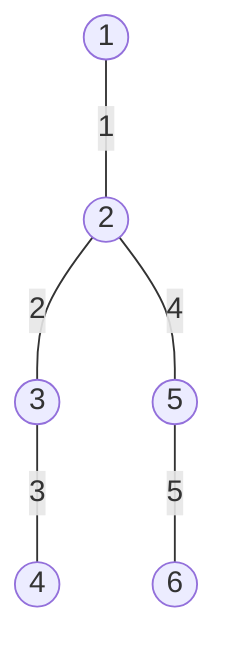

[[TOC]]

## 形式化题目

给定一棵 $n$ 个结点的树（边按输入顺序编号 $1 \sim n-1$）和 $m$ 个无序数对 $(a_i, b_i)$。这些数对满足

- $a_1, \ldots, a_m$ 互不相同，$b_1, \ldots, b_m$ 互不相同；
- $a_i \neq b_j$ 对任意 $i, j$ 成立，也就是说两个集合 $A = \{a_i\}$、$B = \{b_i\}$ 不相交。

要求选出一条边砍断，使得**每一对** $a_i, b_i$ 都不再连通。若有多条边可行，输出编号最大的一条；一条都没有则输出 $-1$。

关键点在于“不连通”在树上的含义。树中删掉一条边后只剩两个连通块，所以：

> $a_i$ 和 $b_i$ 被分开 $\iff$ 被砍的那条边属于 $a_i$ 到 $b_i$ 的唯一路径。

于是题目重新表述为：

> 求所有满足“被全部 $m$ 条树上路径覆盖”的边中，编号最大的那一条。

样例给出的树结构以及两对 $(3,6)$、$(4,5)$ 的路径如下（边旁数字是输入编号）：

$(3,6)$ 的路径是 $3 \to 2 \to 5 \to 6$，$(4,5)$ 的路径是 $4 \to 3 \to 2 \to 5$。两条路径的公共边只有编号 $2$ 和编号 $4$，其中编号更大的是 $4$，所以答案是 $4$。观察这个例子可以立刻得出：**答案必须同时出现在每一条路径上**，这正是后面的统计目标。

## 暴力解法

### 思路

完全照着题面做，不需要任何结构上的洞察：

1. 枚举砍掉哪一条边（$n-1$ 种可能）；
2. 把剩下的 $n-2$ 条边用并查集连起来，得到砍边后的两个连通块；
3. 检查每一对 $(a_i, b_i)$ 是否都不连通；
4. 全部合法就更新答案，最后输出编号最大的那条。

第 1 层的选择就是“砍哪一条边”，一共 $n-1$ 种选择，全部枚举一遍就不会漏掉答案。代码里把“检查一种砍法”写成一个独立函数 `check_after_cut(cut)`，枚举和判定分得很干净，容易确认正确性。

### 代码

@include-code(./brute.cpp, cpp)

### 复杂度

枚举 $n-1$ 条边，每次重建并查集需要 $O(n \alpha(n))$，总时间复杂度 $O(n^2 \alpha(n))$，空间复杂度 $O(n)$。

### 瓶颈

瓶颈是“每换一条边就把整棵树重新合并一次”。$n = 10^5$ 时这个做法要合并 $10^{10}$ 量级的边，完全不可行。之所以浪费，是因为砍不同的边时，绝大多数路径的形态是不变的，但我们每次都重新判定了一遍。要打破这个瓶颈，就要把 $n-1$ 种砍法**一次性**处理掉。

## 正解

### 思路

#### 第一步：把“能否分开”翻译成“路径是否跨过这条边”

$$a_i, b_i \text{ 被分开} \iff \text{被砍的边在 } a_i \to b_i \text{ 的唯一路径上}$$

这个等价是整道题的支点。它把“删边以后检查连通性”这个要跑 $n$ 次的动态过程，变成了每条边上的一个静态计数：

> 记 $cnt(e)$ 为“路径经过边 $e$”的数对个数。答案就是所有满足 $cnt(e) = m$ 的边中编号最大的那条。

因为 $(a_i, b_i)$ 只有 $m$ 对，$cnt(e) = m$ 表示 $m$ 条路径**全部**跨过了 $e$；只要有一条不跨过，砍掉 $e$ 就分不开对应的那一对。

#### 第二步：树边与“子树”一一对应

给树随便定一个根（取 $1$ 号点），对每个非根点 $u$，记它的父边为 $(u, par_u)$。砍掉这条边会把树分成两块：

- $u$ 的子树里的点；
- 子树外的点。

一条路径跨过 $(u, par_u)$ 当且仅当它的两个端点**恰有一个**落在 $u$ 的子树内。于是：

> $cnt(u, par_u) = $ 子树 $u$ 内“被路径端点选中”的标记和。

每个路径的两个端点 $a_i, b_i$ 都在自己所在的子树里留下一次标记，所以只要把“以 $u$ 为子树的所有标记”加起来，就能得到跨过父边的路径数。**这一步把“路径”这个一维对象压成了“点权”这个零维对象**，是能线性统计的关键。

#### 第三步：用点差分一次性打标记

想直接给“某条路径经过的每条边都加一”是很贵的（一条路径可以长达 $O(n)$）。差分技巧的做法是：只在端点上做加减，让子树求和的自然过程去还原每条边上的真实值。

对每个数对 $(a_i, b_i)$，设 $w = \mathrm{LCA}(a_i, b_i)$，执行：

$$\mathrm{diff}[a_i] \mathrel{+}= 1,\qquad \mathrm{diff}[b_i] \mathrel{+}= 1,\qquad \mathrm{diff}[w] \mathrel{-}= 2.$$

为什么是 $-2$？因为从根往下看，$a_i$ 到 $b_i$ 的路径可以拆成 $a_i \to w$ 和 $b_i \to w$ 两段，两段的“顶端”都是 $w$：

- 对 $a_i$ 加 $1$，会让 $w$ 到根的整条链都多出 $1$，其中 $a_i \to w$ 这一段正是我们要的；
- 对 $b_i$ 加 $1$，同样会让 $b_i \to w$ 这一段多出 $1$；
- 但 $w$ 到根这一段被多加了两次，而这条路径根本没走到那里，所以要用 $\mathrm{diff}[w] -= 2$ 抵掉。

做完差分后，把每个点的值**自底向上**累加到父亲，累加结束后 $u$ 上的值就等于“跨过父边 $(u, par_u)$ 的路径数”，也就是 $cnt(u, par_u)$。

用样例里的 $(3,6)$ 和 $(4,5)$ 走一遍（根取 $1$，$w_1 = \mathrm{LCA}(3,6) = 2$，$w_2 = \mathrm{LCA}(4,5) = 2$）：

| 结点 | 1 | 2 | 3 | 4 | 5 | 6 |
| --- | --- | --- | --- | --- | --- | --- |
| $\mathrm{diff}$ | 0 | $-4$ | $+1$ | $+1$ | $+1$ | $+1$ |
| 子树求和（= 父边被跨过次数） | — | 0 | 1 | 1 | 1 | 1 |

对照输入编号：边 $1=(1,2)$ 对应 $cnt=0$，边 $2=(2,3)$ 对应 $cnt=1$，边 $3=(3,4)$ 对应 $cnt=1$，边 $4=(2,5)$ 对应 $cnt=1$，边 $5=(5,6)$ 对应 $cnt=1$。$m=2$ 时只有编号 $2$ 和编号 $4$ 满足 $cnt=m$，取编号最大得 $4$，与样例一致。

#### 第四步：LCA 与实现细节

$\mathrm{LCA}$ 用**倍增**求：先预处理 $up[j][u]$ 表示 $u$ 的第 $2^j$ 级祖先，然后先把深的点抬到同一深度，再一起往上跳。

两个实现上的边界值得注意：

- **不能写递归 DFS 求深度**。$n$ 可达 $10^5$，输入可以是一条链，深度就是 $10^5$，递归会爆系统栈。改成用 `queue` 做一次迭代 BFS，顺便得到“父亲一定排在儿子前面”的 bfs 序。
- **自底向上求和不走第二遍 DFS**。把 bfs 序倒着扫一遍就是自底向上的顺序：处理到 $u$ 时，它的所有儿子都已经把自己的值推给了 $u$，于是 $\mathrm{diff}[u]$ 已经是最终值，直接记下来再推给父亲即可。
- **每条边归属哪个端点**。编号为 $i$ 的边 $(x, y)$ 在根树上一定有且只有一个端点是另一个的父亲，那个端点就是要查 $cnt$ 的儿子点。
- **输出最大编号**。按 $i = 1 \sim n-1$ 递增检查，每次满足条件就覆盖 `ans`，循环结束时留下的自然就是最大编号，不需要额外比较。

### 代码

@include-code(./main.cpp, cpp)

### 复杂度

BFS 与建倍增表都是 $O(n \log n)$；每个数对求一次 LCA 是 $O(\log n)$，共 $O(m \log n)$；差分打标记是 $O(m)$，自底向上求和与枚举边都是 $O(n)$。总时间复杂度 $O((n + m) \log n)$，空间复杂度 $O(n \log n)$（主要是倍增表）。$n = 10^5$ 时运行时间在毫秒级。

## 总结

这道题的难度不在数据结构，而在**把“删边后检查连通性”改写成“边被路径覆盖”**这一步：

1. 树删一条边只剩两个连通块，所以分离一对点等价于把这条边放在它们的路径上；
2. 于是要给每条边统计“被多少条路径覆盖”，答案就是覆盖数等于 $m$ 的边里编号最大的那条；
3. 树上的“路径加、单点查”用点差分转成“端点加、子树求和”，配合 LCA 就能做到 $O((n+m)\log n)$。

差分的关键永远是**先想清楚朴素做法在做哪种区间加法，再找能抵消重复部分的位置**。这里重复的位置就是 $\mathrm{LCA}$，所以减去 $2$。写代码时再顺手处理掉两处 $O(n)$ 递归的爆栈隐患（求深度、求子树和），就能安全通过 $n = 10^5$ 的规模。
