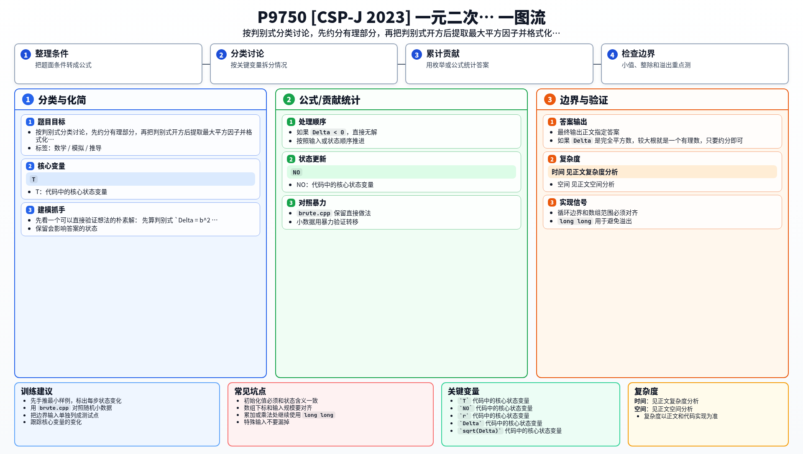

[[TOC]]

## 形式化题目

给出 $T$ 组整系数一元二次方程 $ax^2 + bx + c = 0$，其中 $a \neq 0$。对每组方程：

- 判别式 $\Delta = b^2 - 4ac$ 为负时方程无实数解，输出 `NO`；
- 否则输出两个实数解中较大的那个，并且必须写成题面规定的两种形式之一：
  - 最简有理数 $v = p/q$，其中 $q > 0$、$\gcd(p, q) = 1$，$q = 1$ 时只写 $p$；
  - 根式 $q_1 + q_2\sqrt{r}$，其中 $q_2 > 0$，$r > 1$ 且不含平方因子（不存在 $d > 1$ 使 $d^2 \mid r$），$q_1 = 0$ 时省略有理部分和它后面的加号。

这题真正容易错的不是复杂度，而是格式和符号：根号项系数必须为正、$r$ 必须提净平方因子、分数必须约到最简。

## 解法总览

两种解法共享同一套化简骨架：

1. 用判别式判断有没有实数解；
2. 把较大根统一写成 $-b/(2a) + \sqrt{\Delta}/(2|a|)$，让根号项前面的系数天然为正，正好满足 $q_2 > 0$；
3. 把 $\Delta$ 拆成 $s^2 \cdot r$，其中 $r$ 不再含平方因子；
4. $q_1 = -b/(2a)$、$q_2 = s/(2|a|)$ 各自约成最简分数，再按题面四种格式输出。

差别只在第 3 步怎么把 $\Delta$ 拆成 $s^2 \cdot r$：

- **解法一（`main.cpp`，正式主解）**：分解质因数，按指数的奇偶分拣平方因子；
- **解法二（`main2.cpp`）**：完全不分解，整数二分求出 $\lfloor\sqrt{\Delta}\rfloor$ 后从大到小枚举 $s$，第一个整除 $\Delta$ 的就是最大平方因子。

两个解法输入输出格式相同、结论一致，属于替代关系而不是层层优化。同目录的 `brute.cpp` 是解法二思路的朴素版本：从小到大枚举所有 $d$ 并记录最大命中者，只用来对拍。

## 解法一：分解质因数提取平方因子

### 思路

先算判别式 $\Delta = b^2 - 4ac$：

- $\Delta$ 为负，直接输出 `NO`；
- $\Delta$ 是完全平方数，较大根一定是有理数，代入公式约分即可；
- 否则较大根是无理数，走根式格式。

把较大根统一写成：

$$-b/(2a) + \sqrt{\Delta}/(2|a|)$$

这样根号项前面的系数恒为正，天然满足题目要求的 $q_2 > 0$，不用再分 $a$ 的正负讨论根号项符号。

接下来把 $\Delta$ 分解质因数，写成：

$$\Delta = s^2 \cdot r$$

其中 $r$ 不再含平方因子，那么答案就能写成：

$$q_1 + q_2\sqrt{r}$$

其中：

- $q_1 = -b/(2a)$
- $q_2 = s/(2|a|)$

最后分别把 $q_1$、$q_2$ 约成最简分数，再按题面四种格式输出：$q_2$ 是 $1$ 只写 `sqrt(r)`，是整数写 `c*sqrt(r)`，倒数是整数写 `sqrt(r)/d`，否则写 `c*sqrt(r)/d`。

### 代码

@include-code(./main.cpp, cpp)

### 复杂度

设判别式为 $\Delta$，单组数据分解质因数的时间复杂度是 $O(\sqrt{\Delta})$，空间复杂度是 $O(1)$。本题 $\Delta \leqslant 5 \times 10^6$，最坏约两千多次试除，$T = 5000$ 时完全够用。

## 解法二：倒序枚举提取平方因子

### 思路

统一公式沿用解法一，区别只在第 3 步：不分解质因数，而是直接枚举 $s$。

1. 用整数二分求出 $s_0 = \lfloor\sqrt{\Delta}\rfloor$，不用 `(long double) sqrt`，避开浮点数在完全平方数边界上的舍入误差；
2. 从 $s = s_0$ 开始往下枚举，第一个使 $s^2$ 整除 $\Delta$ 的 $s$ 就是最大平方因子，令 $r = \Delta / s^2$；都不整除时 $s = 1$。

正确性很直接：题目要的 $s$ 就是满足 $s^2 \mid \Delta$ 的最大值，倒序枚举第一次命中即为最大；起点取 $\lfloor\sqrt{\Delta}\rfloor$ 保证不会漏掉更大的 $s$（$s > \lfloor\sqrt{\Delta}\rfloor$ 时 $s^2 > \Delta$，不可能整除）。

由于 $\Delta \leqslant 5 \times 10^6$，有 $\lfloor\sqrt{\Delta}\rfloor \leqslant 2237$，最坏也就枚举两千多次，与解法一同阶，换来的是更短的代码和纯整数运算。

### 代码

@include-code(./main2.cpp, cpp)

### 复杂度

单组数据的时间复杂度是 $O(\sqrt{\Delta})$（最坏从 $s_0$ 一路枚举到 $1$），空间复杂度是 $O(1)$。

## 复杂度对比

| 解法 | 提平方因子的方式 | 单组时间 | 空间 | 特点 |
| --- | --- | --- | --- | --- |
| 解法一 `main.cpp` | 分解质因数 | $O(\sqrt{\Delta})$ | $O(1)$ | 正式主解，按指数奇偶分拣，思路通用 |
| 解法二 `main2.cpp` | 倒序枚举 | $O(\sqrt{\Delta})$ | $O(1)$ | 纯整数、无分解，命中大平方因子时更早结束 |

两者同阶，任选其一都能通过；差别主要在写法长短和是否依赖浮点开方。

## 总结

这题本质是数学化简题：

1. 用判别式判断有没有实数解；
2. 用统一公式 $-b/(2a) + \sqrt{\Delta}/(2|a|)$ 锁定较大根；
3. 把分数约分；
4. 把根号里的平方因子提干净；
5. 按题目规定格式输出。

第 4 步可以用质因数分解做，也可以直接倒序枚举做，两种写法都只要 $O(\sqrt{\Delta})$。只要把这几步拆清楚，实现并不复杂。

## 图示解析

这张图把本题的建模、关键转移、实现检查和训练方法压缩到一页，适合读完正文后复盘。

