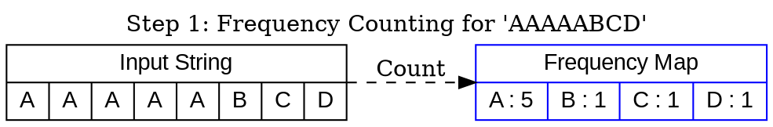
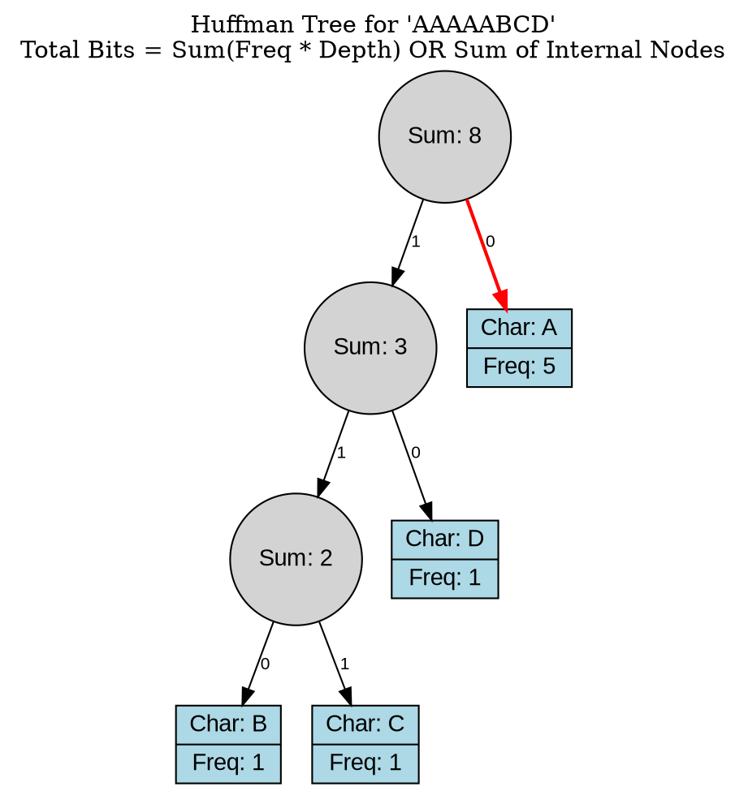
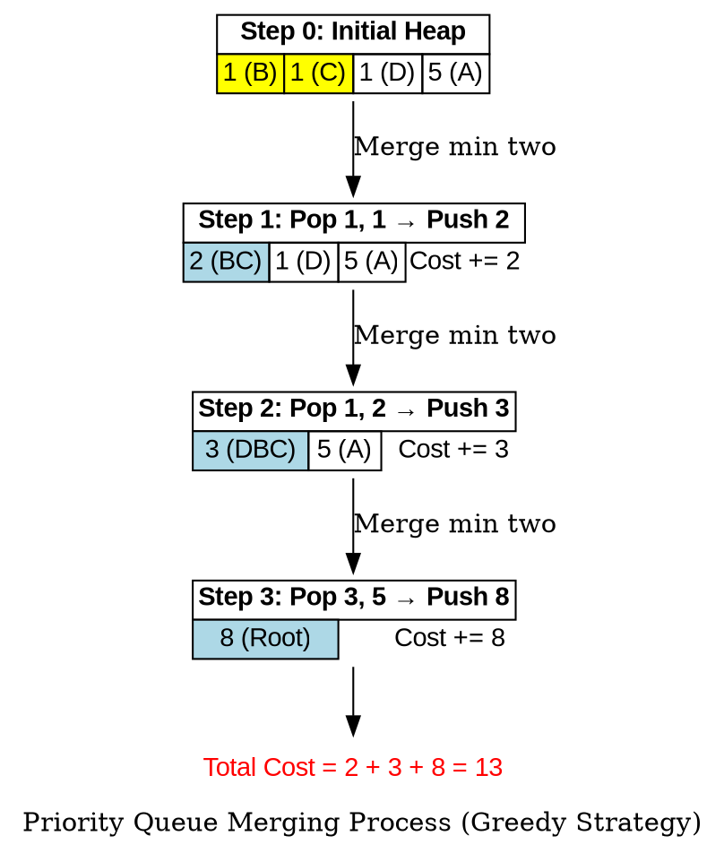
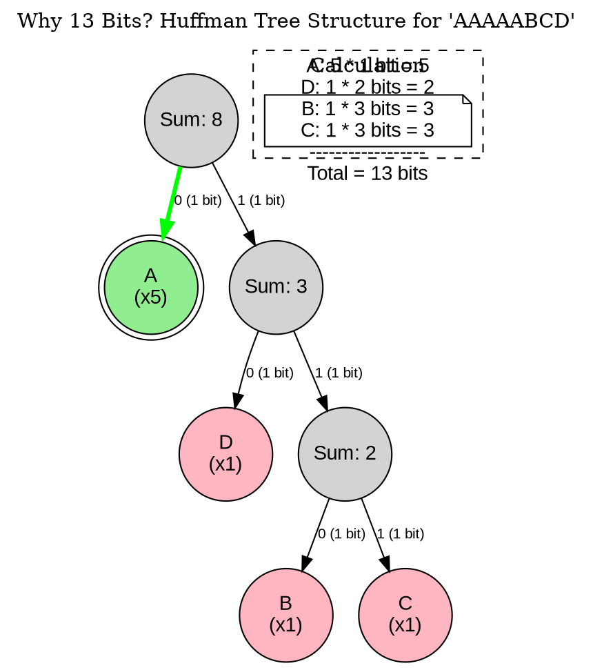
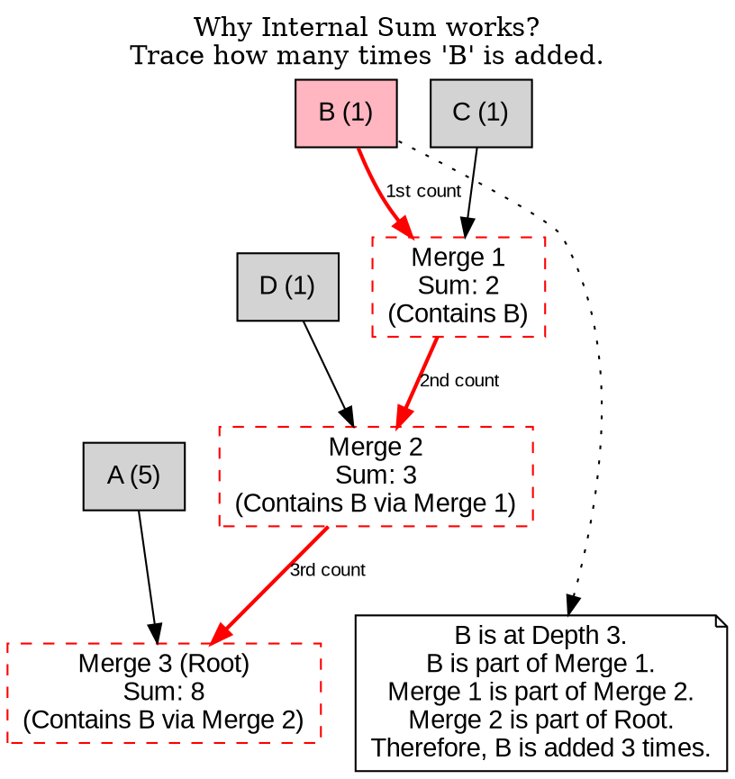
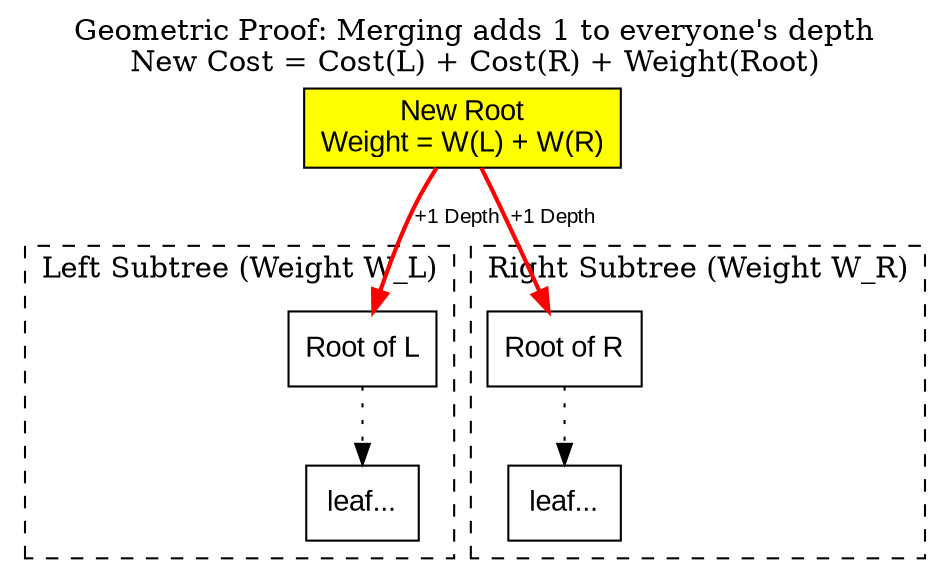
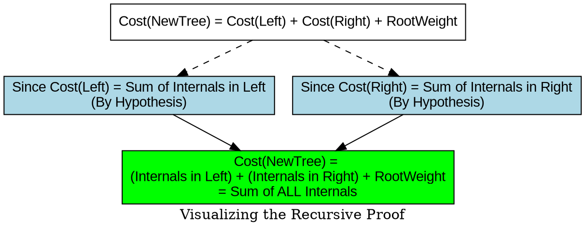

[[TOC]]

## 题目解析


这是一个非常经典的算法题目，源自 **POJ 1521 - Entropy**。

题目的核心本质是要求你实现 **哈夫曼编码（Huffman Coding）** 算法，并将其压缩效果与定长的 8位 ASCII 编码进行对比。


## 1. 题目核心概念解析

- **原始编码（ASCII）**：固定长度编码。无论字符出现的频率如何，每个字符都占用 **8 bits**。
  - 计算公式：$Original\_Size = \text{字符串长度} \times 8$。
- **最优无前缀变长编码（Entropy/Huffman）**：根据字符出现的频率构建编码。
  - 频率高的字符用短的比特串表示。
  - 频率低的字符用长的比特串表示。
  - **无前缀（Prefix-free）**：没有任何一个字符的编码是另一个字符编码的前缀（例如，如果 A 是 `0`，那么 B 不可能是 `01`，否则解码会有歧义）。这正是哈夫曼树的特性。

## 2. 算法思路：哈夫曼树（Huffman Tree）

要计算最优编码的总长度，我们不需要真正生成每个字符的编码（如 "00", "01"），只需要计算**带权路径长度之和（WPL）**。

**具体步骤：**

1. **统计频率**：遍历输入字符串，统计每个字符（包括下划线）出现的次数。
2. **构建优先队列**：将所有出现过的字符的频率放入一个**小顶堆**（Min-Priority Queue）。
3. **贪心策略构建树**：
   - 从小顶堆中取出两个最小的频率值，设为 $a$ 和 $b$。
   - 将它们合并，产生一个新的节点，频率为 $a + b$。
   - 这个 $a + b$ 就是这两个节点在树中产生的“代价”（即编码长度贡献）。
   - 将 $a + b$ 重新放入堆中。
   - **累加代价**：将 $a + b$ 加到总的压缩位长度变量中。
   - 重复上述步骤，直到堆中只剩下一个节点。
4. **特殊情况处理**：
   - 如果字符串中只有一种字符（例如 "AAAAA"），哈夫曼树逻辑会直接结束。但在这种情况下，我们需要 1 个比特来表示该字符。
   - 所以，如果字符种类数为 1，压缩后的长度 = 字符串长度 $\times$ 1。

## 3. 样例分析

以输入 `AAAAABCD` 为例：

1. **统计**：A:5, B:1, C:1, D:1。
2. **堆**：`{1, 1, 1, 5}`。
3. **合并 1**：取出两个最小的 `1` `(B)` 和 `1` `(C)`。合并得 `2`。
   - 当前代价累加：2。
   - 堆变成：`{1, 2, 5}` （剩下的D和新合成的BC）。
4. **合并 2**：取出 `1` (D) 和 `2` (BC)。合并得 `3`。
   - 当前代价累加：$2 + 3 = 5$。
   - 堆变成：`{3, 5}`。
5. **合并 3**：取出 `3` 和 `5` (A)。合并得 `8`。
   - 当前代价累加：$5 + 8 = 13$。
   - 堆变成：`{8}`。停止。
6. **结果**：
   - ASCII长度：$8 \times 8 = 64$。
   - 哈夫曼长度：13。
   - 比率：$64 / 13 \approx 4.9$。

## 4. C++ 代码实现


```cpp
#include <iostream>
#include <string>
#include <queue>
#include <map>
#include <vector>
#include <cstdio> // 用于 printf

using namespace std;

int main() {
    string s;
    while (cin >> s && s != "END") {
        map<char, int> freq;
        // 1. 统计字符频率
        for (char c : s) {
            freq[c]++;
        }

        // 2. 将频率放入小顶堆
        // priority_queue 默认是大顶堆，使用 greater 变成小顶堆
        priority_queue<int, vector<int>, greater<int>> pq;
        
        for (auto const& [key, val] : freq) {
            pq.push(val);
        }

        long long original_len = s.length() * 8;
        long long compressed_len = 0;

        // 3. 特殊情况：只有一种字符
        if (pq.size() == 1) {
            compressed_len = s.length(); // 每个字符用1位表示
        } else {
            // 4. 哈夫曼树构建过程
            while (pq.size() > 1) {
                int a = pq.top(); pq.pop();
                int b = pq.top(); pq.pop();
                
                int combined = a + b;
                compressed_len += combined; // 累加代价
                
                pq.push(combined);
            }
        }

        // 5. 输出结果
        // %.1f 保留一位小数
        printf("%lld %lld %.1f\n", original_len, compressed_len, (double)original_len / compressed_len);
    }
    return 0;
}
```

## 5. 代码关键点说明

1. **数据类型**：虽然题目描述的字符串长度通常不会溢出 `int`，但在累加过程中使用 `long long` 是个好习惯，防止溢出。
2. **小顶堆**：`priority_queue<int, vector<int>, greater<int>>` 是 C++ STL 实现哈夫曼编码最方便的数据结构。它能保证每次 `pop()` 出来的都是当前频率最小的两个节点。
3. **计算逻辑**：
   - 传统的哈夫曼编码计算通常是：$\sum (\text{频率} \times \text{深度})$。
   - 代码中的简便算法利用了一个数学性质：**非叶子节点的权值之和等于所有叶子节点的带权路径长度之和**。每次合并操作 `a+b` 实际上就是生成了一个内部节点，所以直接累加 `a+b` 即可得到最终总长度。
4. **Corner Case (边界情况)**：
   - 务必注意 `if (pq.size() == 1)` 的判断。如果没有这个判断，`while (pq.size() > 1)` 循环一次都不会执行，导致 `compressed_len` 为 0，最终计算比率时会出现除以零错误（Runtime Error 或 NaN）。

## 6. 复杂度分析

- **时间复杂度**：
  - 统计频率：$O(N)$，其中 $N$ 是字符串长度。
  - 堆操作：假设字符集大小为 $C$（这里是大写字母+数字+下划线，最多约 40 种）。构建堆和循环合并的复杂度为 $O(C \log C)$。
  - 由于 $C$ 很小，整体复杂度主要取决于字符串长度，即 $O(N)$。
- **空间复杂度**：$O(C)$，用于存储字符频率映射和优先队列。

## 算法过程


1.  **频率统计与初始化**：展示数据是如何被预处理的。
2.  **哈夫曼树的最终形态**：展示 `AAAAABCD` 是如何形成 13 bits 的编码的。
3.  **优先队列的构建过程**：展示贪心算法是如何一步步合并节点的（对应代码中的 `pq.pop()` 和 `pq.push()`）。

---

### 图形 1：频率统计 (Frequency Count)

这是算法的第一步，将字符串转化为字符频率表。

#### Graphviz (Dot)


---

### 图形 2：哈夫曼树结构与编码 (Huffman Tree)

这是核心图形。通过这个树，学生可以直观地看到：
1.  **叶子节点**是具体的字符。
2.  **路径**（左0右1）形成了编码。
3.  **高频字符**（如 A）深度浅，**低频字符**（如 B, C）深度深。

#### Graphviz (Dot)



### 图形 3：优先队列合并过程 (Priority Queue Process)

这个图形解释了代码中的 `while(pq.size() > 1)` 循环。它展示了“代码为什么将中间节点的权值累加”就能得到最终结果。

*   Code Logic: `compressed_len += (a + b)`
*   Cost Breakdown: 2 (First merge) + 3 (Second merge) + 8 (Third merge) = 13.




## 统计占用bit位总长度

这是一个非常好的问题。要理解为什么结果是 **13 bits**，我们需要看哈夫曼树是如何给不同频率的字符分配“不同长度”的编码的。

核心原则是：**出现次数越多的字符，编码越短；出现次数越少的字符，编码越长。**

### 1. 详细推导过程

针对字符串 `AAAAABCD`：

1.  **统计频率**：
    *   **A**: 5次（大哥，出现最多）
    *   **B**: 1次
    *   **C**: 1次
    *   **D**: 1次

2.  **构建哈夫曼树（贪心合并）**：
    *   **第一步**：取出最小的 B(1) 和 C(1)。
        *   合并成新节点 `BC`，权重为 $1+1=2$。
        *   此时 B 和 C 变成了子节点（深度增加）。
    *   **第二步**：取出最小的 D(1) 和刚才生成的 `BC`(2)。
        *   合并成新节点 `DBC`，权重为 $1+2=3$。
        *   此时 D 变成了 `BC` 的兄弟。
    *   **第三步**：取出最小的 `DBC`(3) 和 A(5)。
        *   合并成根节点 `Root`，权重为 $3+5=8$。
        *   A 成为 `DBC` 的兄弟，直接挂在根节点下（深度最浅）。

3.  **分配编码长度**：
    *   **A**：在根节点的直接子节点，深度为 **1**。 -> 编码长度 1 bit (例如 `0`)
    *   **D**：在第 2 层。 -> 编码长度 **2** bits (例如 `10`)
    *   **B**：在第 3 层。 -> 编码长度 **3** bits (例如 `110`)
    *   **C**：在第 3 层。 -> 编码长度 **3** bits (例如 `111`)

4.  **最终计算**：
    $$ \text{Total Bits} = (5 \times 1) + (1 \times 2) + (1 \times 3) + (1 \times 3) $$
    $$ = 5 + 2 + 3 + 3 = \mathbf{13} $$

---

### 2. 图形解析

为了让你直观地看到这 13 bits 是怎么来的，我绘制了下面的哈夫曼树和计算表。

#### Graphviz (Dot)
此图展示了树的结构，并在节点旁标注了**比特长度**的贡献。



### 3. 两种计算方法的对比

在做题（比如写代码）和人脑理解时，通常有两种算 13 的方法，结果是一样的：

**方法一：路径长度法（人脑直观）**
对应上面的图。
*   A 用了 1 个位 (0) $\times$ 5次 = 5
*   D 用了 2 个位 (10) $\times$ 1次 = 2
*   B 用了 3 个位 (110) $\times$ 1次 = 3
*   C 用了 3 个位 (111) $\times$ 1次 = 3
*   **Total = 13**

**方法二：内部节点累加法（代码实现最快）**
你在代码里可能没有显式地算深度，而是每次 `compressed_len += (a+b)`。
*   第一次合并 (B+C)：产生内部节点权值 **2**
*   第二次合并 (D+BC)：产生内部节点权值 **3**
*   第三次合并 (A+DBC)：产生内部节点权值 **8**
*   **Total = 2 + 3 + 8 = 13**

这也是为什么代码里不需要建树就能算出答案的原因，因为**所有非叶子节点的权值之和 = 所有叶子节点的带权路径长度之和**。


## 方法二：内部节点累加法 详解

> ? 所有非叶子节点的权值之和 = 所有叶子节点的带权路径长度之和  
> ? 为什么内部节点累加法是正确的呢?

这是一个非常棒的思维卡点！理解了这一点，你就彻底理解了哈夫曼树的本质。

之所以**“内部节点累加和”** 等于 **“所有叶子的（频率 $\times$ 深度）之和”**，是因为：

**每一个叶子节点的频率值，在向上合并的过程中，每一层都被“加”了一次。**

叶子节点深度是多少，它就被合并了多少次，它的值也就被累加了多少次。

---

### 1. 直观推导（以 B 为例）

让我们追踪一下字符 **B (频率 1)** 在 `compressed_len += (a+b)` 这个过程中到底被加了多少次。

在 `AAAAABCD` 的例子中，B 的深度是 **3**。

1.  **第一次合并 (B + C = 2)**：
    *   产生新节点 `Internal_1` (值 2)。
    *   `compressed_len` 加上了 2。
    *   **本质**：因为 `Internal_1` 包含了 B，所以 **B 被加了第 1 次**。

2.  **第二次合并 (D + Internal_1 = 3)**：
    *   产生新节点 `Internal_2` (值 3)。
    *   `compressed_len` 加上了 3。
    *   **本质**：因为 `Internal_2` 包含了 `Internal_1`，而 `Internal_1` 包含 B，所以 **B 顺带被加了第 2 次**。

3.  **第三次合并 (A + Internal_2 = 8)**：
    *   产生根节点 `Root` (值 8)。
    *   `compressed_len` 加上了 8。
    *   **本质**：`Root` 包含 `Internal_2`，所以 **B 顺带被加了第 3 次**。

**结论**：B 的值是 1，它在计算过程中累计出现了 3 次。贡献总和 = $1 \times 3$。这正好等于 **频率 $\times$ 深度**。

---

### 2. 图形化演示：数值的“每层贡献”

下面的图展示了每个叶子节点的值是如何一层层向上“渗透”并被多次计算的。

#### Graphviz (Dot)
这个图侧重于展示**累加的过程**。看红色的线，它表示 B 的值是如何流向每一次加法操作的。



### 3. 总结

1.  **Code Perspective (代码视角)**:
    我们维护一个堆。每次 `pop` 两个数 `a`, `b`，算出 `sum = a + b`，然后把 `sum` 计入总代价。

2.  **Math Perspective (数学视角)**:
    这个 `sum` 代表了一个新的父节点。
    *   任何被合并的节点，其值都会成为父节点的一部分。
    *   父节点再次被合并时，原来的值又被加了一次。
    *   **合并多少次 = 离根节点有多远 = 深度**。

所以，直接累加每次合并产生的新值，就完美的等同于算出每个叶子的（频率 $\times$ 深度）。这种方法写代码最快，不需要建树，只需要一个优先队列。

## 方法二的数学证明

> 我的理解的:
> - 先看root 是 8 = 3 + 5 , 5 表示 A 的 频率 $\times$ 深度 (root 的其中一个是叶子的孩子)
> 	这里的3,就是 另外一个 非叶子的树的值.
> 
> 证明: 一个树的root值 : root+root 这个新的值相当于 把每个节点的dep+1,频率没有改变
>  
> 使用数学归纳法证明(因为是递归的)
> 
> 或者直接使用数学公式证明


你的直觉非常敏锐，特别是这一点：

> **“root + root 这个新的值相当于 把每个节点的dep+1, 频率没有改变”**

这正是数学证明的核心！你的理解完全正确。

让我们用更严谨的数学推导（代数法 + 归纳法）来证明：**WPL（带权路径长度） = 所有非叶子节点权值之和**。

### 1. 核心思想图解：合并造成的“深度+1”

当你把左子树 $T_L$ 和 右子树 $T_R$ 合并成一个新的树 $T_{New}$ 时，发生了一件事：
$T_L$ 和 $T_R$ 里的**每一个**节点，相对于新的根节点，深度都增加了 1。

#### Graphviz (Dot)
此图展示了合并操作如何物理上增加了路径长度。




### 2. 代数推导证明 (Algebraic Proof)

设 $WPL(T)$ 为树 $T$ 的带权路径长度。
设 $S(T)$ 为树 $T$ 中所有叶子节点的频率之和（即树的总权值）。

> 注: $WPL(T)$ 就是我们要求的字符串的占用bit位总长度

**目标：** 计算合并后的新树 $T_{new}$ 的 $WPL$。

1.  **定义：**
    $$ WPL(T) = \sum_{\text{leaf } i \in T} (\text{Freq}_i \times \text{Depth}_i) $$

2.  **合并过程：**
    新树 $T_{new}$ 由左子树 $T_L$ 和右子树 $T_R$ 构成。
    对于 $T_L$ 中的任意叶子节点 $i$，其在旧树中的深度是 $d_i$，在 $T_{new}$ 中的深度变成了 $d_i + 1$。
    对于 $T_R$ 同理。

3.  **推导公式：**
    $$
    \begin{aligned}
    WPL(T_{new}) &= \sum_{i \in T_L} F_i \cdot (d_i + 1) + \sum_{j \in T_R} F_j \cdot (d_j + 1) \\
                 &= \left( \sum_{i \in T_L} F_i \cdot d_i + \sum_{i \in T_L} F_i \right) + \left( \sum_{j \in T_R} F_j \cdot d_j + \sum_{j \in T_R} F_j \right) \\
                 &= \underbrace{\left( \sum_{i \in T_L} F_i \cdot d_i \right)}_{WPL(T_L)} + \underbrace{\left( \sum_{j \in T_R} F_j \cdot d_j \right)}_{WPL(T_R)} + \underbrace{\left( \sum_{i \in T_L} F_i + \sum_{j \in T_R} F_j \right)}_{\text{Weight}(T_L) + \text{Weight}(T_R)}
    \end{aligned}
    $$

4.  **结论：**
    $$ WPL(T_{new}) = WPL(T_L) + WPL(T_R) + \text{Weight}(\text{NewRoot}) $$

    这说明：**新树的总代价 = 左子树代价 + 右子树代价 + 当前新根节点的权值**。

    这是一个递归定义。如果我们一直递归到底（直到叶子节点，$WPL$为0），那么总代价显然就是**所有合并过程中产生的“根节点权值”的累加和**。

---

### 3. 数学归纳法证明 (Inductive Proof)

我们定义命题 $P(N)$：对于有 $N$ 个叶子节点的哈夫曼树，其 $WPL$ 等于所有非叶子节点的权值之和。

**1. 基础情况 (Base Case):**
*   当 $N=1$ 时：只有一个节点。WPL = $F \times 0 = 0$。非叶子节点集合为空，和为 0。$0=0$，成立。
*   当 $N=2$ 时：有两个叶子 $a, b$。
    *   生成一个根节点 $R$，权值为 $a+b$。
    *   WPL = $a \times 1 + b \times 1 = a+b$。
    *   非叶子节点只有 $R$，权值为 $a+b$。
    *   成立。

**2. 归纳假设 (Inductive Hypothesis):**

假设对于叶子节点数小于 $k$ 的所有树，命题都成立。即 $\text{WPL}(Subtree) = \sum \text{Internal}(Subtree)$。

> 注: 
> 1. $\sum \text{Internal} (Subtree)$ 表示内部的非叶子节点的和
> 2. $\text{SumFreq}(L)$ 表示树上叶子节点的频率和

**3. 归纳步骤 (Inductive Step):**
考虑一个有 $k$ 个叶子的树 $T$。它的根节点 $Root$ 连接了左子树 $L$ 和右子树 $R$。
*   $Root$ 的权值 $W_{root} = \text{SumFreq}(L) + \text{SumFreq}(R)$。
*   根据之前的代数推导：
    $$ WPL(T) = WPL(L) + WPL(R) + W_{root} $$
*   根据归纳假设：
    *   $WPL(L) = \text{SumInternal}(L)$
    *   $WPL(R) = \text{SumInternal}(R)$
*   代入得：
    $$ WPL(T) = \text{SumInternal}(L) + \text{SumInternal}(R) + W_{root} $$
*   而 $T$ 的所有非叶子节点正是：$L$ 的非叶子节点 + $R$ 的非叶子节点 + $Root$ 本身。
*   因此：
    $$ \text{WPL}(T) = \sum \text{Internal}(T) $$
*   **证毕。**

### 总结图

用来总结归纳法逻辑的图。



你的理解完全到位，这就是为什么哈夫曼编码的代码可以写得那么简洁（只用一个堆，不用建树）的原因！