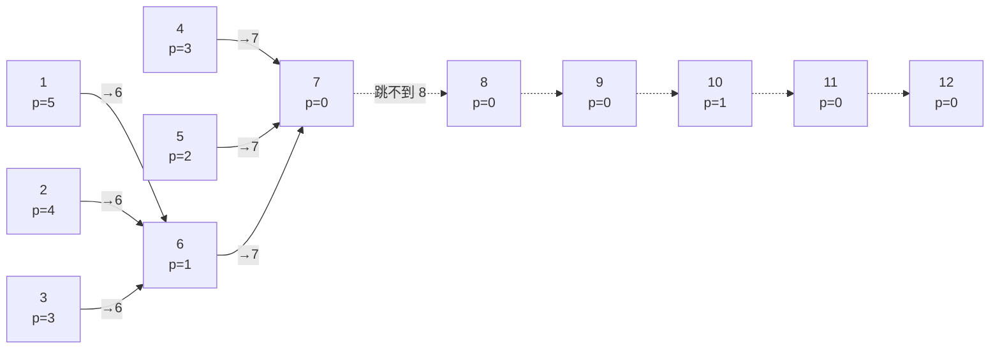

[[TOC]]

## 形式化题目

一维棋盘编号 $1 \sim n+1$，棋子初始在格子 $1$，目标是走到格子 $n+1$。格子 $1 \sim n$ 各有一个弹力系数 $p_i$；当棋子位于格子 $i$ 时，下一步可以移动到 $[i - p_i,\ i + p_i]$ 内的任意一个格子（既可以往右跳也可以往回跳）。

允许在游戏开始前施展若干次魔法：每次魔法选定**一个**格子令其 $p_i$ 增加 $1$，同一个格子至多被施法一次。求让棋子能从 $1$ 走到 $n+1$ 所需的最少魔法次数，并给出一个按字典序最小的施法格子序列（依次输出每次施法的格子编号）。

::: tip 官方样例 1

$n = 12$，$p = [5, 4, 3, 3, 2, 1, 0, 0, 0, 1, 0, 0]$，答案为 $5$ 次，施法序列 `4 8 9 10 12`。$[5,8,9,10,12]$、$[6,8,9,10,12]$ 同样是最少次数的方案，但字典序都更大。

下面这张图里，实线箭头是格子 $i$ 原本最远能跳到的位置 $i + p_i$，虚线是断档：走到 $7$ 之后棋盘"接不上"了。

观察重点：格子 $1$ 到 $6$ 都能触到格子 $7$，但格子 $7$（$p=0$）和它右边的一片 $0$ 把路"封死"了——从 $7$ 出发一步都迈不出去，这就是后文说的**断档**。施法要做的，就是给某个够得着断档边的格子 $+1$，把可达范围重新接上。

:::

## 正解

### 思路

**第一步：先看"不施法"能走多远。** 这就是经典的跳跃游戏（LeetCode 55）可达性问题：维护 `reach` 表示当前不需要魔法就能到达的最右格子，从左往右扫描，若格子 $i \le reach$ 则格子 $i$ 可达，用 $i + p_i$ 更新 `reach`。

为什么只需要维护"最右端点"？虽然题面允许往回跳，但可达集合永远是一个前缀 $[1, reach]$：若格子 $x$ 可达，那么从 $x$ 出发每步向左跳 $1$ 格（弹力系数非负时 $[i - p_i, i + p_i]$ 总是包含 $i-1$），就能依次走到所有 $y < x$。所以"能不能走到格子 $i$"等价于"$i \le reach$"，往回跳的信息可以完全忽略。

**第二步：断档处恰好补一次魔法。** 扫描中若遇到 $i > reach$，说明格子 $[reach + 1, i - 1]$ 全都去不了，这是一次"断档"。记 `cast_at` 为撑起当前 `reach` 的格子（即最近一次令 `reach = j + p_j` 的那个 $j$）。给 `cast_at` 施一次魔法后，从它出发最远能到

$$cast\_at + (p_{cast\_at} + 1) = reach + 1 = i,$$

恰好把断档接上：`reach` 更新为 $i$，且"撑起新 `reach` 的格子"就是 $i$ 自己。于是扫描得以继续，下一次断档再用同样的方式补上。

为什么施法格一定选 `cast_at`？施在更靠右的格子上没有意义——那些格子当前不可达，$+1$ 也用不上；施在更靠左的格子上，它对"推进右端点"的贡献早已被某个更靠右的可达格子覆盖，多出来的 $1$ 帮不上这次断档。所以"给撑起右端点的格子恰好 $+1$"是每次断档的最小代价修法。

**第三步：次数为什么最少。** 每施展一次魔法，可达前缀的右端点至多推进 $1$ 格（弹力系数只能 $+1$，施法格本身必须在施法前可达）。整个扫描过程中每一次断档都必须被"接上"，因此施法次数至少等于断档次数 $k$；贪心恰好施了 $k$ 次并让扫描走完全程，达到下界。

**第四步：字典序为什么最小。** 断档的位置序列由裸棋盘唯一确定。第 $t$ 次施法必须接上第 $t-1$ 次施法后的可达前缀并覆盖第 $t$ 个断档，而扫描过程中 `cast_at` 总是"撑起当前右端点的那个格子"——它是满足条件的编号最小的可行施法格，因此逐次产生的施法序列就是最小字典序（与官方题解结论一致）。

**实现要点。** 把终点 $n + 1$ 也当作一个"格子"参与断档检查（它没有弹力系数，不更新 `reach`），所以扫描范围是 $i = 1 \sim n+1$。另外 $ans = 0$ 时只输出 `0`，**不输出第二行**。

下表用官方样例 1 完整演示扫描过程（`p` 列是施法后的弹力系数，★ 表示该格被施法）：

| $i$ | $p_i$（施法后） | 断档？ | 施法 | 扫描后 `reach` | `cast_at` |
| ---: | --- | :---: | :---: | ---: | ---: |
| 1 | 5 | 否 | — | 6 | 1 |
| 2 | 4 | 否 | — | 6 | 1 |
| 3 | 3 | 否 | — | 6 | 1 |
| 4 | 3 → **4** | 否 | — | 7 | 4 |
| 5 | 2 | 否 | — | 7 | 4 |
| 6 | 1 | 否 | — | 7 | 4 |
| 7 | 0 | 否 | — | 7 | 4 |
| 8 | 0 | **是**（$8 > 7$） | ★4 | 8 | 8 |
| 9 | 0 | 是（$9 > 8$） | ★8 | 9 | 9 |
| 10 | 1 | 是（$10 > 9$） | ★9 | 10 | 10 |
| 11 | 0 | 否 | — | 10 | 10 |
| 12 | 0 | 是（$12 > 10$） | ★10 | 12 | 12 |
| 13（终点） | — | 否 | — | 12 | 12 |

表格观察重点：`cast_at` 只在某个格子把 `reach` 推得更远时才更换主人——第 $1 \sim 3$ 行里格子 $1$ 撑起 `reach = 6`，但格子 $4$ 以 $4 + 3 = 7$ 把 `reach` 推进到 $7$ 后，`cast_at` 就变成了 $4$，所以第一次断档（$i = 8$）施法给 $4$ 而不是 $1$。断档位置 $8, 9, 10, 12$ 由裸棋盘唯一决定，每次施法都恰好把可达前缀接到断档处。最终 5 次施法 `4 8 9 10 12`，与官方输出完全一致。

### 代码

@include-code(./main.py, python)

### 复杂度

- 时间复杂度 $O(n)$：一次从左到右的扫描，每个格子 $O(1)$ 的判断与更新，与 C++ 正解同阶。
- 空间复杂度 $O(n)$：弹力系数数组与施法序列。

## 总结

- 把"能往回跳的可达性"化归为**前缀可达**，用跳跃游戏的最右端点 `reach` 一遍线性扫描刻画裸棋盘的可达范围。
- 魔法的本质是**补断档**：每次断档给撑起 `reach` 的格子恰好 $+1$，恰好把可达前缀延伸到断档处，总次数等于断档数，达到下界；`cast_at` 的取法同时保证了最小字典序。
- 两个实现细节最容易踩坑：扫描必须覆盖到终点 $n+1$；$ans = 0$ 时不能多输出一个空行。
- 这类"可达性 + 最小修改"的模型可以推广：只要单点修改对全局可达性的影响是"右端点至多推进一个定值"，就可以用同样的断档贪心处理。
