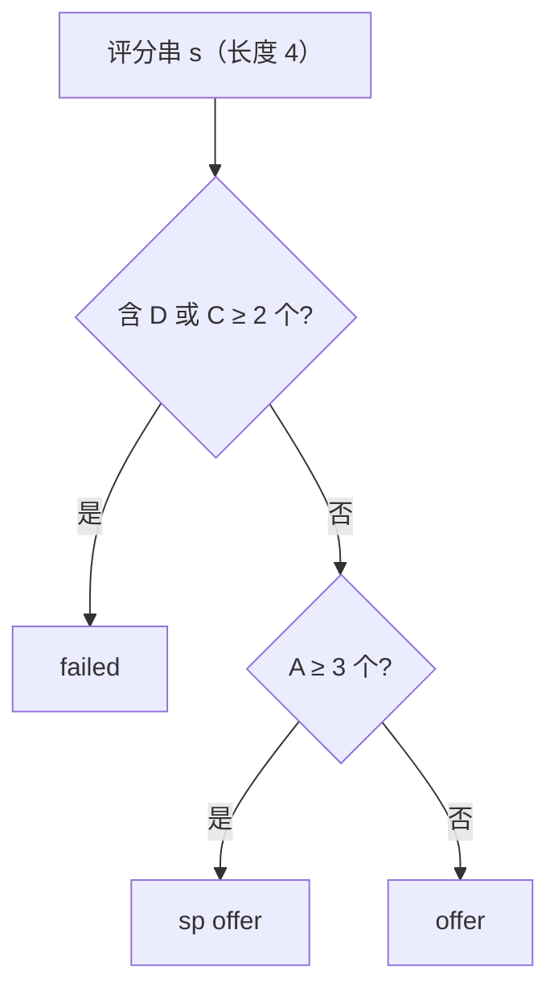

[[TOC]]

## 形式化题目

给定 $T$ 个长度为 4 的字符串，每个字符取自 $\{A, B, C, D\}$，第 $i$ 个字符串表示第 $i$ 名面试者四轮的评分。对每个字符串按下面三条规则**从上到下**匹配，输出它命中的第一条规则对应的结果：

1. 字符串中含有 `D`，或 `C` 出现至少两次 → 输出 `failed`；
2. 否则（此时必然没有 `D`）且 `A` 出现至少三次 → 输出 `sp offer`；
3. 其余情况 → 输出 `offer`。

规则 1、2、3 互斥且覆盖全部 $4^4 = 256$ 种输入，所以每个面试者有唯一结果。注意 special offer 的输出写作 `sp offer`（两个单词之间有空格），必须与官方评测逐字一致。

### 样例

输入：

```plaintext
2
AAAB
ADAA
```

输出：

```plaintext
sp offer
failed
```

逐条判定，看每行命中哪条规则（「C 的个数」用于规则 1，「A 的个数」用于规则 2）：

| 评分串 | 有 `D`？ | `C` 的个数 | `A` 的个数 | 命中规则 | 输出 |
| --- | --- | --- | --- | --- | --- |
| `AAAB` | 没有 | 0 | 3 | 规则 2：通过且 $A \geqslant 3$ | `sp offer` |
| `ADAA` | 有 | 0 | 3 | 规则 1：出现 `D` | `failed` |

- `ADAA` 有 3 个 `A`，却仍然淘汰——规则 2 隐含「没有 `D`」这个前提，它不是和规则 1 并列的条件。
- `AAAB` 通过之后 `A` 恰好 3 个，正好踩在 special 的下界上，少一个（如 `AABB`）就只是普通 `offer`。

## 正解

### 思路

**朴素做法就是最终做法。** 每个人只是一条长度 4 的字符串，判定只涉及三次常数时间的字符串查询，把题面三条规则照抄成一个 if 链即可，不存在需要优化掉的瓶颈：读入本身已经是 $O(T)$，判定也是 $O(T)$，二者同阶。因为没有更简单的独立基线、也没有可替代的第二种完整解法，所以本文不单独设暴力层。

**三个关键观察。**

1. **只依赖计数，与顺序无关。** `"D" in s` 判断「有没有 `D`」，`s.count("C") >= 2` 判断「`C` 是否至少两次」，`s.count("A") >= 3` 判断「`A` 是否至少三个」。字符排在第几轮完全不影响结果，`B` 则自始至终不用管。
2. **必须先判淘汰，再判 special。** 两条规则会重叠的输入只有 `AAAD` 这一类：它有 3 个 `A`，却带着一个 `D`，按题面必须 `failed`。把淘汰判断放在最前面，能走到 special 判断的人一定没有 `D`，题面条件里的「没有 `D`」自动成立，后面只需数 `A`——顺序既保证正确，又让代码最短。顺带一提，带两个 `C` 的串最多只剩 2 个位置给 `A`，永远不会撞上 $A \geqslant 3$，所以重叠只可能来自 `D`。
3. **三分支互斥且覆盖。** 前两条分支都以 `return` 结束，第三条用 `else` 兜底，任何输入都恰好落到一条分支，不会漏判也不会重判。

**从规则到代码。** `judge` 就是上面 if 链的直译：先 `return FAIL` 处理淘汰，再用三元表达式在 `SPECIAL` 和 `OFFER` 之间二选一。三种结果字符串提为模块级常量 `FAIL` / `OFFER` / `SPECIAL`，其中 `SPECIAL = "sp offer"` 的空格是官方输出的一部分，写在常量处一次说明。

**读入与输出。** 一次性 `sys.stdin.read().split()` 取出全部 token，`T = int(data[0])` 是人数、`scores = data[1:T + 1]` 是评分串列表；`map(judge, scores)` 配合 `"\n".join(...)` 批量判定并按行拼接，比分 `T` 次 `print` 少 $T-1$ 次系统调用，也让 `solve()` 只剩读入、调用、输出三件事。

### 代码

@include-code(./main.py, python)

### 复杂度

每个评分串长度固定 4，`in` 和两次 `count` 都是常数时间，`judge` 对每人 $O(1)$，总时间 $O(T)$，与读入下界同阶。空间上只保存读入的 token 与拼好的输出，$O(T)$。官方数据 $T = 256$ 实测 0.017s、峰值 14.6MB，远低于题目 1000ms / 128MB 的限制；即使 `T` 很大也是线性增长，Python 侧没有超时风险。

## 总结

- 三条规则要**按优先级**匹配：先淘汰（有 `D` 或两个 `C`），再判 special（无 `D` 且 $A \geqslant 3$），最后兜底普通 `offer`；`AAAD` 这类输入专治顺序写反。
- 判定只依赖 `D`、`C`、`A` 三个计数，字符顺序无关，所以一个 if 链就是正解，没有可优化的瓶颈。
- 读入一次 `split()`、输出一次 `join`，整体 $O(T)$ 时间、$O(T)$ 空间，与读入同阶。

## 图示解析

下面用判定流程说明一个评分串如何走到唯一出口，以及样例两行的走向：



- `AAAB` 走 `否 → 是`：没有 `D`、`C` 只有 0 个，通过后再数出 3 个 `A`，落到 `sp offer`。
- `ADAA` 在第一个判断就走 `是`：虽然它同样有 3 个 `A`，但 `D` 让它停在 `failed`，后面的 `A` 计数根本不会被执行——这就是「先淘汰」在流程上的体现。
- 三个出口互斥，任何输入恰好走完一条路径，对应代码 `judge` 里两个 `return` 加一个三元表达式。
