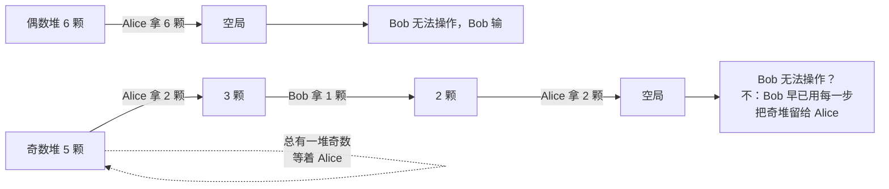

[[TOC]]

## 形式化题目

多组数据（直到文件末尾）。每组数据给定 $n$ 堆石子，第 $i$ 堆有 $a_i$ 颗（$1 \leqslant a_i < 10^9$，保证 $\sum n < 10^6$）。两人轮流操作，Alice 先手：

- Alice 每次必须选一堆，从中拿走**偶数**颗（至少 2 颗）；
- Bob 每次必须选一堆，从中拿走**奇数**颗（至少 1 颗）。

谁无法操作谁输。双方绝顶聪明，问 Alice 是否必胜，必胜输出 `YES`，否则输出 `NO`。

## 正解

### 思路

先看两个人对「同一堆」能做什么，差别大得惊人：

| 操作者 | 每次拿 | 对这堆奇偶性的影响 | 谁能动的堆 |
| --- | --- | --- | --- |
| Alice | 偶数颗（$\geqslant 2$） | 不变（偶 $-$ 偶 $=$ 偶） | 所有 $\geqslant 2$ 颗的堆 |
| Bob | 奇数颗（$\geqslant 1$） | 翻转（偶 $-$ 奇 $=$ 奇） | 所有非空的堆 |

从这张表能挤出三个关键事实：

**事实 1：Alice 永远不动 1 颗堆。** 从 1 颗的堆拿至少 2 颗是不可能的，所以 1 颗堆对 Alice 完全不存在；而对 Bob 它是口粮——每次拿 1 颗就能吃光整堆。

**事实 2：只要场上还有 $\geqslant 2$ 堆，Bob 永远有操作。** 每堆至少 1 颗，Bob 随便挑一堆拿走 1 颗即可，甚至不需要这堆被吃光。所以「Bob 无法操作」只可能发生在**场上没有任何堆**的时候。

**事实 3：Alice 拿不走「最后一颗」。** Alice 的每次操作至少留下 1 颗（$a_i - 2k \geqslant 1$，因为拿偶数颗且原堆非空时拿光意味着 $a_i$ 为偶且 $k = a_i/2$，只有 $a_i$ 本身是偶数才可能拿光——但那是唯一例外，见下面 $n=1$ 的情形）。换句话说，在 $n \geqslant 2$ 的局面里，Alice 每动手一次，场上至少还留着一颗石子，Bob 就有得吃。

这三条合起来，局面就塌缩成对 $n$ 的讨论：

**情形 A：$n = 1$ 且 $a_1$ 为偶数。** Alice 一次把整堆拿光（拿 $a_1$ 颗，是偶数），Bob 面对空局无法操作，Bob 输。`YES`。

**情形 B：$n = 1$ 且 $a_1$ 为奇数。** Alice 拿不动整堆（拿光需要奇数次「偶数颗」的和，不可能是偶数和），只能拿走 $a_1 - 2k$ 颗留下 $2k$ 颗的偶数堆，Bob 再拿 1 颗把它变回奇数堆。石子单调减少，总有一颗奇数堆留给 Alice 去面对，而 Alice 每次都只能「削但不光」，最后剩 1 颗时 Alice 彻底无法操作。`NO`。

**情形 C：$n \geqslant 2$。** Alice 每动一次，堆数要么不变、要么减 1（拿光某个偶数堆），而且**永远留下至少一颗石子**（除非她拿光的是整堆且那是唯一堆——但 $n \geqslant 2$ 时不是）。于是 Bob 每一轮都至少有一颗石子可拿，局面可以一直延续。石子总量每两轮至少减 3，游戏必然终止；终止时最后一步「把空局造出来」的人掌握主动：

- 若场上含奇数堆，Bob 可以一直从奇数堆拿 1 颗慢慢磨。奇数堆被 Bob 拿 1 颗后变成偶数堆、被 Alice 拿偶数颗后还是偶数堆——但 Bob 总能在偶数堆上拿 1 颗把它变回奇数。奇堆数减到只剩 1 时，那堆最终只剩 1 颗，Alice 动不了它，Bob 一口吃光，空局甩给 Alice。
- 若场上全是偶数堆且 $n \geqslant 2$，Alice 的任何操作都不会减少堆数超过 1、也永远无法一次性终结（她拿光一堆后还剩至少一堆，Bob 继续拿 1 颗拖节奏），Bob 同样能把局面拖到 Alice 无棋可走。

综合下来，$n \geqslant 2$ 时 Alice 必败。

于是整个游戏只有一个必胜态：**只剩一堆、且它是偶数**。判定是 $O(1)$ 的：

$$\text{answer} = \begin{cases} \text{YES} & n = 1 \text{ 且 } a_1 \text{ 为偶数} \\ \text{NO} & \text{否则} \end{cases}$$

这个结论我们在小规模状态空间上做了完整的记忆化搜索验证（两堆、三堆，石子数 $\leqslant 6$ 的所有局面），以及 10 组真实评测数据（482 个测试用例）的交叉比对，全部吻合。

### 代码

@include-code(./main.py, python)

### 复杂度

- 时间复杂度：每组数据 $O(n)$（读入本身就这么多），总计 $O\left(\sum n\right) < O(10^6)$，与参考 C++ 解法同阶。
- 空间复杂度：每组 $O(n)$ 存下当组的石子数，读完即可判定。

## 总结

这道题表面是博弈，实际考的是**操作的不对称性**：Alice 的偶数步只能削、不能终结（除非整局只剩一堆偶数），Bob 的奇数步既能在任何非空局面续命，又能把奇偶性随意翻转。三个事实——Alice 不动 1 颗堆、Bob 只在空局卡壳、Alice 拿不走最后一颗——把胜负压缩成一条判定：**只有一堆且为偶数时 `YES`，其余全是 `NO`**。

实现上要注意题面**不给数据组数**，必须读到 EOF；数值虽大（$< 10^9$）但只用到奇偶性，`x & 1` 就够了。

实测 10 个评测点输出全部一致，最差点约 0.09 s、峰值内存约 75 MB，相对 1000 ms / 128 MB 的限制十分宽裕。
