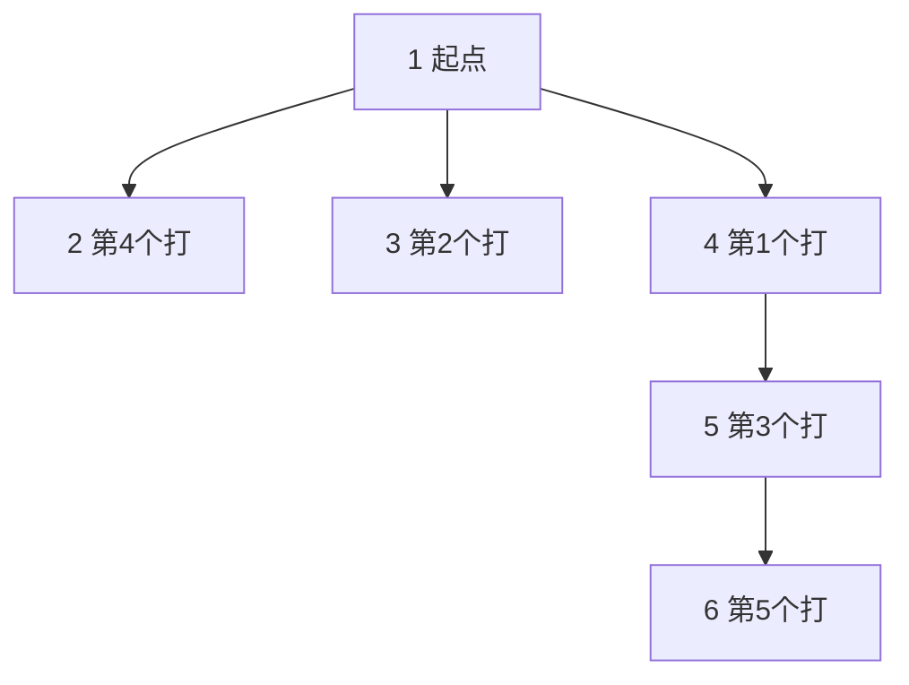

[[TOC]]

## 形式化题目

魔塔是一棵 $n$ 个点的树，勇士从 1 号点出发（1 号点没有魔物）。勇士有血量 $H$、攻击 $A$、防御 $D$ 三个属性；点 $i$（$i \geqslant 2$）上的魔物有血量 $b_i$、攻击 $a_i$、防御 $d_i$，打死后给 $val_i$ 级经验，每升一级勇士防御 $+1$。

战斗规则：

- 勇士先手，双方轮流出手一次造成「攻击 $-$ 自己面对的防御」的伤害，血量 $\leqslant 0$ 的一方死亡；
- 勇士**首次到达**某点时立即与该点魔物战斗，魔物死后该点不再刷怪；
- 树上移动不花代价、不掉血。

由于必须先走到父亲点才能进入子树，合法的战斗顺序恰好是**所有父亲先于儿子的排列**。问打完全部魔物后的最大剩余血量；若勇士中途死亡则输出 $-1$（评测数据中不会出现死亡）。

**样例**：$n = 6$，边 $(1,2),(1,3),(1,4),(4,5),(5,6)$，勇士 $50000\ 10\ 0$，魔物按节点 $2 \sim 6$ 依次为 $(35,54,2,4),(25,55,3,5),(21,51,4,5),(20,64,5,3),(43,64,6,1)$，输出 $48901$。

下图为样例的树形结构与最优出战顺序：

图中给出最优出战顺序 $4 \to 3 \to 5 \to 2 \to 6$：它满足「父亲先于儿子」（4 先于 5、5 先于 6），可以证明这就是最优解，推导见下文。

## 正解

### 思路

**第一步：算清单场战斗的代价。**

勇士攻击 $A$、魔物防御 $d$，打死一只怪要出手 $k = \lceil b/(A-d) \rceil$ 次；因为勇士先手，魔物只来得及反击 $t = k-1$ 次。设交战时勇士防御为 $D$，这一场的损失是

$$\text{loss} = t \cdot (a - D),$$

打完后防御变成 $D + val$。于是「挨打次数 $t$」是怪的固有属性，「升级 $val$」是收益，**每挨一次打换到的升级 $\rho = val / t$ 就是这场战斗的性价比**。

**第二步：把总血量拆成与顺序有关/无关的两部分。**

设战斗按 $i_1, i_2, \dots$ 进行，第 $i$ 场交战时防御 $D_i = D_0 + \sum_{j \text{ 在 } i \text{ 前}} val_j$，则

$$H_{\text{final}} = H - \sum_i t_i a_i + D_0 \sum_i t_i + \underbrace{\sum_{j \text{ 在 } i \text{ 前}} val_j \cdot t_i}_{S}.$$

前三项都是常数，**最大化剩余血量 $\Leftrightarrow$ 最大化 $S$**：每一只怪的 $val$ 要尽早生效，好让它乘上后面所有怪的 $t$。

**第三步：朴素做法与瓶颈。**

枚举所有「父亲先于儿子」的合法排列逐个算 $S$：$n \leqslant 15$ 时勉强可行（对应题面 20% 子任务），$n$ 到 $10^5$ 时排列数指数爆炸。瓶颈很明确：我们需要一个不用枚举的顺序准则。

**第四步：没有树约束时，按性价比排序。**

比较紧邻的两场 $i$ 恰好排在 $j$ 前面与反过来：$i$ 在前贡献 $val_i \cdot t_j$，$j$ 在前贡献 $val_j \cdot t_i$。两者相减得 $val_j t_i - val_i t_j$，所以**交换后更优 $\Leftrightarrow$ 把 $\rho = val/t$ 大的排前面**（相邻交换论证），全按 $\rho$ 从大到小排即最优。

**第五步：树约束下的块合并贪心。**

父亲必须先打，儿子不能插到父亲前面，所以把「一个点 + 已经并进来的子块」视为一个**块**，块的性价比是加权平均：

$$\rho(\text{块}) = \frac{\sum val}{\sum t}.$$

用大根堆按 $\rho$ 维护所有块，反复弹出全局最大的块：

- 若**块顶的父亲已出战**：整块立刻出战——块顶先打，各子块按它们并入的先后（即 $\rho$ 从高到低）依次出战；
- 若**父亲还没上场**：把整块并进父亲所在的块（$\rho$ 取加权平均），相当于先攒着，等父亲能上场时再和别人比性价比。

正确性有两个关键点：

1. **块交换引理**：两个互不相干的块 $X、Y$ 相邻时，$X$ 在前的收益是 $\text{Val}_X \cdot t_Y$，$Y$ 在前是 $\text{Val}_Y \cdot t_X$，$\rho$ 高的整块排前面更优。而每次合并出的新块 $\rho$ 是「刚弹出的最大值」与「父亲块（不超过它）」的加权平均，所以**弹出序列单调不增**——同一父亲名下的子块天然按 $\rho$ 降序并入，整块出战时内部顺序满足引理 1。
2. **可以交换成贪心形式**：任何合法方案中，儿子块都只能排在父亲之后；把尚未上场的父亲块与儿子块捆绑成整体参与性价比比较，不改变它与其他块的相对收益，因此逐块做相邻交换，任意方案都能化成贪心给出的块状方案且 $S$ 不降。

用样例验证公式与顺序：$\rho$ 依次为节点 $3、4$（$5/3 \approx 1.67$）、节点 $2、5$（$1$）、节点 $6$（$0.1$），贪心给出 $4 \to 3 \to 5 \to 2 \to 6$，恰好满足父亲先打：

| 出战 | 交战前防御 $D$ | 挨打次数 $t$ | 每次掉血 $a-D$ | 本场掉血 | 剩余血量 | 战后 $D$ |
| --- | --- | --- | --- | --- | --- | --- |
| 4 | 0 | 3 | $51-0=51$ | 153 | 49847 | 5 |
| 3 | 5 | 3 | $55-5=50$ | 150 | 49697 | 10 |
| 5 | 10 | 3 | $64-10=54$ | 162 | 49535 | 13 |
| 2 | 13 | 4 | $54-13=41$ | 164 | 49371 | 17 |
| 6 | 17 | 10 | $64-17=47$ | 470 | 48901 | 18 |

最终血量 $48901$，与样例输出一致；防御随升级上涨，正是「性价比高的先打」能放大的收益。

### 代码

Python 版：

@include-code(./main.py, python)

C++ 版（同一算法）：

@include-code(./main.cpp, cpp)

### 复杂度

- 时间复杂度：$O(n \log n)$。每个点至多入堆、出堆各一次，路径压缩的并查集均摊 $O(\alpha(n))$，出战序列总长 $n-1$。
- 空间复杂度：$O(n)$，存树、并查集、子块链与堆。

## 总结

这道题的建模核心是**把战斗折算成性价比**：单场战斗的损失只取决于怪自己的 $t = \lceil b/(A-d) \rceil - 1$，全局目标化简为最大化 $\sum_{j \text{ 在 } i \text{ 前}} val_j t_i$，于是无约束时按 $\rho = val/t$ 降序即可（相邻交换论证）。

树上「父亲先于儿子」的限制不改变排序思想，只把单个点升级成**块**：堆弹出 $\rho$ 最大的块，父亲已出战就整块出战，否则并入父亲的块（加权平均），并查集维护块顶。弹出值单调不增保证了块内子块顺序正是 $\rho$ 降序，块交换引理保证了整块方案不劣于任意交错方案。

实现上注意：怪物第 $k$ 行对应节点 $k+1$；英雄先手使挨打次数是 $t = \text{ceil} - 1$ 而非 $\text{ceil}$；出战序列用显式栈展开，避免 $O(n)$ 深的递归。本地用 10 组真实评测数据验证，输出全部一致，与正解同为 $O(n \log n)$。
