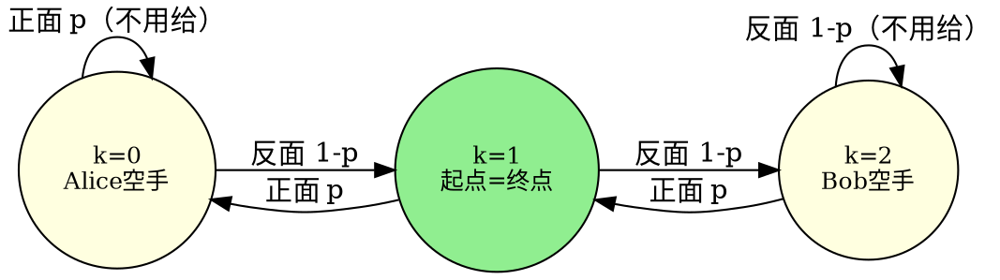
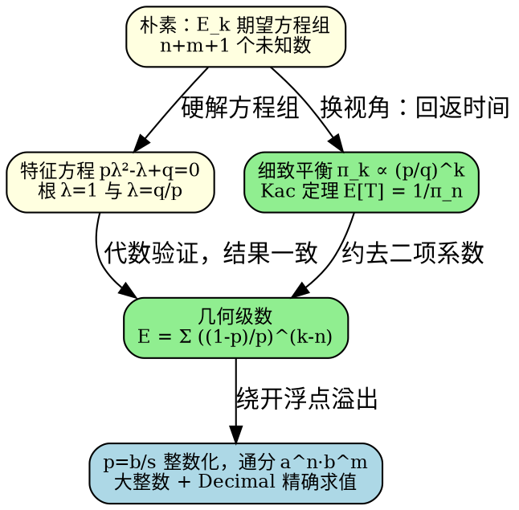

[[TOC]]

## 形式化题目

Alice 初始有 $n$ 颗宝石，Bob 有 $m$ 颗（$n, m \leqslant 100$），宝石总数 $n+m$ 恒定。每回合抛一枚正面概率为 $p$（不超过 6 位的有限小数）的硬币：

- 正面：Alice 给 Bob 一颗宝石（Alice 为 0 时状态不变）；
- 反面：Bob 给 Alice 一颗宝石（Bob 为 0 时状态不变）。

若**某个回合结束时** Alice 恰有 $n$ 颗宝石，游戏结束。求游戏进行的期望回合数，相对误差 $\leqslant 10^{-6}$。

注意终止条件的含义：Alice 初始就恰有 $n$ 颗。若第 1 回合正面朝上，Alice 变成 $n-1$ 颗，游戏**不**结束；游戏只在 Alice 的宝石数经过波动后**回到出发值 $n$** 的那个回合结束。所以本题求的是"从 $n$ 出发的首次回返时间"，而不是"首次到达 $n$"。

以样例 $n = m = 1$、$p = 0.5$ 画出来： Alice 的宝石数每回合在 $0,1,2$ 之间移动，两个端点 0（Alice 空手）与 2（Bob 空手）各有"不用给"的自环，起点 $s_0 = 1$，当 $s_t$ 再次等于 1 时游戏结束：

观察这张状态图：只要第 1 回合没回到 1，游戏就进入了"从 $0$ 或 $2$ 重新走回 $1$"的子问题——这正是"回返时间"的结构。这个状态图与 $n = m = 1$ 的样例输出 $3.0$ 一起，可作为后文公式推导的直观校验：几何级数 $\sum_{k=0}^{2} 1^{k-1} = 3$ 恰好给出样例答案。

## 正解

### 思路

**第一步：把游戏建模成随机游走。**

设 $s_t$ 为第 $t$ 回合结束时 Alice 的宝石数，$s_0 = n$，状态空间 $\{0, 1, \dots, n+m\}$：

- 内部状态 $0 < k < n+m$：以概率 $p$ 走到 $k-1$，以概率 $1-p$ 走到 $k+1$；
- 端点反射：$k = 0$（Alice 空手）时正面"不用给"，$0 \to 0$ 概率 $p$；$k = n+m$ 时反面 $n+m \to n+m$ 概率 $1-p$。

游戏终止时刻 $T = \min\{t \geqslant 1 : s_t = n\}$，即从 $n$ 出发的首次回返时间。

**第二步：朴素做法及其瓶颈。**

设 $E_k$ 为"Alice 有 $k$ 颗宝石时，再过多少回合宝石数回到 $n$"的期望，列方程组：

$$E_n = 1 + p\,E_{n-1} + (1-p)E_{n+1}, \qquad E_0 = 1 + pE_0 + (1-p)E_1, \qquad E_{n+m} = 1 + pE_{n+m-1} + (1-p)E_{n+m}.$$

这是 $n+m+1$ 个未知数的线性方程组：直接高斯消元是 $O(n^3)$；即使利用三对角结构消元做到 $O(n)$，也会在 $p$ 十分接近 $1/2$ 时遇到主元退化（测试数据 game7 ~ game9 的 $p$ 都在 $0.499$ 附近），需要谨慎处理精度。

**第三步：用回返定理一步得到封闭形式。**

这条随机游走每一步都至少挪动（或原地反射）一次，从任何状态出发都能以正概率回到 $n$，所以状态 $n$ 常返。对常返状态，**Kac 回返定理**给出：

$$E[T] = \frac{1}{\pi_n},$$

其中 $\pi_k$ 是这条链的平稳分布。由细致平衡方程 $\pi_k\,p = \pi_{k-1}(1-p)$（两个端点的自环不影响转移的对称性，直接解平稳方程也得同一结果）：

$$\pi_k \propto \left(\frac{p}{1-p}\right)^k, \qquad \pi_k = \frac{(p/q)^k}{\sum_{j=0}^{n+m} (p/q)^j}, \quad q = 1-p.$$

于是期望回返时间

$$E[T] = \frac{1}{\pi_n} = \frac{\sum_{j=0}^{n+m} (p/q)^j}{(p/q)^n} = \frac{\sum_{j=0}^{n+m} \binom{n+m}{j} p^j q^{n+m-j}}{\binom{n+m}{n} p^n q^m} = \sum_{k=0}^{n+m} \left(\frac{1-p}{p}\right)^{k-n}.$$

它也可以从第二步的方程组硬解出来：特征方程 $p\lambda^2 - \lambda + q = 0$ 的根是 $\lambda = 1$ 与 $\lambda = q/p$，通项 $E_k = A + B\,r^k$（$r = q/p$）加上边界对称性 $E_0 = E_{n+m}$，解出的封闭形式与上式完全一致——这正是对回返定理结果的代数验证。

如果不想直接引用定理，也可以用平稳分布的含义论证：这条链长期运行时，每回返一次就"消耗"一个回返间隔，而长期处于各状态的比例就是 $\pi$，所以平均回返间隔必然是 $1/\pi_n$。

**第四步：精确计算，绕开浮点溢出。**

令 $r = (1-p)/p$。当 $p < 1/2$ 时 $r > 1$，级数中最大的项 $r^{m}$ 可达 $2^{100}$，用 `double`/`long double` 逐项累加会有溢出和精度风险（官方 C++ 题解靠"每项为正、乘除交替"侥幸避开，但 Python 里我们有更好的武器：精确整数）。

$p$ 是不超过 6 位的有限小数，把它按小数位数缩放成整数：设 $p = b/s$（$s = 10^{\text{小数位数}}$，$b$ 为整数），$q = a/s$（$a = s - b$）。把通分到 $a^n b^m$：

$$E[T] = \sum_{k=0}^{n+m} \left(\frac{a}{b}\right)^{k-n} = \frac{\sum_{k=0}^{n+m} a^k\, b^{\,n+m-k}}{a^n\, b^m}.$$

$n + m \leqslant 200$，所以分子分母都是不超过 $200 \times 6 = 1200$ 位的整数，Python 大整数精确计算毫无压力；最后用 `Decimal`（40 位有效数字）做一次除法，误差远小于 $10^{-6}$。

整个算法只有 $O(n+m)$ 次大整数乘法。

### 代码

@include-code(./main.py, python)

### 复杂度

设 $N = n + m \leqslant 200$，$s \leqslant 10^6$。

- 时间复杂度：$O(N)$ 次大整数乘法，参与运算的整数不超过 $N \log_{10} s \approx 1200$ 位，单次乘法 $O(1200^2)$ 以内，总体在毫秒级。
- 空间复杂度：$O(1)$，只保存当前的分子累加值与两个幂（不存储整张幂表）。
- 若用 C++ 实现，同样的公式用 `long double` 计算 $\sum_k r^{k-n}$ 即可（注意 $r^{k-n}$ 有正有负时改成乘除交替，避免 $r > 1$ 方向溢出）。

## 总结

- 关键观察 1：终止条件是"Alice 的宝石数**回到**初始值 $n$"，游戏求的是回返时间而非首达时间——这一步想错了，后面全错。
- 关键观察 2：宝石数变化是一个带反射壁的随机游走，由 Kac 回返定理，期望回返时间等于平稳概率的倒数 $1/\pi_n$，其中 $\pi_k \propto (p/q)^k$。
- 关键化简：$1/\pi_n$ 约去二项系数与 $p^n q^m$ 后只剩几何级数 $\sum_{k=0}^{n+m} ((1-p)/p)^{k-n}$，不用任何方程组。
- 实现要点：小数按位数缩放成整数、通分 $a^n b^m$，用大整数 + `Decimal` 精确求值，彻底避开 $p \approx 1/2$ 与 $r$ 很大时的浮点问题。

## 图示解析

最后把整条推导路线串起来，从朴素方程组走到整数化求值：

从图里能看出两条殊途同归的路线：左路（朴素方程组 → 特征根）是纯代数推导，右路（细致平衡 → Kac 定理）是概率论证，两者最终都收敛到同一个几何级数。实现层再补最后一块：利用"有限小数"这个输入约束做整数化，让 Python 的精确运算成为可能。

EOF
