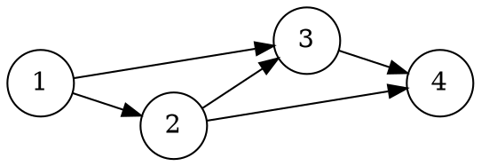

[[TOC]]

## 形式化题目

给定有向图 $G=(V,E)$，$V=\{1,2,\dots,n\}$，每条边都从编号小的点指向编号大的点，且对每个点 $i$，集合

$$H[i]=\{\,j < i : j\to i \in E\,\}$$

本身是一个团（输入可能含重边）。对点集 $T$：

- **团**：$T$ 中任意两点之间都有边（方向为小编号指向大编号），空集也算团；
- **可扩团**：存在一个点，与 $T$ 中每个点之间都有边；
- **极大团**：不是可扩团的团，即不能再加入任何点的团（空团总可以再加入任意一点，所以极大团都是非空团）。

求 $G$ 中不同极大团的个数。

样例输入对应的有向图如下，它同时演示了题设性质：$H[3]=\{1,2\}$、$H[4]=\{2,3\}$ 都是团。

样例的两个极大团是 $\{1,2,3\}$ 和 $\{2,3,4\}$；$\{1,2\}$ 虽然是团，但还能加入点 3，所以是可扩团，不计入答案。

## 正解

### 思路

**朴素做法。** 枚举所有点集，逐一判断“是否为团、是否还能扩大”，复杂度 $O(2^n\cdot n^2)$，只够 $n\leqslant 10$ 的数据。瓶颈在于候选团有指数多个：$n$ 高达 $10^6$，必须放弃“枚举团”，改为把极大团与 $O(n)$ 个、每个 $O(1)$ 可判定的对象一一对应。

**第一步：把每个团挂到它的最大点上。** 对点 $i$ 定义

$$P(i)=\{i\}\cup H[i].$$

由题设 $H[i]$ 是团，且 $i$ 与 $H[i]$ 中每点之间都有边（方向由 $H[i]$ 指向 $i$），所以 $P(i)$ 是团。反过来，任何包含 $i$ 的团 $T$，其余点都比 $i$ 小且与 $i$ 相邻，即 $T\setminus\{i\}\subseteq H[i]$，故 $T\subseteq P(i)$。也就是说，$P(i)$ 就是“包含 $i$ 的最大团”。

由此得到一一对应：任取团 $T$，设 $i$ 是 $T$ 的最大点，则 $T\subseteq P(i)$；若 $T$ 极大，必有 $T=P(i)$。而 $P(i)$ 的最大点恰好是 $i$，所以不同点给出的 $P(i)$ 互不相同。于是

$$\text{极大团个数}=\#\{\,i : P(i)\text{ 不被任何 } P(j)\ (j\neq i)\text{ 包含}\,\}.$$

**第二步：包含关系只需向后检查。** 若 $j<i$，则 $P(j)$ 中所有元素都不超过 $j<i$，于是 $i\notin P(j)$，不可能有 $P(i)\subseteq P(j)$。所以 $P(i)$ 若被包住，只可能被某个 $j>i$、且存在边 $i\to j$ 的 $P(j)$ 包住，条件是 $H[i]\subseteq H[j]\cup\{j\}$。逐条出边做这样的集合包含，最坏要 $O(nm)$，还要再压。

**第三步：用入度比较代替集合包含（关键）。** 记 $j=last[i]=\max H[i]$（最大前驱）。因为 $H[i]$ 是团，$H[i]$ 中除 $j$ 外的每个前驱 $p$ 都满足 $p<j$ 且 $p\to j$，即 $p\in H[j]$，所以恒有

$$H[i]\setminus\{j\}\subseteq H[j],\qquad |H[i]|\leqslant |H[j]|+1. \tag{1}$$

- **充分**：若 $|H[i]|>|H[j]|$，由 (1) 只能是 $|H[i]|=|H[j]|+1$ 且 $H[j]=H[i]\setminus\{j\}$，于是 $P(j)=\{j\}\cup H[j]\subseteq H[i]\cup\{i\}=P(i)$，即 $j$ 的团被 $i$ 吸收。
- **必要**：若 $P(j)\subseteq P(i)$（此时 $j<i$、边 $j\to i$），则 $j\in H[i]$，且 $H[j]$ 的元素都小于 $j<i$、不会等于 $i$，故 $H[i]\supseteq H[j]\cup\{j\}$。从 $v_0=i$ 出发令 $v_{t+1}=last[v_t]$：由 (1) 同样的理由 $H[v_{t+1}]\supseteq H[v_t]\setminus\{v_{t+1}\}$，而 $v_{t+1}>j$ 不会削掉 $H[j]\cup\{j\}$ 的任何元素，故归纳地 $H[v_t]\supseteq H[j]\cup\{j\}$。该序列严格递减且始终满足 $last[v_t]\geqslant j$（因为 $j\in H[v_t]$），有限步后必有某步 $last[v_{t-1}]=j$，此时 $|H[v_{t-1}]|\geqslant|H[j]|+1>|H[j]|$，$j$ 按判据被标记。

于是得到充要判据：

$$P(j)\text{ 被包住}\iff \exists i:\ last[i]=j\ \wedge\ |H[i]|>|H[j]|.$$

**第四步：重边先去重。** 判据里的 $|H[i]|$ 是**不同前驱的个数**，重边会把计数撑高、破坏 (1)。把每条边压成整数 `a<<20|b`（$n\leqslant 10^6<2^{20}$）后排序，相同边相邻、跳过即可去重；排序还让同一个 $b$ 的前驱按 $a$ 升序出现，最后一次写入恰好就是 $last[b]$。

**扫描与答案。** 按 $i=1,\dots,n$ 扫一遍：$last[i]\neq 0$ 且 $|H[i]|>|H[last[i]]|$ 时标记 $last[i]$，最后输出 $n-$ 被标记点数。下表是样例的完整计算，其中 $d(i)=|H[i]|$ 表示不同前驱个数：

| $i$ | $H[i]$ | $d(i)$ | $last[i]$ | $P(i)$ | 扫描到 $i$ 的操作 |
| --- | --- | --- | --- | --- | --- |
| 1 | $\varnothing$ | 0 | $0$ | $\{1\}$ | 无前驱，跳过 |
| 2 | $\{1\}$ | 1 | 1 | $\{1,2\}$ | $1>0$，标记点 1 |
| 3 | $\{1,2\}$ | 2 | 2 | $\{1,2,3\}$ | $2>1$，标记点 2 |
| 4 | $\{2,3\}$ | 2 | 3 | $\{2,3,4\}$ | $2>2$ 不成立 |

被标记的是 1、2：$P(1)=\{1\}\subseteq P(2)$、$P(2)=\{1,2\}\subseteq P(3)$，它们都被更大的团包住；未标记的 3、4 给出两个极大团 $\{1,2,3\}$ 与 $\{2,3,4\}$，答案为 2，与样例输出一致。

实现里 `packed` 是压成 `a<<20|b`、排序去重后的边表，`pred_cnt`/`pred_max` 依次存 $|H[i]|$ 与 $last[i]$，`covered` 存上表最后一列的标记结果，三者与上述推导一一对应。

### 代码

@include-code(./main.py, python)

### 复杂度

时间复杂度 $O(m\log m)$：读入与两次扫描都是 $O(n+m)$，排序去重是主项；空间复杂度 $O(n+m)$，边表与三个计数数组各占线性空间。与参考 C++ 正解同为“排序 + 一次扫描”，只是把集合包含判定换成了入度的一次整数比较。

## 总结

本题的钥匙是题设“$H[i]$ 是团”（即编号顺序是完美消除序列，图是弦图）：它让每个点的 $P(i)=\{i\}\cup H[i]$ 成为包含该点的最大团，从而极大团与“不被其他 $P(j)$ 包住的 $P(i)$”一一对应。再利用团内任意两点相邻推出的计数关系 $|H[i]|\leqslant|H[last[i]]|+1$，把集合包含判定压成一次整数比较，整个问题就落成“排序去重 + 两遍线性扫描”。
