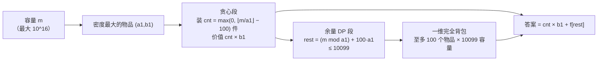

[[TOC]]

## 形式化题目

给定正整数容量 $m$ 与 $n$ 种物品：第 $i$ 种物品体积 $i_a$、价值 $i_b$，每种物品无限件。要求在装下的物品总体积不超过 $m$ 的前提下，最大化总价值。

题面的约束极不对称：物品种数 $n \leqslant 10^6$，但**体积和价值都被压在 $\leqslant 100$**；而**容量 $m$ 高达 $10^{16}$**。这个不对称就是全题的全部突破口。

**样例 1**：$m = 15$，物品 $(3,2)$、$(5,3)$，输出 $10$——装 5 件 $(3,2)$；混装最多 3 件 $(5,3)$ 只有 $9$。

**样例 2**：$m = 70$，物品 $(71,100)$、$(69,1)$、$(1,2)$，输出 $140$——$(71,100)$ 体积超过容量根本装不下，装 70 件 $(1,2)$ 即得 $140$。

## 正解

### 思路

**朴素做法：一维完全背包。** $f[j]$ 表示容量 $j$ 内能拿到的最大价值，对每个物品正序扫描容量，转移

$$f[j] = \max\big(f[j],\; f[j - i_a] + i_b\big)$$

正序更新等价于每件物品可以重复取。时间 $O(nm)$、空间 $O(m)$。但 $m \leqslant 10^{16}$：任何关于 $m$ 的循环或数组都不存在，朴素做法只在前 60% 数据（$m \leqslant 10^5$）可行。**瓶颈非常明确：DP 的容量维度必须压缩到与 $m$ 无关。**

**第一刀：同体积去重。** 体积相同的两件物品，价值低的那件永远不会被用到——无限件背包里随时可以拿同体积更高价值的替换它。体积只有 $1 \leqslant i_a \leqslant 100$ 共 100 种取值，所以去重后参与计算的物品**至多 100 个**（输入里 $n = 10^6$ 行大量重复，逐行读入只留每个体积的最大价值即可）。这把 $n$ 压掉了，但 $m$ 还在。

**第二刀：密度贪心。** 定义密度 $\rho_i = i_b / i_a$，取密度最大的物品 $(a_1, b_1)$。由密度最大，任何其它物品 $(a, b)$ 都满足

$$b \cdot a_1 \leqslant a \cdot b_1$$

即按体积折算，把其它物品换成 $(a_1, b_1)$ 永不亏。直觉结论是"容量全塞 $(a_1, b_1)$"——但**零头会吃亏**：例如物品 $(4,5)$、$(6,7)$，密度 $1.25 > 1.167$，$m = 10$ 时全贪只能装 2 件 $(4,5)$（体积 8，价值 10，剩 2 装不下任何东西），而 $(6,7)+(4,5)$ 恰好体积 10、价值 12。贪心必须给"零头里的更优组合"留出修正空间。

**第三刀：贪心段 + 余量 DP 段。** 把容量切成两段：

- **贪心段**：先装 $\text{cnt} = \max(0,\ \lfloor m / a_1 \rfloor - 100)$ 件最优物品，价值 $\text{cnt} \cdot b_1$；
- **DP 段**：剩余容量 $\text{rest} = m - \text{cnt} \cdot a_1$，当 $\text{cnt} \geqslant 0$ 时 $\text{rest} = (m \bmod a_1) + 100\,a_1 \leqslant 99 + 10000 = 10099$；对这段容量用朴素的一维完全背包算出 $f[\text{rest}]$（物品仍是去重后的那至多 100 个）。

答案 $= \text{cnt} \cdot b_1 + f[\text{rest}]$。DP 段容量上界 10099 与 $m$ 完全无关，这就是"与正解同阶"的复杂度来源。

**为什么恰好留 100 份。** 100 是题面给的体积上限：任何其它物品的体积都不超过 100，贪心可能吃亏的规模（零头 $< a_1$，以及"该不该少拿一件去迁就别的物品"）被这 $100\,a_1$ 的预留全部吸收。预留量取自约束本身，所以对任意数据都成立，DP 段大小因此有了与 $m$ 无关的统一上界。

**正确性（两面夹逼）。**

先证一个引理——**贪心补满引理**：任何一个装法都可以拆成"若干其它物品构成的装法 $O$（体积 $W$、价值 $V_o$）+ $t$ 件 $(a_1,b_1)$"。给定 $O$ 后，$t$ 必须取到 $\lfloor (c - W)/a_1 \rfloor$ 才最优：没塞满就再加一件 $(a_1, b_1)$，体积够、价值严格上升。于是最优值有精确刻画

$$F[c] = \max_{O:\,W \leqslant c} \left\{ V_o + \left\lfloor \frac{c - W}{a_1} \right\rfloor b_1 \right\}$$

- **候选值 $\leqslant$ 最优值（可行性）**：$\text{cnt}$ 件 $(a_1,b_1)$ 加上 DP 段的方案，总体积 $\leqslant \text{cnt} \cdot a_1 + \text{rest} = m$，是真实可行的方案，所以 $\text{cnt} \cdot b_1 + f[\text{rest}]$ 不会超过真正的最优。
- **最优值 $\leqslant$ 候选值**：把 $c = m = \text{cnt} \cdot a_1 + \text{rest}$ 代入引理，$\lfloor (m - W)/a_1 \rfloor = \text{cnt} + \lfloor (\text{rest} - W)/a_1 \rfloor$，提出 $\text{cnt} \cdot b_1$ 后按 $W$ 分两支：
  - **$W \leqslant \text{rest}$**：$\max\{V_o + \lfloor (\text{rest} - W)/a_1 \rfloor b_1\}$ 正是对容量 $\text{rest}$ 使用同一引理的式子，即 $F[\text{rest}]$，而 $f[\text{rest}] = F[\text{rest}]$，此支 $\leqslant f[\text{rest}]$。
  - **$W > \text{rest}$**：此时 $\lfloor (\text{rest} - W)/a_1 \rfloor = -\lceil (W - \text{rest})/a_1 \rceil$，此支价值为 $V_o - \lceil \Delta / a_1 \rceil b_1$，其中 $\Delta = W - \text{rest}$。构造一个 DP 段方案与之比较：从 $O$ 里删掉总体积 $\geqslant \Delta$ 的一部分物品（剩下的体积 $\leqslant \text{rest}$，正好放进 DP 段），空隙用 $(a_1, b_1)$ 补齐。删除部分按密度折算的价值 $v_D \leqslant w_D \cdot b_1 / a_1$ 不超过同体积贪心物品的价值，且 $100\,a_1$ 的预留保证删除体积能对齐到 $a_1$ 的整数倍附近（物品体积 $\leqslant 100$，区间长度 $100\,a_1 \geqslant \mathrm{lcm}(\text{体积}, a_1)$，总能取到合适的 $w_D$），因此构造方案的价值 $\geqslant V_o - \lceil \Delta/a_1 \rceil b_1$；而 $f[\text{rest}]$ 取 DP 段所有方案的最大值，此支同样 $\leqslant f[\text{rest}]$。

两支都不超过 $f[\text{rest}]$，故 $F[m] \leqslant \text{cnt} \cdot b_1 + f[\text{rest}]$。上下界重合，等号成立。

**样例 1 走一遍。** $m = 15$，密度 $2/3 > 3/5$，故 $(a_1, b_1) = (3,2)$；$\lfloor 15/3 \rfloor = 5 < 100$，贪心段为 0，全部容量交给 DP。下表是两个物品依次入包后的 $f[j]$（行 = 处理阶段，列 = 容量 $j$，单元格 = 该容量下的最大价值）：

| 处理阶段 | 0 | 1 | 2 | 3 | 4 | 5 | 6 | 7 | 8 | 9 | 10 | 11 | 12 | 13 | 14 | 15 |
| --- | --- | --- | --- | --- | --- | --- | --- | --- | --- | --- | --- | --- | --- | --- | --- | --- |
| 只放 $(3,2)$ | 0 | 0 | 0 | 2 | 2 | 2 | 4 | 4 | 4 | 6 | 6 | 6 | 8 | 8 | 8 | 10 |
| 再放 $(5,3)$ | 0 | 0 | 0 | 2 | 2 | 3 | 4 | 4 | 5 | 6 | 6 | 7 | 8 | 8 | 9 | 10 |

加入 $(5,3)$ 后 $f[5]$ 从 2 抬到 3、$f[11]$ 抬到 7、$f[14]$ 抬到 9，但每个容量上它都没能超过"纯 $(3,2)$ 或接近纯 $(3,2)$"的装法，最终 $f[15] = 10$，与样例输出一致。这张表也说明 DP 段会自动枚举零头里所有混装可能，贪心段不必替它操心。

### 代码

正式解 `main.py`：逐行流式读入并按体积去重（`best`），取密度最大的物品，切出贪心段与 DP 段，最后相加。

@include-code(./main.py, python)

`knapsack` 就是思路里 DP 段的一维完全背包；`RESERVE = 100` 即预留份数；`greedy`、`rest` 分别是贪心段件数与余量容量；`max(0, ...)` 处理 $m < 100\,a_1$ 时贪心段为负的情形（此时直接对整个 $m \leqslant 9999$ 做 DP，同样是小容量）。

### 复杂度

- **时间**：读入 $O(n)$（$n \leqslant 10^6$，逐行流式，不整体载入）；DP 段 $O(P \cdot \text{rest})$，其中 $P \leqslant 100$ 个去重物品、$\text{rest} \leqslant 10099$，不超过 $10^6$ 次转移。总计约 $2 \times 10^6$ 次基本操作，**与 $m$ 无关**，与正解（`std.cpp` 的贪心 + 小容量背包）同阶。
- **空间**：$O(\text{rest} + 100) = O(10^4)$ 加输入流式常数，实测峰值约 15MB，远低于 128MB 限制。
- **验证**：官方下发的 10 组真实数据（$m$ 最大约 $9.8 \times 10^{15}$）本地实测输出全部一致；Python 侧唯一风险是 OJ 的 1s 限时，按任务约定允许 TLE。

## 总结

- 瓶颈永远在最贵的那个维度上：$m \leqslant 10^{16}$，所以 DP 只能算"与 $m$ 无关"的一小段。
- 同体积去重（支配关系）把 $10^6$ 个输入压到至多 100 个物品；密度最大的物品是"万能填充物"，大数部分用一次乘法承接。
- 贪心装 $\lfloor m/a_1 \rfloor - 100$ 件、余量 $\leqslant 10099$ 留给完全背包修正零头；100 正是体积上限，预留量直接取自题面约束。
- 正确性靠贪心补满引理拆成两支夹逼：可行侧显然，最优侧两支都放不进 $f[\text{rest}]$ 之上，等号成立。
- 复杂度 $O(n + 100 \times 10099)$、空间 $O(10^4)$，全程与 $m$ 无关。
