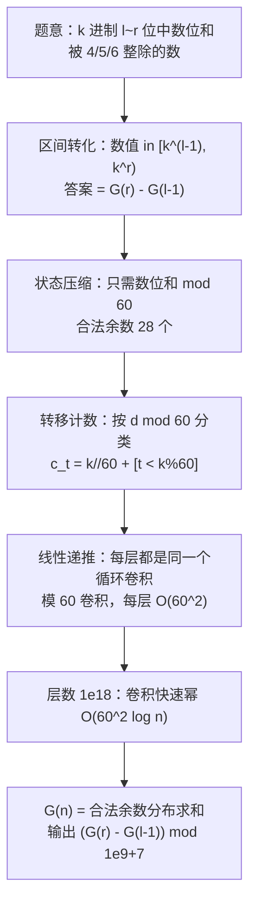

[[TOC]]

## 形式化题目

给定正整数 $l, r, k$（$1 \leqslant l \leqslant r$），统计 $k$ 进制下**位数在 $[l,r]$ 之间**、且**数位和能被 4 或 5 或 6 整除**的整数个数，答案模 $10^9+7$。题面里的"幸运数字 546 的倍数"只是背景故事，与所求无关。

第一步是把"位数"翻译成"数值区间"：$k$ 进制下 $n$ 位数的取值范围是 $[k^{n-1}, k^n)$（$n \geqslant 1$，0 不算 1 位数），于是位数在 $[l,r]$ 的数就是数值落在 $[k^{l-1}, k^r)$ 中的数。再注意到**高位补零不改变数位和**：把每个数补零到固定长度后，"数值在 $[0,k^n)$ 内"与"长度恰为 $n$ 的数字串（允许前导零）"一一对应。记

$$G(n) = \#\{x \in [0,k^n) : x \text{ 的数位和被 } 4 \text{ 或 } 5 \text{ 或 } 6 \text{ 整除}\} = \text{长度 } n \text{ 合法串的个数},$$

所求就是 $G(r) - G(l-1)$：大区间 $[0,k^r)$ 减去前缀 $[0,k^{l-1})$。

样例解释：

- **样例 #1（`1 5 2`）**：区间 $[1,32)$。二进制数位和为 4 的有 15、23、27、29、30，为 5 的有 31，共 6 个。用 $G$ 算：$G(5) = 7$（多出的 1 个是 0），$G(0) = 1$（空串对应数值 0），$7 - 1 = 6$。
- **样例 #2（`8 8 2`）**：区间 $[128,256)$，最高位必为 1，剩余 7 位中放 $m$ 个 1，数位和 $1+m \in \{4,5,6,8\}$，即 $m \in \{3,4,5,7\}$，共 $\binom{7}{3}+\binom{7}{4}+\binom{7}{5}+\binom{7}{7} = 35+35+21+1 = 92$；等价地 $G(8)-G(7) = 156-64 = 92$。

## 正解

### 思路

**朴素做法与瓶颈。** 直接枚举 $[k^{l-1}, k^r)$ 里的每个数求各位和：区间里有 $k^r - k^{l-1}$ 个数，$k$、$r$ 都到 $10^{18}$，完全不可行。退一步改成逐位 DP：记 $f[n][s] =$ 前 $n$ 位、数位和**恰为** $s$ 的方案数，转移要枚举下一位的每个数字 $d \in [0,k)$，即 $f[n+1][s+d] \mathrel{+}= f[n][s]$。三个维度同时爆炸：层数 $n$ 到 $10^{18}$，单层转移要枚举 $k$ 到 $10^{18}$ 个数字，$s$ 的上界 $n(k-1)$ 更是天文数字。下面依次砍掉这三个维度。

**观察一：判定只需要数位和模 60。** 因为 $4,5,6$ 都整除 $60 = \mathrm{lcm}(4,5,6)$，所以"被 4/5/6 之一整除"完全由 $s \bmod 60$ 决定。合法余数集合 $S = \{i : i\%4=0 \lor i\%5=0 \lor i\%6=0\}$，用容斥算出 $15+12+10-3-5-2+1 = 28$ 个。于是把状态从"精确数位和"压成"数位和模 60"，只剩 60 个状态：记 $\mathrm{dist}_n[i] =$ 长度 $n$、数位和 $\equiv i \pmod{60}$ 的串数，初值 $\mathrm{dist}_0 = [1,0,\dots,0]$（空串）。

**观察二：转移不枚举数字，只用 60 个计数。** 加一位数字 $d$ 后状态从 $i$ 走到 $(i+d) \bmod 60$，作用只取决于 $d \bmod 60$，所以按余数分类计数：

$$c_t = \#\{d \in [0,k) : d \equiv t \pmod{60}\} = \lfloor k/60 \rfloor + [t < k \% 60], \quad 0 \leqslant t < 60.$$

（$[\cdot]$ 是 Iverson 括号：条件成立取 1，否则取 0。）

以真实数据里的 $k = 906$（$906 = 60 \times 15 + 6$）为例，看这 60 个计数从哪来：

| 余数 $t$ | $0 \sim 5$ | $6 \sim 59$ | 合计 |
| --- | --- | --- | --- |
| $c_t$ | 16 | 15 | $6 \times 16 + 54 \times 15 = 906 = k$ ✓ |

每个余数先摊 $\lfloor k/60 \rfloor$ 轮完整周期（每轮 60 个数各贡献一次），前 $k \% 60$ 个余数再多一个。转移于是变成只含这 60 个系数的式子：

$$\mathrm{dist}_{n+1}[i'] = \sum_{i=0}^{59} \mathrm{dist}_n[i] \cdot c_{(i'-i) \bmod 60},$$

即 $\mathrm{dist}_{n+1} = \mathrm{dist}_n \circledast c$，是模 60 的**循环卷积**：单层只要 $O(60^2)$ 次乘加，且与 $k$ 的大小无关——观察二同时消掉了"枚举 $k$ 个数字"这个维度。

**观察三：每层转移相同且线性，用快速幂跨过 $10^{18}$ 层。** 连续加 $n$ 位等价于 $\mathrm{dist}_n = c^{\circledast n}$（$c$ 自己卷 $n$ 次）。卷积满足结合律、单位元是 $\delta_0$，所以用倍增求：层数不断平方、按 $n$ 的二进制位把层乘进结果，只需 $O(\log n)$ 层——"层数到 $10^{18}$"这个维度被对数消掉。

**观察四：循环矩阵结构，不必写 $60\times60$ 矩阵乘法。** 上述递推等价于矩阵 $A[i'][i] = c_{(i'-i) \bmod 60}$ 的 $n$ 次幂作用在 $\mathrm{dist}_0$ 上。$A$ 的元素只依赖下标之差，是**循环矩阵**，而 $A^n$ 的第 0 列恰好等于 $c^{\circledast n}$。所以标准的 $60\times60$ 矩阵快速幂（每层 $O(60^3)$）可以直接换成 60 维向量的循环卷积快速幂（每层 $O(60^2)$）——这就是代码里的 `conv` + `pow_dist`。

**小规模演进（$k=2$，样例 #1）。** 此时 $c = [1,1,0,\dots,0]$，且数位和最大为 $5 < 60$，取模不改变数值，分布恰好是二项式系数：

| $n$ \ 余数 $i$ | 0 | 1 | 2 | 3 | 4 | 5 | 合法合计 $G(n)$ |
| --- | --- | --- | --- | --- | --- | --- | --- |
| 0 | 1 | 0 | 0 | 0 | 0 | 0 | 1 |
| 1 | 1 | 1 | 0 | 0 | 0 | 0 | 1 |
| 2 | 1 | 2 | 1 | 0 | 0 | 0 | 1 |
| 3 | 1 | 3 | 3 | 1 | 0 | 0 | 1 |
| 4 | 1 | 4 | 6 | 4 | 1 | 0 | 2 |
| 5 | 1 | 5 | 10 | 10 | 5 | 1 | 7 |

每行是上一行与 $c$ 做循环卷积的结果（这里 $c$ 只有 $t=0,1$ 两项为 1，即每个数往自己和"自己加 1"两个方向各转移一次）。合法列只统计命中 $S$ 的余数 $0,4,5$（$1,2,3 \notin S$）。最后一行 $G(5) = 1+5+1 = 7$，答案 $G(5)-G(0) = 7-1 = 6$，与样例 #1 一致。

**收尾与边界。** 求 $G(r)$、$G(l-1)$ 各做一次卷积快速幂，输出 $(G(r) - G(l-1)) \bmod 10^9+7$。$l = 1$ 时 $G(0) = 1$ 正好把数值 0 排除（0 不是 1 位数，样例 #1 已验证题面口径）；$k < 60$ 时 $\lfloor k/60 \rfloor = 0$、$c_t = [t<k]$；$k$ 是 60 的倍数时 $k\%60=0$、没有 $+1$ 分支——公式在这些边界都自然成立。

### 代码

@include-code(./main.py, python)

正文与代码的对应：`step` 就是系数向量 $c$（60 项推导式），`conv` 实现模 60 循环卷积（观察二），`pow_dist` 实现卷积快速幂（观察三），`count_good(step, n)` 计算 $G(n) = \sum_{i \in S} \mathrm{dist}_n[i]$（观察一），`solve` 末行完成区间相减。

### 复杂度

每次循环卷积 $60^2 = 3600$ 次乘加，快速幂 $\lceil \log_2 r \rceil \leqslant 60$ 层，求 $G(r)$、$G(l-1)$ 各一次：总时间 $O(60^2 \log r)$，空间 $O(60)$。与正解的 $60\times60$ 矩阵快速幂 $O(60^3 \log r)$ 同属 $\log$ 层的线性递推快速幂，这里借助循环矩阵结构把每层压到平方级，复杂度严格不弱于正解。实测 10 组真实数据每例 0.016–0.052s、峰值约 15MB，对 OJ 的 1s / 128MB 限制余量很大，Python 侧没有 TLE/MLE 风险。

## 总结

- **位数 → 数值区间**：$k$ 进制 $n$ 位数即 $[k^{n-1}, k^n)$，所求区间是 $[k^{l-1}, k^r)$；补零不改变数位和，答案 $= G(r) - G(l-1)$。
- **状态压缩**：判定只看数位和模 $\mathrm{lcm}(4,5,6) = 60$，状态从 $n(k-1)$ 级的精确和压到 60。
- **转移计数**：数字按 $d \bmod 60$ 分类，$c_t = \lfloor k/60\rfloor + [t < k\%60]$，一步转移变成模 60 循环卷积。
- **快速幂**：卷积的结合律 + 倍增跨过 $10^{18}$ 层；循环矩阵性质让每层只需 $O(60^2)$，总复杂度 $O(60^2 \log r)$。

## 图示解析

从题意到最终答案的推导路线，每一步消除上一步的一个瓶颈：

每个节点对应正文的一次瓶颈消除：区间转化解决"枚举数值不可行"，模 60 压缩解决"精确和状态爆炸"，余数计数解决"逐个枚举数字"，卷积快速幂解决"$10^{18}$ 层递推"。读图时按箭头顺序对照 `### 思路` 的四个观察即可。
