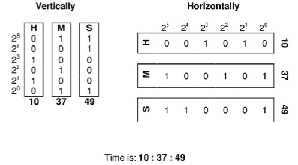

# Clock

> 本文件由题面 `content.pdf` 提取整理，保留原题面结构；配图为题面原图。

## 题目描述

小 s 最近对二进制处于痴迷的状态，什么都想用二进制来表示。今天小 s 看着挂在墙上的钟，就想着用二进制来表示时间。对于一个时间，小 s 先将时、分、秒都用 6 位二进制表示出来，然后将三个二进制对齐，用两种方法得到一个时间的两个二进制串。如：10:37:49。



分别竖着和横着取出字符，于是得到 011001100010100011 和 001010100101110001 两个字符串。现在小 s 想知道，对于某个时刻，对应的两个字符串是什么。

> 注：原题面正文第二个串印作 17 位 `00101010010111001`，而样例与全部测试数据均为 18 位 `001010100101110001`，应为原题排版笔误，以样例为准。

## 输入格式

一行，一个 24 小时表示的时间。符合 `XX:XX:XX` 的形式，分别表示时、分、秒。

## 输出格式

一行，两个字符串，分别表示竖着和横着取出的字符串（具体参见样例）。两个字符串用一个空格隔开。

## 输入样例 #1

```
10:37:49
```

## 输出样例 #1

```
011001100010100011 001010100101110001
```

## 输入样例 #2

```
00:00:01
```

## 输出样例 #2

```
000000000000000001 000000000000000001
```

## 数据范围

- 时限 1s，内存 64M。
- 输入为合法的 24 小时制时间：$0 \leqslant$ 时 $\leqslant 23$，$0 \leqslant$ 分、秒 $\leqslant 59$。
