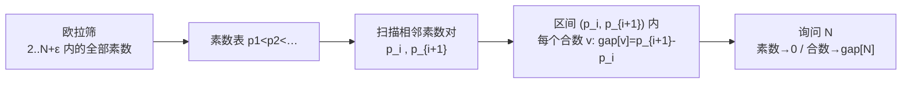

[[TOC]]

## 形式化题目

给定正整数 $N$（$N \leqslant 10^6$）。把不小于 2 的素数从小到大记为
$p_1=2, p_2=3, p_3=5, \dots$，约定素数间距 $g_i = p_{i+1} - p_i$。定义：当
$p_i < N < p_{i+1}$ 时，$N$ 处于「间距为 $g_i$ 的素数 gap」中，要求输出 $g_i$；
特别地，若 $N$ 本身是素数则输出 $0$。

**样例**：$N=10$，两侧最近的素数是 $7$ 和 $11$，间隔 $11-7=4$，输出 $4$。

| $N$ | 左侧素数 $p_i$ | 右侧素数 $p_{i+1}$ | 输出 |
| --- | --- | --- | --- |
| 10 | 7 | 11 | $11-7=4$ |
| 15 | 13 | 17 | $17-13=4$ |
| 24 | 23 | 29 | $29-23=6$ |
| 11 | 11（本身是素数） | — | $0$ |

观察重点：同一个 gap 里的所有合数答案相同，答案只由 $N$ 落在哪一对相邻素数之间决定。

## 正解

### 思路

**朴素做法**：对每个询问先写 `is_prime(n)` 试除判断素性；若 $N$ 是素数直接输出
$0$，否则从 $N$ 向两边逐个整数扩展，直到两侧各自撞上一个素数，输出两者之差。
单次询问是 $O(\sqrt{N})$ 加上平均 $O(\log N)$、最坏 $O(777)$ 次合数检查的扩展，
单个询问并不慢。但如果题目换一个 $N$ 再问一次，这套流程就要从头再跑，$\sqrt{N}$
的试除被重复做了一遍又一遍。

**优化推导**：注意答案的值域极小——整个 $[2,10^6]$ 里只有不到八万对相邻素数，
每一对之间的所有合数共享同一个答案。与其按询问逐个找两侧素数，不如**预先把每个
合数所属的 gap 宽度一次算完**：线性筛（欧拉筛）以 $O(N)$ 的时间把 $10^6$ 以内的
素数按从小到大排列，得到素数表 $p_1, p_2, \dots$；随后从左到右扫一遍素数表，把
$(p_i,\, p_{i+1})$ 之间的每个整数 $v$ 的答案记成 $p_{i+1}-p_i$。这样预处理之后
每个询问都是查表输出，总体 $O(N)$，与任何正解同阶。

$$\underbrace{p_5=11}_{\text{左素数}}\;\overbrace{\;12\;13\;14\;}^{\text{合数区间}}\;\underbrace{p_6=13}_{\text{右素数}}\quad\Longrightarrow\quad gap[12]=gap[13]=gap[14]=13-11=2$$

还有一个必须处理的边界：$N=10^6$ 本身是合数，它右侧的第一个素数是
$1000003$，**超出了 $10^6$**。若筛表只开到 $10^6$，$10^6$ 这个位置永远登记不到
间隔。处理方式是筛表上界外扩一点（代码里取 $10^6+100$，因为 $1000003-10^6$ 只有
$3$，几十的余量已足够安全），其余逻辑不变。

### 代码

@include-code(./main.py, python)

### 复杂度

- 时间：线性筛 $O(N)$，扫描登记 $O(\pi(N))$，单次询问 $O(1)$，总复杂度 $O(N)$。
- 空间：筛表与答案数组各 $O(N)$，约 $27\,\mathrm{MB}$。

## 总结

- 核心转化：单点询问「$N$ 夹在哪两个素数之间」可以离线成「同一对相邻素数之间的
  所有合数共享一个答案」，于是预处理一张 $O(N)$ 的答案表即可。
- 实现：欧拉筛保证素数按升序产出，相邻素数之间的合数区间左闭右开，扫描登记一遍；
  素数位置保持 $0$，天然对应「素数输出 0」。
- 边界：$N=10^6$ 时右侧第一个素数 $1000003$ 超出 $N$ 的上界，筛表必须外扩，
  否则该点会错误地输出 $0$。

## 图示解析

以 $N=10^6$ 附近的数轴为例（这正是筛表必须外扩的原因）：

| 数轴位置 | … | 999983 | … 999984 … 999999 … | 1000000 | 1000001 | 1000002 | 1000003 | … |
| --- | --- | --- | --- | --- | --- | --- | --- | --- |
| 身份 | | 素数 | 合数 | 合数 | 合数 | 合数 | 素数 | |
| gap 值 | | 0 | $1000003-999983=20$ | 20 | 20 | 20 | 0 | |

观察重点：$1000000$ 的答案 $20$ 来自素数对 $(999983,\,1000003)$，而右端点
$1000003$ 在 $N$ 的上界之外——上界只覆盖到 $1000000$ 时这个格子拿不到答案，
外扩筛表后才被登记。
