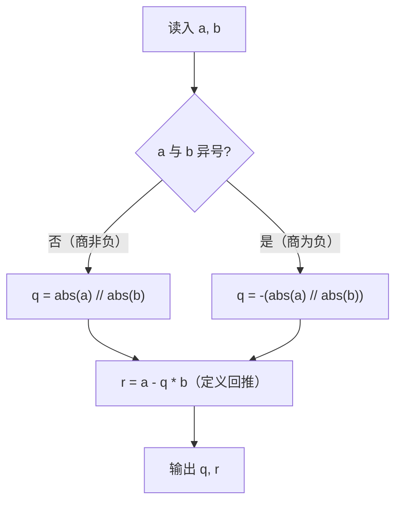

[[TOC]]

## 形式化题目

给定被除数 $a$ 与非零除数 $b$，求整数商 $q$ 与余数 $r$，满足带余除法的定义式：

$$a = q \cdot b + r, \qquad |r| < |b|$$

这样的 $(q, r)$ 有唯一解，但**取整方向由评测数据确定**：真实数据 `problem4`（$963\ -404$）的答案是 $-2\ 155$ 而不是 $-3\ -249$，因为 $963/(-404) = -2.38\ldots$——本题采用 C/C++ 的**向零截断**（trunc）商、余数**符号随被除数**，即 $q = \operatorname{trunc}(a/b)$、$r = a - q \cdot b$；这不是 Python `//` 的向下取整，也不是 `%` 的符号随除数。

样例：$10 = 3 \times 3 + 1$，故输入 `10 3` 输出 `3 1`。

## 正解

### 思路

最自然的直译是 C++ 的 `a / b` 和 `a % b`，写成 Python 就是 `a // b, a % b`。它能通过全部**同号**测例，却会在异号时把商和余数一起算错——因为 Python 的 `//` 是向下取整（floor）、`%` 的符号随除数，而本题要求商向零截断、余数符号随被除数：

| $a$ | $b$ | $a/b$ | Python `//`（floor）+ `%` | 本题答案（trunc） | 是否一致 |
| --- | --- | --- | --- | --- | --- |
| $10$ | $3$ | $3.333$ | `3 1` | `3 1`（样例） | ✅ 同号正 |
| $848$ | $291$ | $2.914$ | `2 266` | `2 266`（`problem2`） | ✅ 同号正 |
| $-83$ | $-230$ | $0.361$ | `0 -83` | `0 -83`（`problem5`） | ✅ 同号负 |
| $963$ | $-404$ | $-2.384$ | `-3 -249` | `-2 155`（`problem4`） | ❌ 异号 |
| $817$ | $-899$ | $-0.909$ | `-1 -82` | `0 817`（`problem6`） | ❌ 异号 |
| $793$ | $-138$ | $-5.746$ | `-6 -35` | `-5 103`（`problem9`） | ❌ 异号 |

两种取整只在**异号**时分岔：同号时商非负，floor 与 trunc 重合；异号时商为负，floor 比 trunc 恰好小 $1$。真实数据 10 个测例中有 3 个异号，直译必挂。所以关键不是算除法，而是把 C 的带余除法语义正确翻译成 Python，且**商、余数两处都要修**。

推导分两步，只修一处语义、让余数自己跟上：

1. **商向零截断**：trunc 分解为"绝对值上整除、最后补符号"，即 $q = \operatorname{sign}(a)\operatorname{sign}(b) \cdot \lfloor |a|/|b| \rfloor$。$|a| \mathbin{//} |b|$ 的两个操作数非负，此时 `//` 就是普通整除，没有取整方向问题；判号用 `(a < 0) != (b < 0)`，异号取负即可。
2. **余数按定义回推**：$r = a - q \cdot b$。定义式保证 $a = qb + r$；又因 $q$ 是实商 $a/b$ 截断而来，与实商相差不足 1，回推余数满足 $|r| < |b|$、符号随 $a$——这正是 C 的 `%` 语义，无需再对 `%` 做任何修正，也避免了“只修商、余数仍用 `a % b`”导致 $a = qb + r$ 被破坏的坑。

下图展示这条单支路的决策流程：

判号是唯一的语义分岔点；绝对值整除在两支中共用，余数统一由定义式回推。备选写法 `int(a / b)`（浮点除法再截断）在本题数据范围内结果也对，但把整数题交给浮点舍入、大整数会失精度，故不采用；`a // b, a % b` 则是必然错误的直译。

### 代码

代码中 `dividend`/`divisor` 即 $a$/$b$，`opposite_sign` 是判号，`quot`/`rem` 即 $q$/$r$，与上面两步一一对应。

@include-code(./main.py, python)

### 复杂度

- 时间复杂度：$O(1)$：一次读入、一次符号比较、一次整数除法、一次乘减回推，与输入规模无关。
- 空间复杂度：$O(1)$：只保存两个输入整数、符号判定、商与余数，无数组与递归。

## 总结

这道题考的是**两种带余除法语义的区别**：Python 的 `//` 向下取整、`%` 符号随除数，C 的 `/` 向零截断、`%` 符号随被除数，两者只在被除数与除数异号时相差 $1$。解法是两步推导：商先取绝对值整除再按异号补负号（向零截断），余数用定义 $r = a - q \cdot b$ 回推（自动与商配套）。注意不要直译成 `a // b, a % b`（异号测例必挂），也不要"只修商不修余数"，更不必引入 `int(a / b)` 的浮点写法。实测 10 个评测点全部一致，单点约 0.016 s、峰值内存 14.5 MB，相对 1000 ms / 128 MB 的限制十分宽裕。
