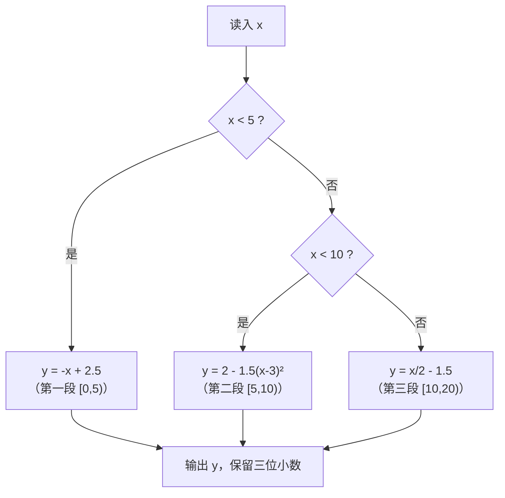

[[TOC]]

## 形式化题目

给定实数 $x \in [0, 20)$，计算分段函数

$$
y = \begin{cases}
-x + 2.5, & 0 \leqslant x < 5 \\
2 - 1.5(x-3)^2, & 5 \leqslant x < 10 \\
\dfrac{x}{2} - 1.5, & 10 \leqslant x < 20
\end{cases}
$$

的值 $f(x)$，保留三位小数。

## 正解

### 思路

最直接的写法是三重 `if/elif`：`if x < 5 ... elif x < 10 ... else ...`。这当然正确，但"三段区间、左闭右开"这个结构被藏在了条件表达式里——读者要自己从 `< 5`、`< 10` 反推出区间端点和开闭性。

更 Pythonic 的做法是**表驱动**：把三段写成 `(区间起点, 表达式)` 的有序表，对给定 $x$ 取**起点不超过 $x$ 的最后一段**：

| 区间 | 表达式 | 边界点归属 |
| --- | --- | --- |
| $[0, 5)$ | $-x + 2.5$ | $x = 0$ 属本段 |
| $[5, 10)$ | $2 - 1.5(x-3)^2$ | $x = 5$ 属本段（不属于上一段） |
| $[10, 20)$ | $x/2 - 1.5$ | $x = 10$ 属本段（不属于上一段） |

表的行按起点升序，所以"过滤出起点 $\leqslant x$ 的段，取最后一段"就等价于判断 $x$ 落在哪个左闭右开区间：

- $x \in [0, 5)$：只有起点 $0$ 满足，命中第一段；
- $x \in [5, 10)$：起点 $0, 5$ 满足，最后一段是起点 $5$，命中第二段；
- $x \in [10, 20)$：起点 $0, 5, 10$ 满足，最后命中起点 $10$，即第三段。

三段不重不漏地覆盖 $[0, 20)$，任意合法输入恰好命中一段。左闭右开由过滤规则直接表达：起点可达（$\leqslant$），终点由下一段的起点接管。

上面的流程图是 `if/elif` 的视角；表驱动把这张图压缩成一行——`[formula for start, formula in PIECES if start <= x][-1]`。它与 C++ 标准写法 `switch(int(x/5))` 同构：`int(x/5)` 的 case 编号恰好等于"起点 $\leqslant x$ 的段数减一"。

样例代入验证：$x = 1.0 \in [0, 5)$，$y = -1.0 + 2.5 = 1.500$，与样例输出一致。

### 代码

@include-code(./main.py, python)

### 复杂度

- 时间：$O(1)$——常数段数的表过滤加一次求值。
- 空间：$O(1)$——`PIECES` 是固定三元素的常量表。

## 总结

本题是入门级的分支结构题，考点只有两个：**区间端点的开闭性**（$x=5$ 属第二段、$x=10$ 属第三段）和**浮点格式化输出**（保留三位小数）。表驱动写法把"三段左闭右开"的区间结构显式放进数据里，分支选择压缩成"取起点不超过 $x$ 的最后一段"一次过滤，既避免了散落的 `if/elif` 条件，也和 C++ 的 `switch(int(x/5))` 技巧形成对照——同一模型在两种语言里的自然表达。
