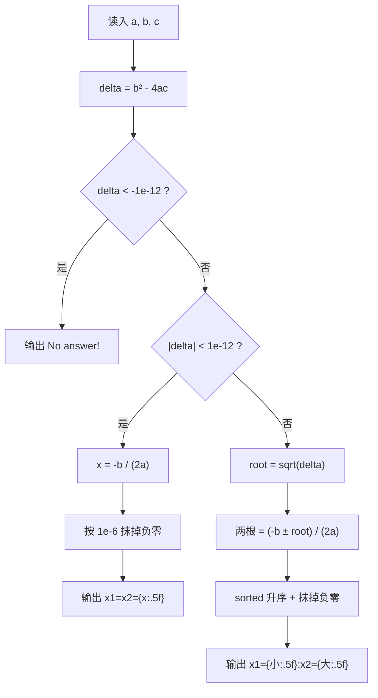

[[TOC]]

## 形式化题目

给定实数 $a \neq 0$、$b$、$c$，求方程

$$ax^2 + bx + c = 0$$

的实根集合 $\{\, x \in \mathbb{R} \mid ax^2+bx+c=0 \,\}$，其中 $a,b,c$ 由输入的一行给出。

要求：

- 若实根集合为空，输出 `No answer!`；
- 若恰有一个实根 $x$，以 `x1=x2=...` 的形式输出 $x$；
- 若有两个实根，以 `x1=...;x2=...` 的形式输出，且左侧的根不大于右侧；
- 所有数值四舍五入到小数点后 5 位，数字与符号之间没有空格。

以样例 $a = -15.97$、$b = 19.69$、$c = 12.02$ 为例，$\Delta = b^2-4ac = 1155.5337 > 0$，两根约为 $-0.44781$ 与 $1.68075$。

## 正解

### 思路

**一句话本质**：判别式 $\Delta = b^2 - 4ac$ 的符号决定输出形态，$\Delta > 0$ 时套求根公式并把两根排序。

先看"照公式直译"会栽在哪里。题面已经把公式写出来了，写成代码只有两行：

```python
x1 = (-b + sqrt(b*b - 4*a*c)) / (2*a)
x2 = (-b - sqrt(b*b - 4*a*c)) / (2*a)
```

这段代码在最普通的双实根数据上是对的，但它没有处理 $\Delta$ **可能为负**——`math.sqrt` 会对负数抛 `ValueError`，所以第一件事是把 $\Delta$ 单独算出来并分支。

**问题？** 三分支的边界该画在哪？

数学上是 $\Delta < 0$、$= 0$、$> 0$，但 $\Delta$ 是浮点算出来的，`== 0` 几乎永远不会命中真实的重根（例如 $a=b=c=1$ 的系数经过十进制读入后，$b^2 - 4ac$ 不保证精确等于 $0$）。参考程序给出的答案是**双侧容差**：取 $\varepsilon_\Delta = 10^{-12}$，

| 判据 | 输出 | 含义 |
| --- | --- | --- |
| $\Delta < -10^{-12}$ | `No answer!` | 判别式显著为负 |
| $\lvert \Delta \rvert < 10^{-12}$ | `x1=x2=...` | 判别式在浮点精度内为 0，视为重根 |
| $\Delta > 10^{-12}$ | `x1=...;x2=...` | 两个不同实根 |

夹在 $[-10^{-12}, 0)$ 的输入被归入重根分支，这既是数值上的合理选择（误差量级已经和 $\Delta$ 同阶），也和评测标准答案的判定一致。

**问题？** 哪根是"小根"？

题面说"根小者在前"，而两根是

$$x_{1} = \frac{-b + \sqrt{\Delta}}{2a}, \qquad x_{2} = \frac{-b - \sqrt{\Delta}}{2a}$$

分子上 $\sqrt{\Delta} > 0$，所以两者的大小**完全由分母 $2a$ 的正负决定**：$a > 0$ 时 $x_1$ 更大，$a < 0$ 时 $x_1$ 更小。样例的 $a = -15.97 < 0$ 正是后一种情形——按"$+$ 在前"照写会输出 `x1=1.68075;x2=-0.44781`，顺序反了。最省心的写法是不分情况、直接 `sorted(...)`，让"小根在前"变成代码本身的性质，而不是一个需要读者验证 $a$ 的符号的隐藏条件。

**问题？** 还有别的坑吗？

两个：**负零**和 **`sqrt` 的实现**。

浮点里有 $+0.0$ 和 $-0.0$ 之分。当 $b = 0$、$c = 0$（方程退化为 $ax^2=0$）时，$-b/(2a)$ 的计算路径可能产出 $-0.0$；更常见的是两根中恰有一个为 $0$：例如 $a = -1$、$b = -3$、$c = 0$ 的两根正是 $-3$ 与 $-0.0$。而 Python 的 `format(-0.0, ".5f")` 会老老实实打印 `-0.00000`。参考程序用 $\lvert x \rvert < 10^{-6}$ 时取绝对值来消掉这个符号，代码沿用同一门限：$10^{-6}$ 以下的根在 5 位小数下本来就要显示成 `0.00000`，所以把它替换成 `0.0` 不改变任何可见结果，只是去掉了负号。重根和两根两个分支都要做这件事，因此抽成 `no_negative_zero(x)`：重根分支直接调用，两根分支用 `map` 一次改写。

`sqrt` 的实现则关系到末位小数。`math.sqrt` 在 IEEE-754 下是**正确舍入**的，与 C++ 标准库的 `sqrt` 同一语义、结果逐位相同；而 `x ** 0.5` 走的是 `pow` 的泛型路径，允许有 1 ulp 的误差，极少数数据上会让第 5 位小数与标准答案差一。本题只有一次开方，直接用 `math.sqrt` 就好。

下图给出三个互斥分支和各自要做的动作：



三个判断把实数轴切成不重不漏的三段，每个输入恰好走到 D、H、L 三个出口之一；只有在 $\Delta$ 显著为正时才计算平方根，`sqrt` 因此永远不会收到负数。

### 代码

两个容差提成模块级常量 `DELTA_EPS`、`ZERO_EPS`，各自带一行注释说明用途；`delta` 只算一次，三个分支各自 `return`，两个分支共用的抹零逻辑抽成 `no_negative_zero`，结构与流程图逐块对应。

@include-code(./main.py, python)

### 复杂度

- 时间复杂度：$O(1)$——一次判别式乘法、常数次浮点运算、2 个元素的排序，与输入规模无关。与 C++ 参考实现同阶。
- 空间复杂度：$O(1)$——只保存三个系数、判别式、根和输出字符串。

## 总结

本题的公式是题面白送的，真正的评分点是**数值与格式的细节**：先用 $10^{-12}$ 的双侧容差把判别式分成"显著为负 / 精度内为零 / 显著为正"三段，避免对负数开方并把重根归入 `x1=x2=` 格式；两根不能按 $\pm$ 写死顺序，因为谁大谁小由分母 $2a$ 的符号决定（样例 $a<0$ 就是反例），直接 `sorted` 最稳；输出前的 $10^{-6}$ 抹零消除 `-0.00000`；开方用正确舍入的 `math.sqrt` 而不是 `** 0.5`，把末位小数的差异风险降到零。实测 10 组真实评测数据全部一致（含 3 组 `No answer!`），单点约 0.017 s、峰值内存 14.7 MB，相对 1000 ms / 128 MB 的限制非常宽裕。
