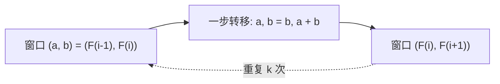

[[TOC]]

## 形式化题目

定义数列

$$F_0 = 0,\qquad F_1 = 1,\qquad F_i = F_{i-1} + F_{i-2}\ (i \geqslant 2),$$

给定 $k$（$1 \leqslant k \leqslant 46$），求 $F_k$。题面从 1 开始计数，第 1、2 项都为 1，
从第 3 项起每项等于前两项之和；这与上面 $F_0 = 0$ 的 0 基定义给出同一串数
$1, 1, 2, 3, 5, 8, \dots$——$k = 1$ 与 $k = 2$ 时 $F_k = 1$。

样例：$k = 19$ 时答案为 $F_{19} = 4181$。

## 正解

### 思路

题面自己就是递推式，所以这题唯一值得讨论的地方是**用哪种方式执行这个递推**。把定义直译成递归：

```python
def fib(k):
    return 1 if k <= 2 else fib(k - 1) + fib(k - 2)
```

它当然能算对，但 `fib(46)` 展开的是一棵深度 46 的二叉递归树：每个子问题都被拆成两个几乎是
原规模的子问题。不同子问题其实只有 46 个（$F_1 \dots F_{46}$），却被重复展开了指数次——
调用次数约 $2F_{47}\approx 6 \times 10^9$，Python 下必然超时。**瓶颈不是加法慢，而是同一子问题
被反复求解**，后面的每一步优化都只是在消除这份重复。

**第一步：让每个 $i$ 只算一次。** 从小到大递推，算过的直接留着用，这就是数组写法
（或给递归加 `@cache` 记忆化）：

```python
f = [0, 1, 1] + [0] * (k - 2)   # k < 2 时尾部为空，f[1]、f[2] 仍是 1
for i in range(3, k + 1):
    f[i] = f[i - 1] + f[i - 2]
print(f[k])
```

复杂度降到 $O(k)$，但空间仍是 $O(k)$。

**第二步：留意哪些值算完就再也用不到。** 递推式只读 `f[i-1]` 与 `f[i-2]`，
所以算出 `f[i]` 之后 `f[i-2]` 永远不会再被访问。既然如此，整张表都可以扔，
只留最近的两个值就够了：让二元组 $(a, b)$ 表示 $(F_{i-1}, F_i)$，一步转移就是

$$T(a,\, b) = (b,\ a + b),$$

即把窗口整体右移一位，最老的那一项被丢弃，新的那一项由两数相加得到。



窗口每右移一位，$a$ 就从 $F_{i-1}$ 变成 $F_i$，$b$ 从 $F_i$ 变成 $F_{i+1}$，所以走 $k$ 步后
窗口是 $(F_k, F_{k+1})$，**首项**就是答案。为让这个"首项"永远正确，种子取 0 基的
$(F_0, F_1) = (0, 1)$，而不是 1 基的 $(1, 1)$——后者需要按 $k$ 决定取哪个分量，容易写错。

一步转移是一个纯粹的"旧状态到新状态"函数，于是"走 $k$ 步"正好是把这个函数在初值上折叠
$k$ 次，即 `functools.reduce` 的语义：

```python
answer, _ = reduce(fib_step, range(k), (0, 1))
```

用样例 $k = 19$ 逐步核对（表里只列到 8 步，此后规律相同）：

| 已走步数 $i$ | 窗口 $(a, b)$ | 含义 | 此刻的 $a$ |
| --- | --- | --- | --- |
| 0 | $(0, 1)$ | $(F_0, F_1)$ | 0 |
| 1 | $(1, 1)$ | $(F_1, F_2)$ | 1 |
| 2 | $(1, 2)$ | $(F_2, F_3)$ | 1 |
| 3 | $(2, 3)$ | $(F_3, F_4)$ | 2 |
| 4 | $(3, 5)$ | $(F_4, F_5)$ | 3 |
| 5 | $(5, 8)$ | $(F_5, F_6)$ | 5 |
| 6 | $(8, 13)$ | $(F_6, F_7)$ | 8 |
| 7 | $(13, 21)$ | $(F_7, F_8)$ | 13 |
| 8 | $(21, 34)$ | $(F_8, F_9)$ | 21 |
| 19 | $(4181, 6765)$ | $(F_{19}, F_{20})$ | **4181** |

最后一行与样例输出 `4181` 一致。正因为起点是 $F_0$，$k = 1$ 与 $k = 2$ 也不需要任何特判：
`range(1)` 走 1 步、`range(2)` 走 2 步，取首项分别得 1 和 1，正合题面。
$F_{46} = 1836311903$ 也在 Python 的任意精度整数里精确表示；题面上界停在 46，
恰好落在 32 位有符号 `int` 能装下的最后一项（下一项 $F_{47} = 2971215073$ 就溢出了）。

### 代码

`fib_step` 是被抽出的唯一函数，职责只有一句："把窗口右移一位"。`reduce` 会把
`(累积值, 当前元素)` 两个参数一起传给回调，而步数下标并不参与计算，所以第二个形参写作
`_step` 占位。

@include-code(./main.py, python)

### 复杂度

- 时间复杂度：$O(k)$。`reduce` 对 `range(k)` 的每个元素调用一次 `fib_step`，共 $k$ 次，
  每次一次整数加法。对照朴素递归的 $O(\varphi^k)$，$k = 46$ 时相差约 8 个数量级。
- 空间复杂度：$O(1)$。全程只有两个整数在滚动，`range(k)` 是惰性区间对象，
  `reduce` 不保存中间结果；对照数组写法的 $O(k)$。

## 总结

本题的算法就是题面给出的递推式，教学价值全在**如何执行**它：直译递归会因重复求解
同一子问题而指数爆炸；从小到大算一遍把时间降到 $O(k)$；再观察到"每个值只被后两项引用"
（无后效性），把表格压缩成两个变量的滚动窗口，空间降到 $O(1)$。最终写法把一步转移写成
纯函数 $T(a, b) = (b, a + b)$，用 `functools.reduce` 把 $k$ 步折叠成一行，
种子取 $(F_0, F_1)$ 使 $k = 1, 2$ 无特判。同样的算法在 C++ 里就是一个
`for (int i = 3; i <= k; ++i) { t = a + b; a = b; b = t; }` 的循环，
注意用 `long long` 以免上界放宽后溢出。
