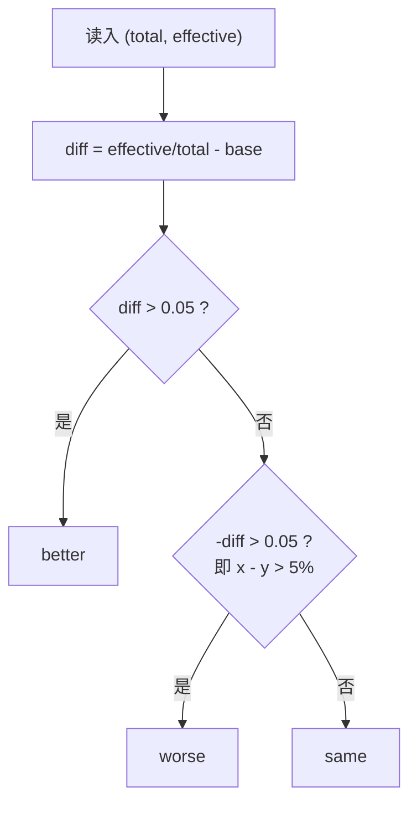

[[TOC]]

## 形式化题目

给定一个基准比率 $x = \dfrac{e_0}{t_0}$（$t_0$ 为总病例数，$e_0$ 为有效病例数）与 $n-1$ 个待判定比率 $y_i = \dfrac{e_i}{t_i}$（$1 < n \leqslant 20$，$t_i \leqslant 10000$），对每个 $y_i$ 输出三档判定之一：

$$
\begin{cases}
y_i - x > 5\% & \Rightarrow \texttt{better} \\
x - y_i > 5\% & \Rightarrow \texttt{worse} \\
\text{其余（} |y_i - x| \leqslant 5\% \text{）} & \Rightarrow \texttt{same}
\end{cases}
$$

样例解释：基准是第一组 $x = \dfrac{99}{125} = 0.792$，四个改进疗法逐组判定如下。

| 组 | 总病例 $t_i$ | 有效 $e_i$ | 有效率 $y_i$ | $y_i - x$ | 判定 |
| --- | --- | --- | --- | --- | --- |
| 基准 | $125$ | $99$ | $0.792$ | — | — |
| $1$ | $112$ | $89$ | $0.7946\ldots$ | $\approx +0.0026$ | `same` |
| $2$ | $145$ | $99$ | $0.6828\ldots$ | $\approx -0.1092$ | `worse` |
| $3$ | $99$ | $97$ | $0.9798\ldots$ | $\approx +0.1878$ | `better` |
| $4$ | $123$ | $98$ | $0.7967\ldots$ | $\approx +0.0047$ | `same` |

表里三、四列的差都远离 $\pm 0.05$，两组 `same` 的差不足 $0.5\%$，`worse` 与 `better` 的差超过 $10\%$，三档边界一目了然。

## 正解

### 思路

本题没有可以优化的结构，解法就是把题面直译成代码，但有两个高危细节决定了能不能一次写对。

**第一处：比率是"有效除以总"，分子分母不能颠倒。** 每行先给总病例数、再给有效病例数，而比率是 $y = \dfrac{\text{有效}}{\text{总}}$，读入顺序与分子分母正好相反。为了不给自己埋雷，循环体里先把两个数命名成 `total, effective` 再做除法，让顺序写在变量名里。作者调试时就把除法写反过一次，10 组数据全军覆没——这是本题最常见的错法，值得单独强调。

**第二处："大于 5%"是严格不等号。** $y - x = 0.05$ 恰好成立时输出的是 `same` 而不是 `better`，所以判定必须用 `>` 而不是 `>=`。三档分类用一个 `judge` 函数收口：先查 `diff > 0.05` 得 `better`，再查 `-diff > 0.05`（即 $x - y > 5\%$，复用同一个减法结果，不必再算一遍反向差）得 `worse`，剩下的必然 $|y - x| \leqslant 0.05$，默认返回 `same`。两段严格比较加一个默认档，恰好覆盖全集，不会漏也不会重。

判定流程如下：

流程图把"两个严格比较 + 一个默认档"的判定顺序固定下来：先判 `better` 再判 `worse`，落空的一律是 `same`，不需要第三个条件。

还有一个值得说破的细节：浮点比较在数学差恰好 $0.05$ 时理论上可能翻转（$0.95 - 0.90$ 在二进制浮点里并不精确等于 $0.05$）。本题官方数据不含这种临界构造，`float` 直译可通过全部测试；若想彻底免疫，可以把比较整数化——$y - x > 0.05$ 两边同乘 $20\,t_0\,t > 0$，等价于整数不等式 $20(e\,t_0 - e_0\,t) > t_0\,t$，本题范围内乘积远小于 $2^{53}$，精确无舍入。

### 代码

@include-code(./main.py, python)

### 复杂度

- 时间复杂度：$O(n)$，读入 $2n$ 个整数、做 $n - 1$ 次除法与比较；$n \leqslant 20$，远低于限制。
- 空间复杂度：$O(n)$，保存读入 token 与输出串。

## 总结

本题知识点只有三条：

- **比率的分子分母要对清楚。** 输入是"总在前、有效在后"，比率是"有效除以总"，先命名再除法是最便宜的防错手段。
- **"大于 5%"用严格不等号。** 恰好 $5\%$ 属于 `same`；三档判定用"两段严格比较 + 默认档"收口，天然覆盖全集。
- **浮点临界差要心里有数。** 差恰为 $0.05$ 时浮点可能不精确，稳妥做法是交叉相乘化成整数比较。

题面来自一本通在线评测，是比率比较的入门练习：算法上无事可做，写对的关键全在边界与细节。
