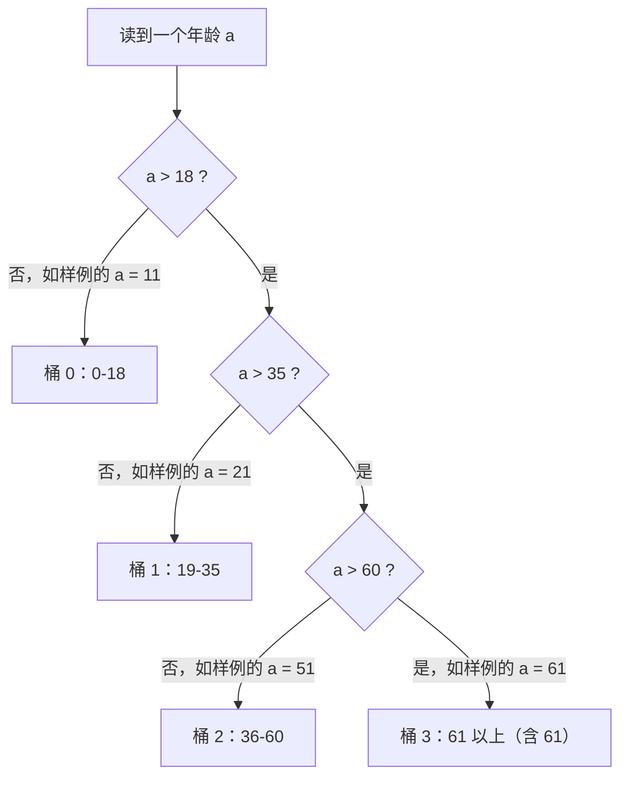

[[TOC]]

## 形式化题目

给定 $n$ 个整数（病人年龄，$0 < n \leqslant 100$），把整数轴用三个右端点 $18$、$35$、$60$ 切成四段：$[0,18]$、$[19,35]$、$[36,60]$、$[61,\infty)$。要求统计每个年龄所属段的计数 $\text{cnt}_0 \sim \text{cnt}_3$（四段互不相交且覆盖全体，计数之和恰为 $n$），对每段输出

$$
\frac{\text{cnt}_i \times 100}{n}
$$

保留两位小数、后缀 `%`，共 4 行。

样例中 $n = 10$，四个桶计数为 $2, 2, 2, 4$，输出 `20.00%`、`20.00%`、`20.00%`、`40.00%`。

## 正解

### 思路

朴素做法一眼可见：对每个年龄写一串互斥分支（`a <= 18` 进桶 0、`a <= 35` 进桶 1、`a <= 60` 进桶 2、否则进桶 3），四个计数器各自累加，最后逐桶输出百分比。$O(n)$ 完全正确，没有任何复杂度瓶颈可优化——真正值得压缩的是**表达形式**。

观察这四个条件：它们是同一条比较链在三个右端点处的截断，唯一由年龄 $a$ 决定。于是"落在第几桶"恰好等于"**严格大于几个右端点**"：

$$
f(a) = \#\{\,b \in \{18, 35, 60\} : a > b\,\}
$$

一个年龄如何顺着这条单调比较链定桶，用样例中的四个代表年龄走一遍：



从上往下每多回答一个“是”，桶编号就多 1；链上的比较顺序就是右端点从小到大，所以越过的右端点个数就是桶编号。用题面样例 `1 11 21 31 41 51 61 71 81 91` 走一遍：11 停在第一问（桶 0），21、31 越过 18（桶 1），41、51 越过 35（桶 2），61、71、81、91 越过 60（桶 3），四个桶计数 $2,2,2,4$，正是样例输出的四行百分比。三个易错边界都在图里：18 本身归桶 0（`18 > 18` 为假）、61 归桶 3（`61 > 60` 为真，题面“含 61”）。

落到代码上，把这条链写成**数据**而不是**控制流**：右端点收进模块级常量 `BOUNDS = [18, 35, 60]`，定桶函数压缩成一个生成器求和——`sum(age > bound for bound in BOUNDS)`。它与 if-else 链比较语义完全相同（`age > 18` 即 `not age <= 18`），但 18/35/60 三个边界数字只出现一处，题面分段规则变了也只改一个常量。

计数之后是输出。每桶要"乘 100、除 $n$、保留两位小数、加 `%`"，四行共享同一个模式，用一行推导式收尾：

```python
f'{count * 100 / n:.2f}%'
```

`:.2f` 的四舍五入与 C++ 的 `setprecision(2)` 行为一致（10 组真实数据里 24.39%、41.46% 这类非整百分比逐字节吻合）。分母 $n$ 由题面保证 $> 0$，不存在除零。

### 代码

@include-code(./main.py, python)

### 复杂度

- 时间复杂度：$O(n)$——读入 $n$ 个年龄，每个做 3 次比较定桶，输出 4 行；$n \leqslant 100$，实测约 0.02 s/组（限制 1000 ms）。
- 空间复杂度：$O(n)$——读入的 token 流；计数数组恒为 4。峰值内存约 14.6 MB（限制 128 MB）。

## 总结

- 四桶分段计数的本质是三个右端点 $18/35/60$ 上的单调比较链，"桶编号 = 越过的右端点个数"，`sum` 生成器一个表达式替代整条 if-else。
- 边界都由严格大于 `>` 统一表达：18/35/60 归较低桶，61 归第四桶。
- 输出格式一个 f-string 搞定"百分比 + 两位小数 + `%`"，舍入行为与 C++ `setprecision(2)` 一致。
- 验证：真实测试数据 10/10 全部 PASS（约 0.02 s/组，远低于 1000 ms 限时）。
