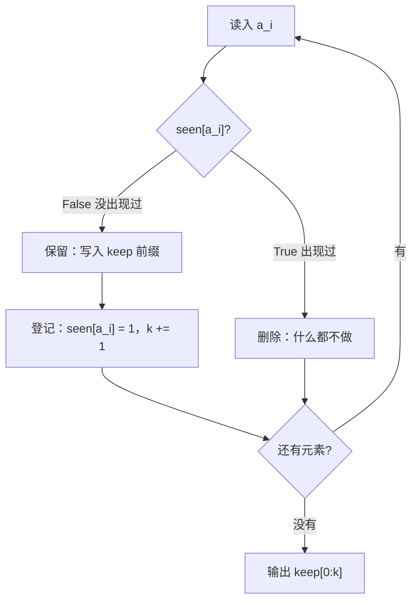

[[TOC]]

## 形式化题目

给定长度为 $n$ 的整数序列 $a_1, a_2, \ldots, a_n$，其中每个元素满足 $10 \leqslant a_i \leqslant 5000$。
要求构造输出序列 $b$：

$$b = \langle a_{i_1}, a_{i_2}, \ldots, a_{i_k} \rangle, \qquad i_1 < i_2 < \cdots < i_k,$$

其中下标集合 $\{i_1, \ldots, i_k\}$ 恰好是**首次出现**位置的全体，即 $i \in \{i_1, \ldots, i_k\}$
当且仅当 $a_i \notin \{a_1, a_2, \ldots, a_{i-1}\}$。

换句话说：对每个不同的值，只保留它最靠左的那一次出现，其余全部删除；
输出的先后顺序必须与这些首次出现位置在原序列中的先后一致。称这种操作是**稳定去重**。

以题面样例 `10 12 93 12 75` 为例，逐元素判定过程如下。「已出现?」一列是查表得到的结果
（读入 $a_i$ **之前** `seen` 中的值），`keep` 是保留下来的序列：

| $i$ | $a_i$ | 已出现? | 动作 | `keep` |
| :-: | :-: | :-: | --- | --- |
| 1 | 10 | 否 | 保留并登记 | `10` |
| 2 | 12 | 否 | 保留并登记 | `10 12` |
| 3 | 93 | 否 | 保留并登记 | `10 12 93` |
| 4 | 12 | **是** | 删除 | `10 12 93` |
| 5 | 75 | 否 | 保留并登记 | `10 12 93 75` |

观察重点：第 4 个元素 $12$ 在第 2 位已经出现过，所以它被删除，而第 2 位那个 $12$ 保留；
输出 `10 12 93 75` 中 `12` 的位置，正是它**第一次**出现的位置。
可见每个位置只需要问一次「这个值以前出现过吗」，整道题就是这个判断的重复执行。

## 正解

### 思路

先看最朴素的写法——完全照抄定义，对每个位置回头检查后面有没有相同的数：

```python
b = [True] * (n + 1)              # b[i] 表示 a[i] 要不要输出
for i in range(1, n + 1):
    if b[i]:                      # a[i] 没被标成重复，说明它是首次出现
        for j in range(i + 1, n + 1):
            if a[i] == a[j]:
                b[j] = False      # 后面所有和 a[i] 相同的都标成删除
```

内层只有对「首次出现」的位置 $i$ 才会真正执行完整的一轮扫描（已被标记为重复的 $i$
会被 `if b[i]` 挡掉），于是代价为

$$\sum_{i \in F}(n - i), \qquad F = \{\, i \mid a_i \text{ 是首次出现} \,\}.$$

**这里有个容易算错的地方。** 若忽略值域约束，会以为最坏是「$n = 20000$ 且全部互不相同」，
从而得到 $\frac{n(n-1)}{2} \approx 2 \times 10^8$。但题面钉死了 $10 \leqslant a_i \leqslant 5000$，
不同值的个数 $|F| = k$ 最多只有 $V = 4991$ 个，所以「$n$ 个元素全部互不相同」根本不可能发生。
在 $|F| \leqslant V$ 的约束下，$\sum_{i \in F}(n-i)$ 在 $F = \{1, 2, \ldots, 4991\}$ 时取到最大：

$$\sum_{i=1}^{4991}(20000 - i) = 4991 \times 20000 - \frac{4991 \times 4992}{2}
= 99\,820\,000 - 12\,457\,536 = 87\,362\,464 \approx 8.74 \times 10^7 .$$

也就是说，**真实最坏是 $8.74 \times 10^7$ 而不是 $2 \times 10^8$**（后者永远达不到）。
把它拆开看更清楚：取 $F = \{1, 2, \ldots, 4991\}$，即前 4991 个位置放互不相同的值、
其余位置全是重复值，此时

- 前 4991 个位置两两之间的比较贡献 $\binom{4991}{2} = 12\,452\,545$ 次；
- 后面 $20000 - 4991 = 15009$ 个重复元素各被这 4991 个首次出现值回扫一遍，
  贡献 $15009 \times 4991 = 74\,909\,919$ 次。

两者相加正是 $87\,362\,464$。可见真正的大头不是前半段的互不相同的元素，
而是后半段那 $15009$ 个重复元素——**重复得越多，朴素做法反而越慢**。

**瓶颈在哪**：同一个事实「某个值出现过没有」被**反复重新发现**。
$a_i$ 和 $a_j$ 比过一次之后，这个信息就被丢掉了，等遇到下一个相同的值又得从头比一遍。
而「$a_i$ 是否重复」其实只取决于 $a_i$ 这个**值**以前有没有出现过——
它和 $a_i$ 的具体下标、和后面还有多少元素都无关。

于是把结论存下来：维护一个查询结构 `seen`，从左到右扫一遍，
遇到没见过的值就保留并登记，见过就丢掉。整个算法只有一次查表和两种结局：



对照之下，内层那个 $O(n)$ 的回扫被一次 $O(1)$ 的数组访问替换：

| | 朴素写法 | 本解 |
| --- | --- | --- |
| 回答「值 $x$ 出现过吗」 | 回扫 $a_1..a_{i-1}$ 逐个 `==` 比较，$O(n)$ | 直接读 `seen[x]`，$O(1)$ |
| 同一个值的重复出现 | 每次都要重新比一遍 | 只问一次，答案永久保存 |
| 总时间 | $O(nk)$，最坏约 $8.74\times10^7$ 次比较 | $O(n + V)$，最坏约 $2.5\times10^4$ 次操作 |

那么 `seen` 该用什么？题面给出的**关键约束**是 $10 \leqslant a_i \leqslant 5000$。
值域上界只有 $5000$，比 $n$ 的上界 $20000$ 还小。既然每个元素都能当合法下标，
**布尔表（桶标记）就比哈希表更直接**：`seen[x]` 是一次数组随机访问，
没有哈希函数、没有冲突链、没有扩容，最坏也是 $O(1)$。
这张表按**值**索引而不是按位置索引，样例扫描过程中的快照是：

| `seen` 下标（= 值） | 10 | 11 | 12 | 13 | … | 74 | 75 | 76 | … | 93 | 94 | … | 5000 |
| :-: | :-: | :-: | :-: | :-: | :-: | :-: | :-: | :-: | :-: | :-: | :-: | :-: | :-: |
| 扫描前 | F | F | F | F | … | F | F | F | … | F | F | … | F |
| 读到 `93` 后 | **T** | F | **T** | F | … | F | F | F | … | **T** | F | … | F |
| 读到 `75` 后 | T | F | T | F | … | F | **T** | F | … | T | F | … | F |

（`T`/`F` 即 `1`/`0`；样例只触及 4 个下标，其余位置始终保持 `F`。）
注意第 4 个元素是 `12`，查表发现下标 12 处已经是 `T`，于是被删除——
这正是流程图中「`True` → 删除」那条分支。

最后是**保序**问题：扫描顺序就是原序列顺序，新值向右追加进 `keep`，
所以输出天然保持首次出现的先后次序，不需要任何额外排序。
代码里把这个「追加」写成了**紧凑前缀**：`keep[k]` 存第 $k$ 个首次出现的值，用计数器 `k`
指向下一个空位。这样 `keep` 的 `[0, k)` 段恰好就是按首次出现顺序排列的答案，
既保序又可以直接 `b' '.join(keep[:k])` 一次性输出。
这也是为什么不能图省事写 `set(seq)`——那样输出集合虽然正确，顺序却由哈希决定，
而本题的语义恰恰要求保留这个顺序。

正文概念与代码的对应关系：

| 正文概念 | `main.py` 中的实现 |
| --- | --- |
| 按值索引的登记表 `seen` | `seen = bytearray(LIMIT)` + `seen[x]` |
| 「$x$ 首次出现」 | `if not seen[x]` |
| 登记「$x$ 已出现」 | `seen[x] = 1` |
| 保序保留（紧凑前缀） | `keep[k] = token` 后 `k += 1` |
| 稳定去重结果 | `b' '.join(keep[:k])` |

**这里有个必须踩清楚的坑。** 布尔表的长度必须 $\geqslant 5001$，
因为下标是用元素值本身，而 $a_i = 5000$ 是合法输入。若写成 `bytearray(5000)`，
下标 `5000` 会直接抛 `IndexError: bytearray index out of range`。
这不是杞人忧天——本题官方 10 组数据里，第 2、6、7、8、9、10 组都真的出现了 `5000`，
端点确实会被踩到。

### 代码

@include-code(./main.py, python)

### 复杂度

设序列长度为 $n$，值域大小为 $V = 5000 - 10 + 1 = 4991$。

- **时间复杂度**：$O(n + V)$。读入与切分 $O(n)$；主循环对每个元素做一次查表与至多一次赋值，
  共 $O(n)$；布尔表初始化 $O(V)$。由于 $V$ 是常数、$n \leqslant 20000$，实际就是 $O(n)$，
  最坏约 $2 \times 10^4 + 5 \times 10^3$ 次基本操作。
  相比朴素写法的最坏 $8.74\times10^7$ 次比较（注意这是在值域约束下能达到的真实上界，
  见上文推导），二者相差约 **3.5 个数量级**。
  又因为读入与输出本身就需要 $\Omega(n)$，所以 $O(n)$ 已是本题的最优量级。
- **空间复杂度**：$O(n + V)$。`seen` 占 $O(V)$（5001 字节），`keep` 固定占 $O(V)$
  （5001 个槽位），`tokens` 占 $O(n)$（全部输入 token）。
  除输入之外只多出 `seen` 与 `keep` 这两张 $O(V)$ 的固定表。
  实测 10 组数据峰值内存 14.6–16.0 MB，远低于 128 MB 限制。

## 总结

- 去重的语义是「对每个不同的值只保留它**最靠左**的一次出现」，输出顺序必须与这些位置的
  原序列顺序一致——这是**稳定**去重，不能用 `set` 或排序代替。
- 每个位置只有一次判断：**这个值以前出现过吗**。朴素写法每次回扫 $O(n)$；
  把答案记进表里，每个值就只问一次。
- 题面给出的 $10 \leqslant a_i \leqslant 5000$ 是优化的支点：值域只有 4991，
  可以直接用值当下标开布尔表，查询 $O(1)$，比哈希表更直接。
- **估算最坏代价时必须带上值域约束**。$|F| \leqslant 4991$ 使得朴素做法最坏只有
  $8.74 \times 10^7$ 次比较，而非「全部互不相同」导出的 $2\times10^8$——
  后者在本题约束下不可能出现。
- 布尔表长度必须 $\geqslant 5001$。官方数据确实会出现值 `5000`，
  开成 `bytearray(5000)` 会越界崩溃。
- 天然保序：用计数器 `k` 把保留值写成紧凑前缀，扫描结束即得答案，无需任何排序。
- 官方 10 组真实数据全部 PASS（单点 0.018–0.022 s、峰值 14.6–16.0 MB，
  限时 1000 ms / 128 MB）；$n = 20000$、值在 $[10, 5000]$ 内循环取遍的最坏构造用例
  输出 4991 个 token，约 0.021 s。
  按任务要求本题不写 `brute.cpp`、不写 `gen.py`、不做对拍，验证以官方数据
  与手工边界（$n=1$、全部相同、全部不同、值域端点 10 与 5000、交替重复）为准。
