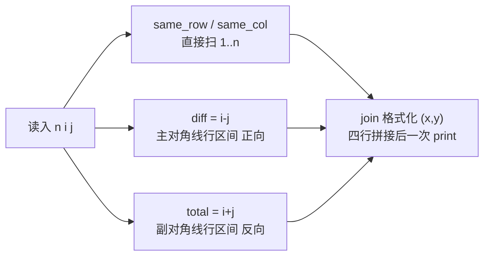

[[TOC]]

## 形式化题目

在 $N \times N$ 的棋盘（行列均从 1 编号）上给定一个格子 $(i, j)$。要求按题面规定的四个方向，分别输出与它同行、同列、同主对角线（左上到右下）、同副对角线（左下到右上）的全部格子坐标，每个坐标写成 `(x,y)`，同一行内相邻坐标用单个空格隔开。$(i, j)$ 同时属于这四个集合，因此会在四行中各出现一次。

以样例 $N = 4,\ i = 2,\ j = 3$ 为例，四条线在棋盘上的走向如下表，○ 为行、● 为列、■ 为主对角线、◆ 为副对角线，★ 为给定格子 $(2,3)$：

| 行\列 | 1 | 2 | 3 | 4 |
| --- | --- | --- | --- | --- |
| 1 | | ■ | ● | ◆ |
| 2 | ○ | ○ | ★ | ○ |
| 3 | | ◆ | ● | ■ |
| 4 | ◆ | | ● | |

对应的四行输出分别是：行 `(2,1) (2,2) (2,3) (2,4)`（○ 从左到右）、列 `(1,3) (2,3) (3,3) (4,3)`（● 从上到下）、主对角线 `(1,2) (2,3) (3,4)`（■ 只有三格，被右上边界截断）、副对角线 `(4,1) (3,2) (2,3) (1,4)`（◆ 从左下往右上）。★ 同时属于四条线，所以 `(2,3)` 在四行里各出现一次；两条对角线各只有三格，体现了不变量相同但被棋盘边界截短的性质。

四条线可以用四个不变量统一刻画：行上 $r \equiv i$，列上 $c \equiv j$，主对角线上 $r - c \equiv i - j$，副对角线上 $r + c \equiv i + j$。对角线与棋盘边界相交会被截短，所以真正要算的是每条对角线在棋盘内的行号区间。

## 正解

### 思路

$N \leqslant 10$ 时，"把四条线上的格子都枚举出来"本身就是 $O(N)$ 的最终做法，不存在需要单独教学的暴力层，因此按直接正解型组织（过程文档 `problem-analysis-workspace/03-solution-derivation.md` 记录了判定理由）。

关键观察是把"找线"变成"算区间"。设 $d = i - j$（主对角线不变量）、$s = i + j$（副对角线不变量）：

- **行与列**没有越界问题：行直接扫 $c = 1 \dots N$，列直接扫 $r = 1 \dots N$。
- **主对角线**上列号由行号决定：$c = r - d$。要求 $1 \leqslant c \leqslant N$，即 $1+d \leqslant r \leqslant N+d$，与 $1 \leqslant r \leqslant N$ 取交得到行区间
  $$r \in [\max(1,\, 1+d),\ \min(N,\, N+d)]$$
  行号从小到大遍历，$c = r - d$ 随之递增，正好是从左上到右下。
- **副对角线**上 $c = s - r$，同理解出行区间
  $$r \in [\max(1,\, s-N),\ \min(N,\, s-1)]$$
  这次把行号**从大到小**遍历，列号从小到大，正好是从左下到右上——方向问题被 `range` 的正负步长顺带解决，不需要任何转向逻辑。

端点公式里 $r = i$ 必然落在区间内（因为 $1 \leqslant i \leqslant N$ 且对应的 $c = j$ 合法），所以给定格子不会被裁掉。$N=1$、角上、边上等退化情况端点公式同样成立，无需特判。

四条线最终都归结为"坐标列表 → 一行字符串"，所以用同一个生成器加 `'\n'.join` 一次输出：

### 代码

@include-code(./main.py, python)

### 复杂度

- 时间复杂度：$O(N)$，四条线各枚举至多 $N$ 个格子，共输出 $O(N)$ 个坐标，每个坐标 $O(\log N)$ 字符。$N \leqslant 10$，实际瞬间完成。
- 空间复杂度：$O(N)$，四个坐标列表各存至多 $N$ 个二元组。

## 总结

这道题的模型是"直线上的格子 = 不变量 + 边界裁剪"：行、列、主对角线（行减列）、副对角线（行加列）各有一个守恒量，对角线的端点由 `max`/`min` 与棋盘范围取交一次算出，输出方向由 `range` 的步长正负决定，越界和转向都不需要循环内判断。整个解法四条推导式加一次格式化输出，复杂度 $O(N)$；实测 10 组真实数据全部一致，0.019 s、峰值约 14.7 MB，相对 1000 ms / 128 MB 的限制毫无压力。
