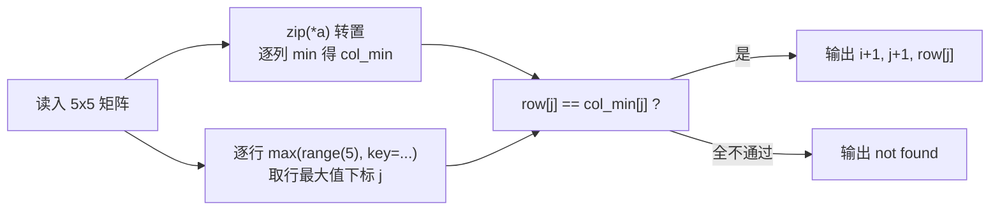

[[TOC]]

## 形式化题目

给定一个 $5 \times 5$ 的整数矩阵 $a$（行列均从 1 编号），题目保证**每行只有一个最大值、每列只有一个最小值**。求一个位置 $(i, j)$，使得

$$a_{i,j} = \max_{1 \leqslant c \leqslant 5} a_{i,c} \quad \text{且} \quad a_{i,j} = \min_{1 \leqslant r \leqslant 5} a_{r,j}$$

即该元素既是所在行的最大值，又是所在列的最小值（称为鞍点）。存在则输出行号、列号和值；不存在则输出 `not found`。

以题面样例为例，下表中 ★ 标出每行唯一最大值的位置（候选），○ 标出每列唯一最小值的位置：

| 行\列 | 1 | 2 | 3 | 4 | 5 |
| --- | --- | --- | --- | --- | --- |
| 1 | ★ | ○ | | ○ | |
| 2 | ★ | | | | |
| 3 | | | | | ★ |
| 4 | ★○ | | ○ | | ○ |
| 5 | | | | | ★ |

第 4 行的唯一最大值是 8（位置 $(4,1)$），而第 1 列的唯一最小值恰好也是 8——两个标记落在同一格，所以 $(4,1)$ 是鞍点，输出 `4 1 8`。其余四个 ★ 都不与任何 ○ 重合：第 1 列的另外两个 ★（第 1、2 行）遇到的是列最小值 8 所在的第 4 行，而第 5 列的两个 ★（第 3、5 行）遇到的是列最小值 2 所在的第 4 行。这张表也说明了为什么候选只有 5 个：鞍点必然是所在行的最大值，而每行的最大值位置唯一，逐行各取一个候选再验证列最小性即可，不必检查全部 25 个格子。

## 正解

### 思路

矩阵固定 $5 \times 5$，"逐格检查"和"逐行取候选"都只差常数，因此不存在需要单独教学的暴力层，按直接正解型组织（判定理由见 `problem-analysis-workspace/03-solution-derivation.md`）。

朴素的双重枚举有一个逻辑冗余：同一行会被重复检查 5 次，而每行只有一个位置可能满足行最大条件。利用题目给的两个唯一性保证，可以把检查压缩成一条流水线：

1. **预计算列最小值**：转置矩阵（`zip(*a)`）后对每列取 `min`，得到 `col_min`，之后的"列最小验证"变成一次查表。
2. **逐行取唯一候选**：`max(range(5), key=lambda j: row[j])` 求的是行最大值的**下标**（鞍点需要列号，所以取下标而不是值）。唯一性保证这个位置就是该行唯一可能的鞍点位置。
3. **验证**：候选 $(i, j)$ 通过当且仅当 `row[j] == col_min[j]`，即行最大值恰好也是列最小值。

正确性双向成立：任何鞍点必然是其所在行的最大值，故必然作为候选被生成（不漏）；非候选位置不是行最大值，直接不满足定义（不多）。流水线整体如下：

三个步骤全部压进一个生成器表达式：`for j in [...]` 用单元素列表把 `max` 的结果绑定进生成器作用域，`if` 过滤出通过验证的 `(行, 列, 值)` 元组，最后 `next(gen, None)` 取第一个匹配、找不到时得 `None`，由条件表达式决定输出鞍点还是 `not found`。

### 代码

@include-code(./main.py, python)

### 复杂度

- 时间复杂度：$O(R \times C)$（本题即 $O(25)$）：读入 25 个元素，列最小值 25 次比较，每行一次 `max` 共 20 次比较，验证 $O(1)$。与读入同阶，已是这类问题的下界阶。
- 空间复杂度：$O(R \times C)$：矩阵本身加 5 个列最小值，共 30 个整数。

## 总结

这道题的核心是"用题目给的唯一性保证收缩候选集"：每行只有一个最大值，让 25 个格子收缩成 5 个候选；每列只有一个最小值，让验证可以放心地用预计算的列最小值查表完成。剩下的部分交给 Python 的表达式能力——`max(range(5), key=...)` 同时给出下标、单元素列表绑定把计算塞进生成器、`next(..., None)` 把"找不到"变成普通分支。整个解法没有显式循环体，复杂度 $O(R \times C)$；实测 10 组真实数据全部一致，约 0.019 s、峰值约 14.6 MB，相对 1000 ms / 128 MB 的限制毫无压力。
