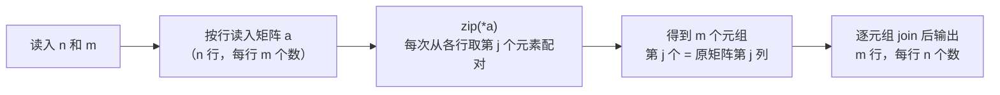

[[TOC]]

## 形式化题目

给定一个 $n \times m$ 的整数矩阵 $A$（行列均从 1 编号），求它的**转置** $A^T$：一个 $m \times n$ 的矩阵，满足

$$A^T[j][i] = A[i][j]$$

即输出的第 $j$ 行恰好是原矩阵的第 $j$ 列。输出从 $n$ 行 $m$ 列变成 $m$ 行 $n$ 列。

以题面样例（$3 \times 3$ 方阵）为例，原矩阵与转置的对应关系如下——左表用颜色标出第 1、2、3 列，右表可以看到这三列分别变成了输出的三行：

| 原矩阵 $A$ | | 转置 $A^T$ | | |
| --- | --- | --- | --- | --- |
| 1 2 3 | | 1 | 4 | 7 |
| 4 5 6 | $\Longrightarrow$ | 2 | 5 | 8 |
| 7 8 9 | | 3 | 6 | 9 |

观察重点：沿主对角线（$1, 5, 9$）翻折后，红色的第 2 列 $(2, 5, 8)$ 变成了输出的第 2 行，蓝色的第 3 列 $(3, 6, 9)$ 变成了输出的第 3 行。方阵看起来像"翻折"，但 $n \neq m$ 的矩形（如 $94 \times 28$ 的输入）没有对角线可翻，必须老老实实按"输出第 $j$ 行 = 原第 $j$ 列"重排。

## 正解

### 思路

转置是纯下标重排，不含任何计算。按定义写就是显式双重循环：外层枚举输出行 $j$（共 $m$ 个），内层枚举 $i$（共 $n$ 个），逐个搬运 `at[j][i] = a[i][j]`，$O(n \times m)$。读入本身就要 $O(n \times m)$，所以这个阶已是下界，**没有可优化的复杂度，只有可压缩的代码**。

关键一步是识别出 Python 内置 `zip` 的语义恰好就是这个搬运循环：`zip(*a)` 把 $n$ 行作为参数展开传给 `zip`，`zip` 每次从每行各取一个元素配成元组；第 $j$ 次产出的元组就是

$$\bigl(A[0][j],\; A[1][j],\; \dots,\; A[n-1][j]\bigr)$$

——所有行的第 $j$ 个元素，即原矩阵的第 $j$ 列，也正是输出的第 $j$ 行。朴素循环的内层被一个 C 实现的内置函数整体替代：

读入按行进行：先读第一行得到 $n, m$，再用一层列表推导读入 $n$ 个数据行，与题面"每行 $m$ 个数"的结构一一对应。输出时每个结果行用 `' '.join(map(str, row))` 拼接，行间再 `'\n'.join`，一次写出。

两个实现细节：`zip` 在长度不齐时按最短截断，这里每行恰好 $m$ 个数，配对次数正好是 $m$，不会截断；`*a` 的参数展开最多 100 行，没有栈深度风险。

### 代码

@include-code(./main.py, python)

### 复杂度

- 时间复杂度：$O(n \times m)$：读入 $nm$ 个数、`zip` 配对 $nm$ 次、输出 $nm$ 个数，与输入规模同阶，是本题的下界阶。
- 空间复杂度：$O(n \times m)$：矩阵必须完整保存——输出的每一行都含有第 1 行的元素，第 1 行的数据要等最后一行读完才可能输出，无法边读边写省掉整个矩阵。

## 总结

这道题的核心是认识"转置 = 按位置配对"：`zip(*a)` 第 $j$ 次从每行各取第 $j$ 个元素，组成的元组恰好就是原矩阵的第 $j$ 列，于是 $O(nm)$ 的双重搬运循环被压成一行内置调用。要注意 $n$ 和 $m$ 可以不等，输出形状由 `zip` 的配对次数（列数 $m$）和元组长度（行数 $n$）自然决定，不需要手工翻转。实测 10 组真实数据（含 $94 \times 28$、$3 \times 31$ 等矩形）全部一致，约 0.019 s、峰值约 15 MB，相对 1000 ms / 128 MB 的限制毫无压力；同样的算法在 C++ 里就是标准的双重循环 `for j { for i { print a[i][j]; } }`。
