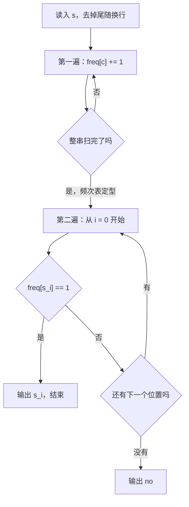

[[TOC]]

## 形式化题目

给定长度为 $n$ 的小写字母串 $s = s_0 s_1 \cdots s_{n-1}$，记 $f(c)$ 为字符 $c$ 在 $s$ 中出现的次数。
求最小的下标 $i^*$ 使 $f(s_{i^*}) = 1$，输出字符 $s_{i^*}$；若这样的下标不存在，输出 `no`。

「第一个」指的是**位置最靠左**，不是字母表序最靠前。

以样例 `abcabd` 为例，四个字符的频次与位置判定如下：

| 位置 $i$ | 0 | 1 | 2 | 3 | 4 | 5 |
| :-: | :-: | :-: | :-: | :-: | :-: | :-: |
| 字符 $s_i$ | `a` | `b` | `c` | `a` | `b` | `d` |
| 频次 $f(s_i)$ | 2 | 2 | **1** | 2 | 2 | 1 |
| 是否为答案 | 否 | 否 | **是** | 否 | 否 | 否 |

观察重点：频次为 1 的字符有两个——位置 2 的 `c` 和位置 5 的 `d`，
按位置序最早的是 `c`，所以答案是 `c` 而不是 `d`。
这提示「频次」与「谁在最左边」是两件独立的事，需要分别处理。

## 正解

### 思路

先看最朴素的写法——完全照抄定义，对每个位置回头数一遍它出现了几次：

```python
for c in s:
    if sum(1 for x in s if x == c) == 1:   # 每个位置都要把整串重新数一遍
        print(c); break
else:
    print("no")
```

对每个位置都要扫一遍整串，代价

$$\sum_{i=0}^{n-1} n = n^2.$$

长度上限 $n < 10^{5}$，最坏约 $10^{10}$ 次字符比较，远超 1000 ms 能承受的量级。

**瓶颈在哪**：设字符 $c$ 在串中出现 $k$ 次，上面这段代码就替 $c$ 数了 $k$ 遍频次，
而每一遍都要扫完整串。可是 $f(c)$ 是一个**只取决于字符本身、与位置无关**的定值——
数一次就够了。重复计算，就是平方复杂度的来源。

于是把答案存下来：**第一遍只负责统计**，为每个字符记下它的总频次；
**第二遍只负责判定**，拿着已经定型的表按原串顺序找第一个频次为 1 的字符。

| | 朴素写法 | 本解 |
| --- | --- | --- |
| 字符 $c$ 的频次被计算几次 | $k$ 次（$k$ 为出现次数），每次 $O(n)$ | 恰好 1 次 |
| 回答「$f(s_i)$ 是几」 | 现场回扫，$O(n)$ | 查表 `freq[s_i]`，$O(1)$ |
| 总时间 | $\Theta(n^2)$，最坏约 $10^{10}$ 次比较 | $O(n)$，最坏约 $3 \times 10^5$ 次操作 |

**这里有个必须先想清楚的问题：为什么不能一边扫一边判断？**
因为答案要求的是「频次为 1」，而扫描到位置 $i$ 时，后面还可能再出现 $s_i$，
此刻 `freq[s_i]` 的数值还不确定。反例 `aab`：读到第一个 `a` 时 `freq['a'] == 1`，
若此时就下结论会错误输出 `a`，而正确答案是 `b`（前两个位置的字符频次都是 2）。
**表必须在整串读完、频次定型之后，才能用来下判断**，两遍扫描的顺序不可交换。

两遍扫描的状态机如下：



**第二遍为什么必须按原串顺序走？** 因为频次表是按**值**索引的，它丢掉了顺序信息。
它只能回答「这个字符总共出现了几次」，不能回答「谁在最左边」。
所以判定这一步要在**位置坐标**上重新走一遍原串：

| 第二遍的位置 $i$ | 0 | 1 | 2 | 3 | 4 | 5 |
| :-: | :-: | :-: | :-: | :-: | :-: | :-: |
| 字符 $s_i$ | `a` | `b` | `c` | `a` | `b` | `d` |
| 查表 `freq[s_i]` | 2 | 2 | 1 | 2 | 2 | 1 |
| 判定 | 否 | 否 | **命中，输出 `c`** | — | — | — |

命中位置 2 之后立即停止，后面的 `d` 虽然频次也是 1，但已经不是「第一个」了。

同样地，也不能拿 `set(s)` 或按字母表序去挑：
两者都是「按值序」而非「按位置序」。
反例 `ba`（正确答案 `b`，按值序会得到 `a`）和 `zab`（正确答案 `z`）都能区分这两种做法。

最后是把两遍扫描写成代码。它们的索引维度不同——
第一遍按**位置**累加、第二遍按**位置**查**值**索引的表——这个「两套坐标系的对接」
正是本题唯一需要想清楚的地方，落到 Python 里就是三行：

| 正文概念 | `main.py` 中的实现 |
| --- | --- |
| 第一遍扫描：统计频次 | `freq = Counter(s)` |
| 频次表按值索引、$O(1)$ 查询 | `freq[c]`（`c` 是 0..255 的字节编码） |
| 第二遍扫描：按位置序找第一个 | `for c in s if freq[c] == 1` |
| 「找到就输出」 | `next(...)` 取生成器的第一个产出 |
| 「找不到输出 `no`」 | `next(..., "no")` 的默认值参数 |
| 编码还原成字符 | `chr(c)` |
| 用字节迭代避免逐字符解码 | `sys.stdin.buffer.read()` |

`next(gen, default)` 就是 `for / break / else` 的表达式写法：
生成器按原串顺序产出频次为 1 的字符，`next` 取第一个（因而必然是位置最靠左的那个），
默认值对应「遍历耗尽」即无解的分支。

还有一个容易踩的细节：输入末尾有换行符。若直接迭代 `sys.stdin.buffer.read()` 的结果，
`\n` 也会被统计进 `freq`，而它的频次恰好是 1，会在第二遍抢先命中并输出一个空行。
所以读入后必须 `.strip()`。

### 代码

@include-code(./main.py, python)

### 复杂度

设串长为 $n$，字符集大小 $|\Sigma| = 26$。

- **时间复杂度**：$O(n)$。读入一次 $O(n)$；`Counter(s)` 遍历 $n$ 个字节、每个字节一次哈希查表与自增，
  $O(n)$；第二遍最坏走完 $n$ 个位置才确认无解，$O(n)$。合计 $O(n)$，
  最坏约 $3 \times 10^5$ 次操作。相较朴素写法的 $\Theta(n^2)$（最坏约 $10^{10}$ 次比较）
  相差约 5 个数量级。又因为读入与输出本身就需要 $\Omega(n)$，$O(n)$ 已是本题的最优量级。
- **空间复杂度**：$O(n + |\Sigma|) = O(n)$。`s` 占 $n$ 字节，`freq` 最多 26 个键。
  实测峰值内存 14.6 MB，远低于 128 MB 限制。

## 总结

- 答案是「**频次为 1**」与「**位置最靠左**」两件事的交汇，二者必须分开处理：
  频次只与字符的值有关，位置只在原串上才有意义。
- 朴素写法对每个位置重新回扫整串数频次，把同一个字符的频次重复算了 $k$ 遍，导致 $\Theta(n^2)$。
  把频次存进表里，每个字符就只统计一次。
- **必须两遍扫描**：第一遍统计、第二遍判定。扫描中频次尚未定型，此时判断会出错——
  反例 `aab` 会输出 `a` 而非 `b`。
- 第二遍必须按**原串位置序**走。频次表按值索引，回答不了「谁在最左边」；
  用 `set` 或按字母表序挑都会给出错误答案（反例 `ba`、`zab`）。
- Python 里两遍分别落到 `Counter(s)` 与 `next((chr(c) for c in s if freq[c] == 1), "no")`，
  后者是 `for / break / else` 的表达式写法。
- 读入要 `.strip()`：尾随换行的频次恰好是 1，不去掉会抢先命中。
- 官方 10 组真实数据全部 PASS（单点约 0.018–0.022 s、峰值约 14.6 MB，
  限时 1000 ms / 128 MB）；另以 $n = 99999$ 的三种最坏串与 7 组手工边界
  （`a`、`aaaa`、`abcd`、`aabb`、`aab`、`za`、样例 `abcabd`）复核。
  按任务要求本题不写 `brute.cpp`、不写 `gen.py`、不做对拍。
