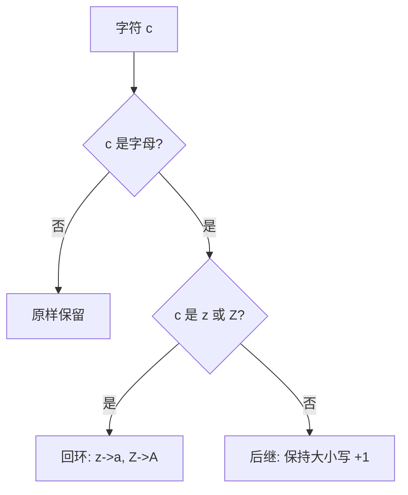

[[TOC]]

## 形式化题目

给定一行字符串 $s$，对它做逐字符替换 $c \mapsto f(c)$：

$$
f(c) = \begin{cases}
c \text{ 在字母表中的后继}, & c \in \{a,\dots,y\} \cup \{A,\dots,Y\} \\
a, & c = z \\
A, & c = Z \\
c, & \text{其他字符}
\end{cases}
$$

后继保持大小写（`a` 的后续是 `b`，`A` 的后续是 `B`）。要求输出替换后的字符串。

用字母表的 0 基下标 $L(c)$ 表述更紧凑：小写与大写各自构成一个长度为 26 的循环，$f$ 在各自环上**右移一步**：

$$
f(c) = \text{第 } (L(c) + 1) \bmod 26 \text{ 个同大小写字母}, \qquad \text{非字母字符 } f(c) = c
$$

例如样例 $s = $ `Hello! How are you!`，答案是 `Ifmmp! Ipx bsf zpv!`。

## 正解

### 思路

先写出最直白的翻译——把题面四条规则照抄成 `for` + `if/elif`：

```python
out = []
for c in s:
    if c == 'z': out.append('a')
    elif c == 'Z': out.append('A')
    elif 'a' <= c <= 'y' or 'A' <= c <= 'Y': out.append(chr(ord(c) + 1))
    else: out.append(c)
print(''.join(out))
```

它是对的，但规则被拆散在三个地方：`'a' <= c <= 'y'` 这一段要靠读者自己看出上界取 `y`（而不是 `z`）是为了
把回环让给前面的特判；`chr(ord(c) + 1)` 也只表达了"编号加一"，看不出"在字母表上走一步"。**这段代码跑得动**
（长度小于 80），真正的短板是规则和数据混在一起，看不出模型。

抽出模型的关键是两条观察：

1. **替换是局部的**。$f(c)$ 只取决于 $c$ 自身，与位置、上下文无关。所以整串加密就是若干个互不影响的
   单字符替换——不存在需要整体考虑的"结构"。
2. **只有两条互相独立的 26 环**。小写 `a…z`、大写 `A…Z` 各自成环：在环上右移一步，末尾的 `z` 与 `Z`
   自然绕回 `a` 与 `A`。大小写之间不交叉。

于是"规则"可以整体换成"数据"：

| 输入字符 | 输出字符 | 规则 |
| --- | --- | --- |
| `a`–`y` | 下一个字符 | 小写环右移一步 |
| `z` | `a` | 小写环回环 |
| `A`–`Y` | 下一个字符 | 大写环右移一步 |
| `Z` | `A` | 大写环回环 |
| 其他 | 自身 | 恒等 |

这正是 Python 内置的**字符翻译表**模型：`str.maketrans(源串, 目标串)` 把两个等长字符串按位置配成映射表，
`s.translate(table)` 用 C 层循环完成"命中就替换、未命中保持原样"。后一句正好就是"非字母字符不变"，
不需要在代码里显式写出来。构造时把两个环的**目标串写成源串右移一格**：

```text
abcdefghijklmnopqrstuvwxyz  ->  bcdefghijklmnopqrstuvwxyza   # 小写环，末位 z->a
ABCDEFGHIJKLMNOPQRSTUVWXYZ  ->  BCDEFGHIJKLMNOPQRSTUVWXYZA   # 大写环，末位 Z->A
```

回环因此被编码进字符串的写法本身，不再是需要 `if` 特判的例外。

下图是单字符视角的决策：只有"是不是 `z`/`Z`"这一处非单调，其余都是顺序加一或恒等。



这张图说明 $f$ 只有一处不是"顺序加一"：环尾的 `z`/`Z` 必须绕回。剩下两条分支（字母加一、非字母恒等）
在表驱动写法里分别对应"表中命中"和"表中查不到"，代码中不再出现判断。

把样例逐位展开，可以确认"局部替换"在真实字符串上的行为：空格与 `!` 被跳过，字母各自走一步，
第 16 位的 `y` 还没到环尾，因此照常前进到 `z`。

| 下标 | 1 | 2 | 3 | 4 | 5 | 6 | 7 | 8 | 9 | 10 | 11 | 12 | 13 | 14 | 15 | 16 | 17 | 18 | 19 |
| --- | --- | --- | --- | --- | --- | --- | --- | --- | --- | --- | --- | --- | --- | --- | --- | --- | --- | --- | --- |
| 输入 | H | e | l | l | o | ! | ␣ | H | o | w | ␣ | a | r | e | ␣ | y | o | u | ! |
| 输出 | I | f | m | m | p | ! | ␣ | I | p | x | ␣ | b | s | f | ␣ | z | p | v | ! |
| 规则 | 大写+1 | 小写+1 | 小写+1 | 小写+1 | 小写+1 | 恒等 | 恒等 | 大写+1 | 小写+1 | 小写+1 | 恒等 | 小写+1 | 小写+1 | 小写+1 | 恒等 | 小写+1 | 小写+1 | 小写+1 | 恒等 |

表里除 3 个空格和 2 个 `!` 外全是字母，逐一验证了"字母走一步、非字母不动"；输出长度 19 与输入相同，
说明替换是双射。唯一没被样例覆盖的是环尾回绕 `z→a`、`Z→A`，它由 `SUCCESSOR` 两条目标串的末位
（`...xyza` 与 `...XYZA`）保证，并在真实数据的 10 个测点上验证。

最后一个实现细节是读入与行尾。必须整行读入（用 `.split()` 会把空格吃掉，而空格要原样保留）；
行尾换行不属于要加密的内容，也永远不会被表命中，代码用 `rstrip("\n")` 摘掉它，再由 `print` 补上恰好一个换行，
保证输出恰好一行。

### 代码

`SUCCESSOR` 是模块级预计算的 52 条映射表（两条 26 环），`solve` 只负责读入、翻译、输出。

@include-code(./main.py, python)

### 复杂度

- 时间复杂度：$O(n)$，$n = |s| < 80$；建表是模块加载时一次性的 $O(1)$（52 条映射），
  之后每个字符一次表查找。与 C++ 逐字符 `for` 循环同阶。
- 空间复杂度：$O(n)$，存放输入串与翻译结果串；映射表本身 $O(1)$。

## 总结

本题的规则本身很简单，值得学的是**把规则从控制流搬进数据**：既然替换是逐字符且只依赖字符自身，
就可以先把 52 条映射预计算成常量表，运行期只剩下"查表"这一个动作。Python 的 `str.maketrans` / `str.translate`
恰好就是这个模型的现成实现，它连"非字母字符保持不变"都替你默认完成——因为在表里查不到。

这一转换消掉了三处易错点：`z`/`Z` 的回环不再需要特判（写进目标串的末位即可），
大小写不再需要两个区间判断（两段字符串各自成环），`chr(ord(c) + 1)` 也不再出现。
代价只是一张用两行字符串描述的表，时间与空间复杂度与 C++ 标准解完全同阶。

实测 10 个真实评测点全部一致，单点约 0.018 s、峰值内存约 14.5 MB，相对 1000 ms / 128 MB 的限制非常宽裕。
