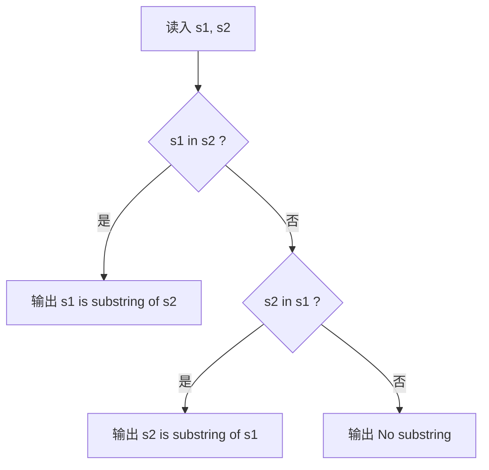

[[TOC]]

## 形式化题目

给定两个不含空格的字符串 $s_1, s_2$，判定它们之间的**连续子串**关系，并按题面给出的优先级输出第一件成立的事：

| 判定顺序 | 成立条件 | 输出 |
| :-: | --- | --- |
| 1 | $s_1$ 是 $s_2$ 的子串 | `s1 is substring of s2` |
| 2 | 否则，$s_2$ 是 $s_1$ 的子串 | `s2 is substring of s1` |
| 3 | 否则 | `No substring` |

其中 $a \sqsubseteq b$ 表示 $a$ 是 $b$ 的连续子段：

$$a \sqsubseteq b \iff \exists\, k \in [0,\ |b| - |a|],\quad b[k : k + |a|] = a .$$

两个方向有**先后**：只有当两串内容完全相同时两个方向才同时成立，此时题面要求输出第 1 条。

> 补充：长度不同时两个方向中至多一个可能成立（连续子段不可能比母串更长），所以真正需要用到“先后”的只是两串相等的情形；写成 `if` / `elif` 就自动把这件事处理对了。

样例 `s1 = abc`、`s2 = dddncabca` 的窗口对照如下，起点 $k = 5$ 处 $s_2[5:8] = \texttt{abc}$ 命中：

| 起点 $k$ | 0 | 1 | 2 | 3 | 4 | **5** | 6 |
| :-: | :-: | :-: | :-: | :-: | :-: | :-: | :-: |
| 窗口 $s_2[k:k+3]$ | `ddd` | `ddn` | `dnc` | `nca` | `cab` | **`abc`** | `bca` |
| 是否等于 `abc` | 否 | 否 | 否 | 否 | 否 | **是** | 否 |

观察重点：`abc` 并不出现在开头，而是在起点 5 处作为一个**连续**窗口出现；判定的是"某个窗口整体相等"，因此 `ace` 与 `abcde` 这种只有子序列关系的串对不成立（`ace` 的三个字符在 `abcde` 里依次出现，却凑不成连续的一段）。

## 正解

### 思路

**朴素做法。** 照抄"连续子段"的定义：枚举 $s_1$ 在 $s_2$ 中所有可能的起点，把长度为 $|s_1|$ 的窗口整段比一次。

```python
n, m = len(s1), len(s2)
for k in range(m - n + 1):
    if s2[k:k + n] == s1:
        ...
```

它是正确的，但有两个代价：每个窗口都要比到失配处为止，最坏（例如 `s1 = aaaa...ab` 对 `s2 = aaaa...a`）是 $O(|s_1| \cdot |s_2|)$；而且 `s2[k:k+n]` 每次都会**新造一个临时串**，把常数再抬高一截。

**关键观察：本题只问“是不是”。** 不要出现位置、不要出现次数、不要所有匹配,只要一个布尔值--这正是**子串匹配**这一标准问题,而它已经是语言内置的原语:

```python
s1 in s2     # s1 是否为 s2 的连续子串
```

`in` 对 `str` 的语义与上文的 $\sqsubseteq$ 定义逐字同构，不需要任何额外假设。CPython 在 `Objects/stringlib/fastsearch.h` 里按长度阈值分派：本题这样的短文本（长度 $< 2500$）命中 `default_find` 分支——它是 Horspool 式的右端对齐比较，先看窗口末字符是否匹配，失配时再用一张由模式字符集生成的 Bloom 位图判断下一个字符“有没有可能在模式里”，据此整块跳跃，命中候选才逐字符回比；全程没有切片、没有 Python 层循环。而当文本与模式都足够长、且模式明显短于文本时（源码把这一“more expensive startup”场景单独分派），同一行代码会切换到 Crochemore–Perrin 的 Two-Way 算法，最坏 $O(|s_1| + |s_2|)$，与手写 KMP 同阶。也就是说，**把数据放大到 KMP 量级，本解依然同阶**——算法没有退化，只是判定的循环下沉到了运行时里。

**唯一容易写错的是分支顺序。** 题面写的是"若第一个串是第二个串的子串……否则若第二个串是第一个串的子串……"，所以两次判定必须**先方向一、后方向二**。下面的流程图就是这三条分支，节点上的"是/否"边与代码里的 `if` / `elif` / `else` 一一对应：



观察重点有两个：一是**判定的方向被固定死**，`s1 in s2` 排在 `s2 in s1` 前面，两串完全相同时会走最上面那条边，输出方向一——这与题面一致；二是**三个出口互斥且穷尽**，任一输入都恰好走到一个叶子。

还有一个反例值得警惕：`ace` 是 `abcde` 的**子序列**（`a`、`c`、`e` 依次出现），却不是**子串**——`abcde` 里找不到连续的一段 `ace`。`in` 只接受连续子段，天然不会把这个情况判成成立。此外像 `abc` / `cab` 这样两个方向都不成立的串对，也必须老老实实落到 `No substring`。

### 代码

@include-code(./main.py, python)

### 复杂度

- 时间复杂度：两个方向各做一次子串存在性判定。最坏 $O(|s_1| \cdot |s_2|)$，典型（含长数据下的 Two-Way 分支）$O(|s_1| + |s_2|)$，与子串匹配正解同阶；本题 $|s_1|, |s_2| \leqslant 200$，实测单组约 0.02 s。
- 空间复杂度：$O(|s_1| + |s_2|)$，只保存两个输入串。

## 总结

- 模型：判定 $s_1 \sqsubseteq s_2$ 与 $s_2 \sqsubseteq s_1$ 是否成立，$\sqsubseteq$ 是**连续**子段关系，不是子序列。
- 解法：直接调用 `in` 这一内置的子串匹配原语；算法与 KMP 同阶，但循环在 C 层，不必自己维护失配表。
- 细节：两次判定必须按题面顺序排列，否则等长全等的输入会输出错方向；另外 `ace` / `abcde` 这类子序列反例不会被误判成子串。
- 实测 10 组真实数据全部通过（每组约 0.02 s，峰值内存约 14.5 MB，远低于 1000 ms / 128 MB 限制）。

> 注：评测数据附带的参考实现 `std.cpp` 按“先比长度、再单向 `strstr`”分支，并在长度相等时直接输出 `No substring`；按题面文字，等长且全等时 $s_1$ 确实是 $s_2$ 的子串，应输出方向一，本解即按题面文字实现。10 组评测数据的两串长度均不相等，两种实现在现有数据上输出一致。
