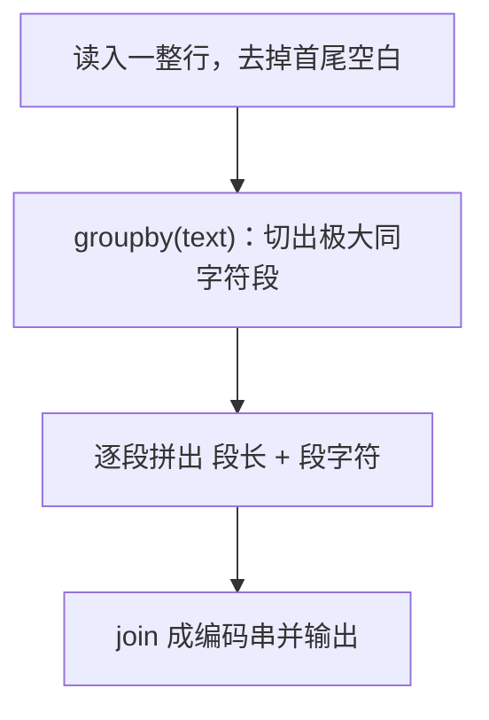

[[TOC]]

## 形式化题目

给定一个只含数字字符的字符串 $s = s_0 s_1 \cdots s_{n-1}$，其中 $s_i \in \{\texttt{0}, \texttt{1}, \ldots, \texttt{9}\}$，把它按**极大同字符段**切开：若 $s_l = s_{l+1} = \cdots = s_r$ 且（$l = 0$ 或 $s_{l-1} \neq s_l$）且（$r = n-1$ 或 $s_{r+1} \neq s_r$），则称下标区间 $[l, r]$ 为一段。设切分得到的段依次为 $[l_1, r_1], [l_2, r_2], \ldots, [l_m, r_m]$，要求输出字符串

$$\texttt{len}_1\, c_1\, \texttt{len}_2\, c_2\, \cdots\, \texttt{len}_m\, c_m,$$

其中 $\texttt{len}_k = r_k - l_k + 1$ 是第 $k$ 段的长度（写成十进制数字，不加前导零），$c_k$ 是该段的那个数字字符。

注意每段的长度**可以超过 9**，此时它自身占多个字符位：例如 $s = \texttt{00000000000}$ 只有一段，长度 11，输出是 `11` 加上字符 `0` 得 `110`，而不是 `110` 的某种"三位十进制数"。

以样例 $s = \texttt{122344111}$（$n = 9$）为例，切分与输出如下：

| 段号 | 下标区间 | 段字符 $c_k$ | 段长 $\texttt{len}_k$ | 输出片段 |
| :-: | :-: | :-: | :-: | :-: |
| 1 | $[0,0]$ | `1` | 1 | `11` |
| 2 | $[1,2]$ | `2` | 2 | `22` |
| 3 | $[3,3]$ | `3` | 1 | `13` |
| 4 | $[4,5]$ | `4` | 2 | `24` |
| 5 | $[6,8]$ | `1` | 3 | `31` |

把"输出片段"列依次拼起来，得到 `11` `22` `13` `24` `31` → `1122132431`，与样例输出一致。

观察重点：段是按"字符发生变化"的位置切出来的，段数 $m$ 等于相邻位置字符不等的次数加一；输出长度 $\sum_k (1 + \text{$len_k$ 的位数})$ 不固定等于 $2m$，这正是第一个样例之外那三个样例要提醒的坑。

## 正解

### 思路

**朴素做法（一次线性扫描）。** 直接照抄定义：维护当前段的起点，从左往右扫，一旦 $s_i \neq s_{i+1}$（或已到串尾）就结算这一段。

```python
out = []
start = 0
for i in range(len(s)):
    if i == len(s) - 1 or s[i] != s[i + 1]:
        out.append(f"{i - start + 1}{s[i]}")
        start = i + 1
ans = "".join(out)
```

这是正确的，而且已经是**最优复杂度** $O(n)$：即使答案长度为 0，也至少要读一遍输入才能知道有哪些字符，所以 $\Omega(n)$ 是本题的时间下界，不可能有比线性更快的算法。

**瓶颈在哪里。** 瓶颈不在算法，而在代码形态：上面这个循环里，"找段边界"（`i == len(s) - 1 or s[i] != s[i + 1]`）和"结算一段"（`append` 长度与字符、移动 `start`）被揉在同一层,还额外维护了 `start`、`i`、串长三个量。$O(n)$ 的下界意味着没有更快的算法可找，但"切段"这件事在 Python 里已经有现成原语，可以把整个循环消掉。

**关键观察：切段本身就是分组。** 定义里的"极大同字符段"，用一句全称命题说就是：相邻两个位置属于同一段，当且仅当它们的字符相同。这恰好是**分组**（把相邻且 `key` 相等的元素归为一组）的定义，而 `itertools.groupby` 干的就是这件事：

```python
groupby(text)   # 产出 (key, run) 二元组：key 是段字符，run 是该段元素的迭代器
```

它一次扫描即可切出所有段，`key` 直接就是我们要输出的段字符，段长则是 `run` 的元素个数。于是朴素做法里的边界判断、`start` 指针、串尾特判全部消失：

```python
for digit, run in groupby(text):
    piece = f"{len(list(run))}{digit}"
```

**注意段长要"先物化再数"。** `run` 是个只能消费一次的迭代器，`len(run)` 会直接 `TypeError`，必须先 `list(run)` 把这一段取出来再求长度。这一步也是**必要**的：`groupby` 的分组在迭代器推进时才成立，提前 `list` 掉当前段才能安全地读下一段。

把上面两步串起来，$O(n)$ 的扫描收敛成一个生成器表达式加一次 `join`：

```python
"".join(f"{len(list(run))}{digit}" for digit, run in groupby(text))
```

复杂度与朴素做法同阶（都是 $O(n)$），但代码里不再有任何手写的循环变量。

**两个容易写错的地方。** 一是**段长是多位数时不能只输一位**：`00000000000` 必须输出 `110`，上面的 `f"{...}"` 天然处理任意位数，反而是"只输出一位长度"的写法会错。二是**行尾换行**：输入是一整行，`read()` 会带上结尾的 `\n`，必须先 `strip()` 掉，否则换行会自成一段被编成 `1\n`；题面保证串内没有空白，所以 `strip()` 不会误删有效字符。

编码过程可以用一句话概括：



观察重点：图上只有一条主干、没有分支，也不存在"判断字符是否相同"的节点——切段完全由 `groupby` 内部完成，本算法的控制流里只剩"逐段拼接输出"这一件事。

### 代码

@include-code(./main.py, python)

### 复杂度

- 时间复杂度：$O(n)$。`groupby` 对原串做一次线性扫描，每段再各被 `list` 消费一次，总消费次数仍是 $n$ 个字符，拼接输出的总长为 $\sum_k (1 + \text{$len_k$ 的位数}) = O(n)$。与朴素扫描的 $O(n)$ 同阶；同时 $\Omega(n)$ 是本题下界（至少要读完输入），故该算法已最优。题面 $n \leqslant 1000$，实测 10 组数据最慢约 0.02 s，远低于 1000 ms。
- 空间复杂度：$O(n)$。分段时每段被短暂物化成一份列表，但同一时刻只持有一段；稳定占用来自输出串本身 $O(n)$。峰值内存实测约 15 MB，远低于 128 MB。

## 总结

- **模型**：p 型编码即游程编码——切出每个极大同字符段，逐段输出「段长 + 段字符」。
- **推导**：线性扫描已是最优复杂度，可压缩的是代码形态；"切段"交给 `itertools.groupby`，"拼输出"交给生成器表达式 + `join`，手写循环变量全部消失。
- **边界**：段长可以是多位数（`00000000000` → `110`），必须按十进制完整输出；`groupby` 的 `run` 是一次性迭代器，要先 `list` 再求长；必须 `strip()` 掉行尾换行。
- **复核**：题面样例 `122344111` → `1122132431`，另测 `1111111111` → `101`、`00000000000` → `110`、`100200300` → `112012201320`，四例全部与题面一致。
