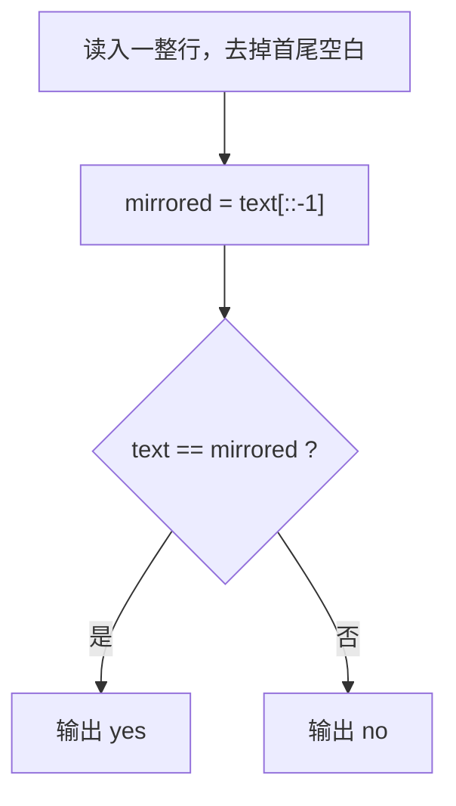

[[TOC]]

## 形式化题目

给定一个不含空白字符的字符串 $s = s_0 s_1 \cdots s_{n-1}$，判定它是否**回文**，即顺读与倒读得到同一个字符串：

$$s \text{ 是回文} \iff \forall\, i \in [0,\, n-1],\quad s_i = s_{n-1-i}.$$

也就是说，每一对关于中心对称的位置上字符必须相同。字符比较**大小写敏感**，`'a'` 与 `'A'` 视为不同字符。

以样例 $s = \texttt{abcdedcba}$ 为例，左右两端向中间逐对配对，9 个位置两两相等，因此是回文；对照表如下（$i$ 与 $n-1-i$ 是同一对的两个下标）：

| 配对 | 下标 $i$ | 下标 $n-1-i$ | 两侧字符 | 是否相同 |
| :-: | :-: | :-: | :-: | :-: |
| 第 1 对 | 0 | 8 | `a` / `a` | 是 |
| 第 2 对 | 1 | 7 | `b` / `b` | 是 |
| 第 3 对 | 2 | 6 | `c` / `c` | 是 |
| 第 4 对 | 3 | 5 | `d` / `d` | 是 |
| 中心 | 4 | 4 | `e` / `e` | 恒成立 |

观察重点：$n = 9$ 为奇数，中间剩一个位置与自身配对，它不可能成为"失配点"，所以奇数长度不会破坏判定；真正需要检查的只有前 4 对。

## 正解

### 思路

**朴素做法（双指针）。** 直接照抄上面的全称命题：左指针 $i$ 从 $0$ 出发、右指针 $j$ 从 $n-1$ 出发，每轮比较 $s_i$ 与 $s_j$，相等就向中间收缩，否则立刻判定不是回文；当 $i \geqslant j$ 时说明所有配对都通过。

```python
i, j = 0, len(s) - 1
while i < j and s[i] == s[j]:
    i += 1
    j -= 1
is_palindrome = i >= j
```

这是正确的，而且已经是**最优复杂度** $O(n)$——每个字符至少要被读一次，所以 $\Omega(n)$ 是本题的时间下界，不可能有比线性更快的算法。

**瓶颈在哪里。** 瓶颈不在算法，而在代码形态：这个判定式有"取倒读"和"整体比较"两半，`while` 把两半揉进了手写的循环变量、循环条件和推进语句里。$O(n)$ 的下界意味着没有更快的算法可找，但这两半在 Python 里各自都有现成的原语，可以把循环整个消掉。

**关键观察：倒读串本身就是构造出来的。** 定义里"倒读"指的是字符串 $s'$，其中 $s'_i = s_{n-1-i}$——这是一个可以直接**生成**的对象，不需要模拟"倒着读的人"：

```python
text[::-1]      # 步长 -1 的切片：一次反转，循环在 C 层完成
```

得到 $s'$ 之后，全称命题 $\forall i,\ s_i = s_{n-1-i}$ 恰好就是两串逐位相等，也就是一个 `==`：

```python
text == text[::-1]
```

`==` 对 `str` 的语义是"长度相同且每个位置字符相同"，长度不等立即为假，长度相等则逐位比较并在失配处短路——它与双指针判定的是**同一个命题**，只是把循环下沉到了运行时里。于是三步推导收敛成一行：

$$s \text{ 是回文} \iff s = s' = s_{n-1} s_{n-2} \cdots s_0 .$$

**两个容易写错的地方。** 一是**大小写**：`'a' != 'A'`，所以像 `UnHCWSxxSWCHnU` 这种大小写严格对称的串是回文，而 `aA` 不是；不要顺手加 `lower()`。二是**行尾换行**：输入是一整行，`read()` 会带上结尾的 `\n`，必须先 `strip()` 掉，否则任何串都会因为"最后一个字符是换行"而判成 `no`；题面保证串内没有空白，所以 `strip()` 不会误删有效字符。

判定过程可以用一句话概括：



观察重点：只有一条主干、没有循环分支，唯一的判断就是那次整体比较；图上不存在"逐字符比较"的节点，因为那个循环在 C 层内部，不属于本算法的控制流。

### 代码

@include-code(./main.py, python)

### 复杂度

- 时间复杂度：$O(n)$。反转切片复制一次全部字符，`==` 最坏再比到失配处（回文时要全比完），两步都是线性，与双指针朴素做法的 $O(n)$ 同阶；同时 $\Omega(n)$ 是本题下界，故该算法已最优。实测 10 组数据最慢 0.019 s，题面 $n \leqslant 100$，远低于 1000 ms。
- 空间复杂度：$O(n)$，来自倒读串这一份临时拷贝（双指针做法只用 $O(1)$ 额外空间，本解在这一项上多花 $n$ 个字符，题面 $n \leqslant 100$ 时可忽略）。峰值内存实测约 14.5 MB，远低于 128 MB。

## 总结

- **模型**：回文即全称命题 $\forall i,\ s_i = s_{n-1-i}$。
- **推导**：双指针已是最优复杂度，可压缩的是代码形态；把"取倒读"交给切片 `[::-1]`、"整体比较"交给 `==`，循环下沉到 C 层。
- **边界**：长度奇偶不影响判定（中心位置与自身配对）；判题大小写敏感；必须 `strip()` 掉行尾换行。
- **复核**：题面样例 `abcdedcba` → `yes`，另测 `abcd` → `no`；数据仓 10 组真实数据全部输出一致（PASS=10, FAIL=0）。
