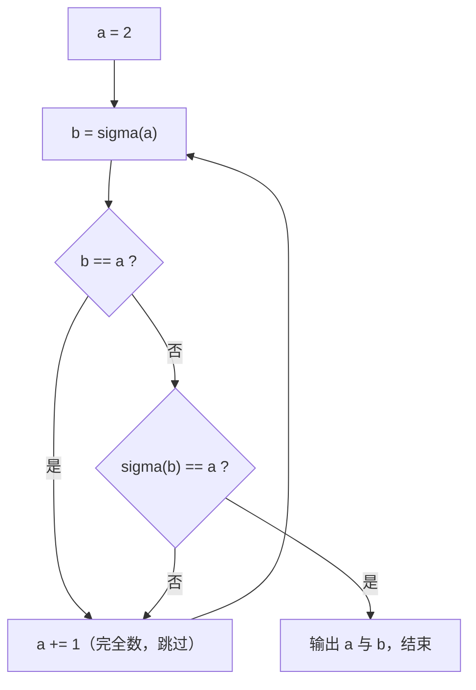

[[TOC]]

## 形式化题目

记 $n$ 的**真因数和**（不含 $n$ 本身的因子之和）为

$$\sigma(n)=\sum_{\substack{d\mid n\\ d<n}} d .$$

例如 $\sigma(12)=1+2+3+4+6=16$。

求**最小**的一对自然数 $a<b$，满足

$$\sigma(a)=b,\qquad \sigma(b)=a .$$

输出 $a$ 与 $b$，中间一个空格。

题目无输入，答案唯一，为 `220 284`。

## 正解

### 思路

**一句话本质**：先写一个函数算 $\sigma(n)$，再从小到大枚举 $a$，第一个满足
$\sigma(\sigma(a))=a$ 且 $\sigma(a)\ne a$ 的 $a$ 就是答案中较小的那个。

**第一步：判定怎么写。** 题面的定义已经把判定方式写好了——「$a$ 的因子之和为 $b$，
且 $b$ 的因子之和又等于 $a$」翻译成函数调用就是 $\sigma(a)=b$ 且 $\sigma(b)=a$。
令 $b=\sigma(a)$，判定式等价于

$$\sigma(\sigma(a))=a,\qquad \sigma(a)\ne a .$$

所以整道题只剩一个问题：**怎么快速算 $\sigma(n)$。**

**第二步：朴素做法及其瓶颈。** 最直白的 $\sigma$ 是把 $1$ 到 $n-1$ 全试一遍：

```python
sum(d for d in range(1, n) if n % d == 0)
```

对 $n=220$ 要做 219 次取模，配合外层枚举 $a=2,3,4,\ldots$，总代价 $O(I^2)$；
本题 $I=220$，合计 $\sum_{i\leqslant220}(i-1)=24090\approx2.4\times10^4$ 次取模，能过。
但它暴露了真正的瓶颈：**试除区间 $[1,n)$ 里绝大多数数根本不是因子**，
我们花了 $n$ 次尝试只换回十几个真因子。

**第三步：消除瓶颈——因子成对出现。** 关键观察是整除的对称性：

$$d\mid n \iff \frac nd \mid n .$$

于是一个 $\leqslant\sqrt n$ 的因子 $d$，必定配着一个 $\geqslant\sqrt n$ 的搭档 $n/d$；
反过来说，**每一对因子中都至少有一个 $\leqslant\sqrt n$**（两个都大于 $\sqrt n$
则乘积 $>n$，两个都小于 $\sqrt n$ 则乘积 $<n$）；只有 $n$ 为完全平方数时这一对
退化成同一个数 $\sqrt n$。所以只需在 $d=2\ldots\lfloor\sqrt n\rfloor$ 上试除，
命中时把 $d$ 和 $n/d$ **两端一起**收进来：

$$\sigma(n)=1+\sum_{\substack{2\leqslant d\leqslant\lfloor\sqrt n\rfloor\\ d\mid n}}\Bigl(d+\frac nd\Bigr)
\qquad(\text{当 }d=n/d\text{ 时只加一次，见第四步})$$

$1$ 单独加上（它是 $n\geqslant2$ 时必有的真因子）。试除次数从 $n$ 降到 $\sqrt n$。

以答案中的 $a=220$（$\sqrt{220}\approx14.8$）为例，只需试 $d=2\ldots14$：

| $d$ | $d\mid 220$？ | 收进来的因子对 | 累计真因子集合 |
| --- | --- | --- | --- |
| 2 | 是 | $2,\ 110$ | $\{1,2,110\}$ |
| 3 | 否 | — | 不变 |
| 4 | 是 | $4,\ 55$ | $\{1,2,4,55,110\}$ |
| 5 | 是 | $5,\ 44$ | $\{1,2,4,5,44,55,110\}$ |
| 6–9 | 否 | — | 不变 |
| 10 | 是 | $10,\ 22$ | $\{1,2,4,5,10,22,44,55,110\}$ |
| 11 | 是 | $11,\ 20$ | $\{1,2,4,5,10,11,20,22,44,55,110\}$ |
| 12–14 | 否 | — | 不变 |

在 $d=2\ldots14$ 上共 $13$ 次试除（表中把连续不命中的 $d$ 合并成了几行），
只有 $5$ 次命中，却拼出了全部 $11$ 个真因子，和为 $284=\sigma(220)$。再对 $284$
（$\sqrt{284}\approx16.9$）试 $d=2\ldots16$：只有 $d=2$（收 $2,142$）与 $d=4$（收 $4,71$），
加上 $1$，共 $1+2+4+71+142=220$，正好回到 $a$。

**第四步：完全平方数的边界。** 若 $n=k^2$，则 $d=k$ 时搭档仍是 $k$，
按"两端一起收"会把这个因子算两次（$n=4$：正确结果 $1+2=3$，硬收两端得 $1+2+2=5$）。
处理方式是当 $d\cdot d=n$ 时只收 $d$ 一端：

```python
low = [d for d in range(2, isqrt(n) + 1) if n % d == 0]
return 1 + sum(low) + sum(n // d for d in low if d * d != n)
```

这里用 `math.isqrt` 而不是 `int(n ** 0.5)`：后者走浮点，$n$ 较大时可能因舍入
把 $\sqrt n$ 算小 1，从而漏掉 $d=\lfloor\sqrt n\rfloor$ 那一对；`isqrt` 是精确整数开方。

**第五步：为什么"第一次命中"就是"最小的一对"。** 从 $a=2$ 开始递增枚举，
假设命中的是 $i$，即 $\sigma(\sigma(i))=i$ 且 $\sigma(i)\ne i$。

先证此时必有 $\sigma(i)>i$：若 $\sigma(i)<i$，令 $j=\sigma(i)$，则
$\sigma(j)=i$、$\sigma(\sigma(j))=\sigma(i)=j$，且 $\sigma(j)=i\ne j$，
说明 $j$ 也命中，而 $j<i$ 与 $i$ 是第一次命中矛盾。

所以命中时 $\sigma(i)>i$，$i$ 就是这一对里较小的那个。又设 $\{u,v\}$（$u<v$）
是任意一对亲和数，则 $u$ 也满足命中条件，故 $i\leqslant u$——**第一次命中的 $i$
就是所有亲和数对中较小者的最小值**，直接输出 $i$ 和 $\sigma(i)$ 即可，
不需要收集、排序或比较。

**第六步：扫描过程有多短。** 判定命中非常稀疏，把前段有代表性的 $i$ 列出来
（连续且情形相同的 $i$ 已省略；表格列依次是：枚举值、真因数和 $\sigma(i)$、
二次求值 $\sigma(\sigma(i))$、是否命中）：

| $i$ | $\sigma(i)$ | $\sigma(\sigma(i))$ | 命中 | 说明 |
| --- | --- | --- | --- | --- |
| 2 | 1 | 0 | 否 | $\sigma(1)=0$ |
| 3 | 1 | 0 | 否 | 同上 |
| 4 | 3 | 1 | 否 | $1$ 的真因数和为 $0$ |
| 5 | 1 | 0 | 否 | — |
| 6 | 6 | 6 | 否 | $\sigma(i)=i$，完全数，被 $a\ne b$ 排除 |
| 7 | 1 | 0 | 否 | — |
| 8 | 7 | 1 | 否 | — |
| 9 | 4 | 3 | 否 | — |
| 10 | 8 | 7 | 否 | — |
| 12 | 16 | 15 | 否 | — |
| 16 | 15 | 9 | 否 | — |
| 28 | 28 | 28 | 否 | 第二个完全数 |
| **220** | **284** | **220** | **是** | 第一对亲和数 |

这里能看出 `b != a` 这个条件不是防御性冗余：$i=6$ 时 $\sigma(6)=1+2+3=6$，
$\sigma(\sigma(6))=6$ 也成立，若不排除 $a=b$，答案会错误地变成 `6 6`。

**关于 `@cache`**：$\sigma$ 的同一批输入会被反复查询（每个 $i$ 一次，命中时
再查一次 $\sigma(i)$，而 $\sigma(i)$ 常落在已枚举范围内）。本次运行共调用
`divisor_sum` 436 次，其中 203 次命中缓存、233 个不同参数；不加缓存时需要
3099 次试除，加了之后是 2058 次，省下约三分之一。
它**不改变渐进复杂度**（同一批 $n$ 的规模只有 $O(I)$ 量级），只是一层风格上的保险。

### 代码

`divisor_sum` 对应 $\sigma$，`count(2)` 对应"从 2 开始递增枚举"，
`b != a and divisor_sum(b) == a` 对应判定式，`break` 对应"第一次命中即停"。

@include-code(./main.py, python)

### 复杂度

设答案中的较小者为 $I=220$。程序查过的 $\sigma$ 参数不会超过 $O(I)$ 量级：
实测最大参数为 $384$（$a=216$ 时 $\sigma(216)=384$，接着还会再查一次
$\sigma(384)=636$），全部 $233$ 个参数都落在 $[1,636]$ 内。

- 时间复杂度：单个参数 $n$ 要试除 $\lfloor\sqrt n\rfloor-1$ 次，即 $O(\sqrt n)$。
  外层扫描 $i=2\ldots I$，每个 $i$ 新增 $\sigma(a)$、$\sigma(b)$ 两次调用，
  所以被查参数个数是 $O(I)$，总代价 $O(I\sqrt M)$；本题 $M$ 与 $I$ 同阶
  （$M=384$，$I=220$），即 $O(I^{3/2})$ 量级。实测去重后共 $233$ 个参数、
  实际试除 **2058 次**（不加 `@cache` 为 3099 次）。
  朴素写法是 $O(I^2)=24090$ 次取模，本题数据同样能过——**本题真正的考点是
  $\sigma$ 的定义（是否含 $n$ 本身）与枚举方向，而不是复杂度**。
- 空间复杂度：$O(\sqrt M)$ 存放当前因子列表，加上缓存里 $233$ 项 $\sigma$ 值；
  实测峰值 14.7 MB / 128 MB，用时 0.019 s / 1000 ms。

## 图示解析

### 判定与枚举流程

从 $a=2$ 开始，每轮算一次 $\sigma$，只有 $\sigma(\sigma(a))=a$ 且 $\sigma(a)\ne a$
才停；命中点就是最小的一对里较小的那个。



注意 `a += 1` 之后仍回到 `b = sigma(a)`，即**每个 $a$ 只新增常量次数的试除**
（$\sigma(a)$ 一次、$\sigma(b)$ 一次）；因为外层是从小到大扫描，第一次走到 `输出`
的 $a$ 就是答案。

### 试除范围：$O(n)$ 到 $O(\sqrt n)$

以 $n=220$ 为例，朴素做法在 $[1,220)$ 上试除 $219$ 次，但只有 $11$ 个数是因子。
成对观察后，只需试 $[2,\lfloor\sqrt{220}\rfloor]=[2,14]$ 这 $13$ 个位置：

| 做法 | 试除位置 | 试除次数 | 找到的真因子个数 |
| --- | --- | --- | --- |
| 朴素 $O(n)$ | $1,2,3,\ldots,219$ | 219 | 11 |
| 成对 $O(\sqrt n)$ | $2,3,\ldots,14$ | 13 | 11（每对两端一起收） |

两者找到的因子完全相同，差别只在"无效试除"的次数：$219 \to 13$，约 17 倍；
$n$ 越大，这个倍数越接近 $\sqrt n$。

## 总结

本题代码不到 30 行，但三个细节都容易翻车：

1. **$\sigma$ 是真因数和，不含 $n$ 本身**。若误写成因数和（含 $n$），
   $\sigma(6)=12\ne 6$，判定规则整体错位，答案全错。
2. **必须排除 $a=b$**。完全数满足 $\sigma(\sigma(a))=a$，题面「$a$ 与 $b$ 不相等」
   把它们挡在外面；漏掉这一条，第一个输出会变成 `6 6`。
3. **枚举必须从小到大**，这样第一次命中就是最小的一对，否则要先收集再排序，
   还会遇到更大的对（如 $1184,1210$）。

$\sigma$ 的加速点是因子成对：每对因子中至少有一个 $\leqslant\sqrt n$，于是试除范围从
$[1,n)$ 收缩到 $[2,\lfloor\sqrt n\rfloor]$，两端一起收因子。唯一要特殊处理的是
完全平方数——$d=\sqrt n$ 的搭档是自己，只能算一次。

实测真实数据 `problem1.out` 为 `220 284`，程序输出一致，用时 0.019 s、峰值内存 14.7 MB。
