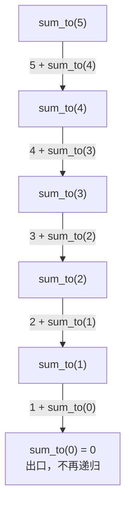

[[TOC]]

## 形式化题目

给定整数 $N$，求

$$S(N) = 1 + 2 + \cdots + N$$

要求用递归（函数调用自身）的方式实现，而不是循环或等差数列公式。

## 正解

### 思路

本题的计算量小到可以一眼看穿——$N \leqslant 13$ 时加数最多 13 个，怎么写都不会超时。所以这道题真正要练的不是"怎么算得更快"，而是**把一段重复的累加翻译成递归**。一个能用的递归必须交代清楚三件事，缺一件就会写错：

| 递归要素 | 本题的答案 | 写错的后果 |
| --- | --- | --- |
| 参数：每一层处理什么 | 还剩 $1 \cdots n$ 要加，$n$ 是当前上界 | 参数不缩小就永远到不了出口 |
| 出口：什么时候不再递归 | $n = 0$ 时没有数可加，返回 0 | 漏掉出口 → 无限递归、栈溢出 |
| 转移：本层做完剩什么 | 本层只认领 $n$，把 $n-1$ 交给下一层 | 写成 `n + sum_to(n)` 会死循环 |

把这三件事写成一行，就是本题的正解：

$$S(n) = \begin{cases} 0, & n = 0\\ n + S(n-1), & n \geqslant 1 \end{cases}$$

在代码里它对应 `return 0 if n == 0 else n + sum_to(n - 1)`：条件表达式的前半段是出口，后半段是转移，"先判边界"的顺序在书写顺序上就是可见的。

以 $N = 5$ 为例，递归的执行分成"下行分解"和"上行累加"两段。下行时每层先把 $n-1$ 交出去，自己停在原地等结果，直到 $n = 0$ 触底；触底后返回值沿原路反弹，每一层把返回值加上自己的 $n$ 再往上传。

这张图展示了下行阶段的调用链：它是一条直链，每一层只派生出唯一一个子调用，没有分叉。这正是本题规模小却值得用递归讲清楚的原因——递归树在这里退化成了一条链，读者不必处理"多个子问题怎么合并"的额外复杂度。

触底之后，每一层的返回值如下表，从最底层往上读：

| 层 | 本层认领的加数 | 下层返回值 | 本层返回 |
| --- | --- | --- | --- |
| `sum_to(0)` | 无（出口） | — | 0 |
| `sum_to(1)` | 1 | 0 | 1 |
| `sum_to(2)` | 2 | 1 | 3 |
| `sum_to(3)` | 3 | 3 | 6 |
| `sum_to(4)` | 4 | 6 | 10 |
| `sum_to(5)` | 5 | 10 | 15 |

观察这张表的"本层认领的加数"一列：$1, 2, 3, 4, 5$ 各出现一次，恰好覆盖 $1 \cdots N$，这就是"不重不漏"的来源——每一层只负责自己那一个数，剩下的全部交给下一层。最后一行的 15 与样例输出一致。

代码里的 `@cache` 装饰器让同一个 $n$ 只计算一次。本题的调用链是直链，$S(n)$ 只会被 $S(n+1)$ 调用一次，所以缓存不会改变结果，也不影响复杂度；它只是与仓库中其它 Python 题解保持一致的写法，同时让函数在将来被多次调用时依然正确。

关于边界：题面没有给出 $N$ 的范围，测试数据中 $1 \leqslant N \leqslant 13$，因此递归深度最多 14 层，远低于 CPython 默认的 1000 层上限，**不需要**也不应该用 `sys.setrecursionlimit` 去改限制。$N = 1$ 时返回 `1 + sum_to(0) = 1`，$N = 0$ 时直接命中出口返回 0，两种情况函数本身都能正确处理。

### 代码

@include-code(./main.py, python)

### 复杂度

- 时间复杂度：$O(N)$。从 $N$ 到 0 共 $N+1$ 次函数调用，每次 O(1)。与数据仓 `std.cpp` 的递归实现同阶。
- 空间复杂度：$O(N)$，全部来自递归调用栈；$N \leqslant 13$ 时栈深 14，实测峰值约 14.5 MB，远低于 128 MB 的限制。

## 总结

- 递归只有三个要素：参数是什么、出口在哪里、本层做完把什么交给下一层。本题三要素分别是 $n$、$n=0$、$n-1$，写全了就不会错。
- 本题的调用链是一条**直链**而不是树：每层只有一个子调用，把递归树退化成了递归链，这正是它适合作为递归入门题的原因。
- 数学公式 $\frac{N(N+1)}{2}$ 也是 $O(1)$ 的正确做法，但它绕开了题面要求的递归训练，因此在本题中不采用。
- $N \leqslant 13$ 时栈深极小，不要习惯性地去调 `sys.setrecursionlimit`——那会掩盖真正的深递归问题。
