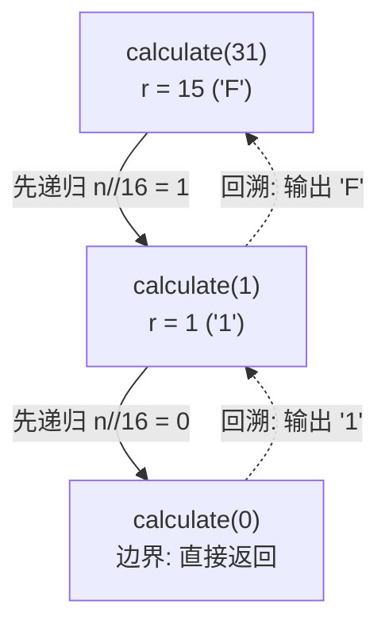

[[TOC]]

## 形式化题目

给定十进制整数 $X$ 与进制 $M$，输出 $X$ 的 $M$ 进制表示 $d_{L-1}d_{L-2}\cdots d_1d_0$
（高位在前），使得

$$
X = \sum_{i=0}^{L-1} d_i \cdot M^i, \qquad 0 \leqslant d_i < M
$$

余数 $0$–$9$ 输出数字字符，$10$–$15$ 输出大写字母 `A`–`F`。题面指定用**递归算法**实现。
例如样例 `31 16`：$31 = 1\times 16 + 15$，答案是 `1F`。

## 正解

### 思路

**除基取余**是进制转换的标准事实：设 $X = q\cdot M + r$（$0 \leqslant r < M$），
则 $r$ 恰是 $X$ 在 $M$ 进制下的**最低位**，而对 $q$ 重复这一过程就依次剥出次低位、再高位。
把余数按「低位→高位」的产出顺序反过来排，就是答案。

递归天然完成了这次反转。对照题面给的 C++ 框架：

```text
calculate(n):
    temp = n % k          # 记下当前余数（最低位）
    n = n / k
    若 n != 0: calculate(n)   # 先钻到最高位
    输出 num[temp]            # 回溯时才输出：从高位到低位
```

**输出语句在递归调用之后**是全部关键：最深的调用对应最高位，回溯时最先执行输出，
余数序列就自动按高位到低位的顺序落纸。如果反过来把输出写在递归之前，
就会按「个位→高位」打印，整个答案左右颠倒。

用样例 $31_{10} \to$ 十六进制把递归展开一遍（$q$ 是下一次调用的实参）：

| 调用 | $n$ | $n \bmod 16$ | 输出字符 | 层级 |
| --- | --- | --- | --- | --- |
| `calculate(31)` | 31 | 15 | `F` | 第 1 层（最低位） |
| `calculate(1)` | 1 | 1 | `1` | 第 2 层（最高位） |
| `calculate(0)` | 0 | — | 不输出，直接返回 | 边界 |

递归树与输出顺序如下——注意箭头上「先下钻、后回溯」的方向：



实线是调用方向（向下钻），虚线是回溯方向（输出发生在这里）：先 `1` 后 `F`，拼成 `1F`。

把这个结构写成 Python，一行条件表达式就够了——`convert(n//M, M)` 在前、
`ALPHABET[n%M]` 在后，拼接顺序即输出顺序，边界 `n == 0` 返回空串：

```python
def convert(n: int, base: int) -> str:
    return convert(n // base, base) + ALPHABET[n % base] if n else ""
```

**一个必须处理的现实问题**：题面写 $M \leqslant 16$，但真实评测数据的 $M$ 最大到 $30$
（生成器 `randint(2, 30)`），此时余数会落在 $16 \sim 29$ 区间，评测机的参考实现只有
16 项字符表、对这些余数越界读内存，并把读到的字节固化成了答案：真实测点
`642 24` 的期望输出是 `12` 后跟一个 **NUL 字节**（其余 9 组数据余数都小于 16，
是纯粹的 0–9/A–F 转换）。因此 Python 侧的输出表要扩到 30 项，并把余数 $18$
单列一项映射成 NUL，其余按字母 `A`–`T` 连续延伸：

| 余数 $r$ | $0$–$9$ | $10$–$15$ | $16, 17$ | $18$ | $19$–$29$ |
| --- | --- | --- | --- | --- | --- |
| 输出字符 | `0`–`9` | `A`–`F` | `G`, `H` | NUL 字节 | `J`–`T` |

由于 NUL 不是文本字符，输出必须走字节通道 `sys.stdout.buffer.write`，不能只用 `print`。

### 代码

`ALPHABET` 是覆盖余数 $0 \sim 29$ 的 30 项输出表；`convert` 一行完成「先商后余」的递归。

@include-code(./main.py, python)

### 复杂度

- 时间复杂度：$O(\log X)$。递归层数等于余数个数（即答案位数），每层一次整除、一次取余、
  一次字符串拼接；答案长度本身就是信息量下界，没有可优化的瓶颈。本题 $X \leqslant 1000$，最多 $10$ 层。
- 空间复杂度：$O(\log X)$，即调用栈深度与结果串长度。

## 总结

- 进制转换的标准事实是「除基取余、倒序拼接」；**递归把倒序交给调用栈**——输出语句放在递归
  调用之后，回溯时自然从高位往低位输出，这是本题唯一值得学的结构。
- Python 里一行条件表达式 `convert(n//M, M) + ALPHABET[n % M] if n else ""` 同时完成
  递归主体与边界，拼接顺序即输出顺序。
- 题面 $M \leqslant 16$ 与真实数据 $M \leqslant 30$ 不符：输出表扩到 30 项，其中余数 $18$
  按评测数据输出 NUL 字节，并用 `sys.stdout.buffer` 按字节写出。
- 实测 10 个真实评测点全部逐字节一致，单点约 0.018 s、峰值内存约 14.5 MB，
  相对 1000 ms / 128 MB 的限制非常宽裕。
