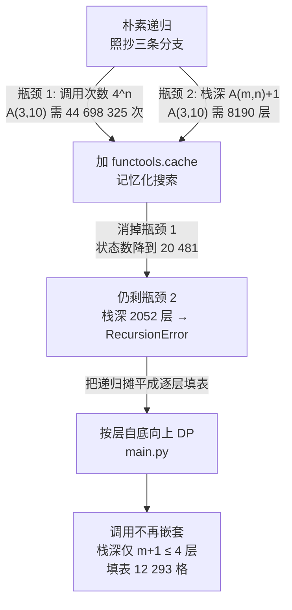

[[TOC]]

## 形式化题目

给定非负整数 $m,n$，求按如下三分支递归定义的阿克曼函数值：

$$
A(m,n)=\begin{cases}
n+1, & m=0\\[2pt]
A(m-1,\,1), & m>0,\ n=0\\[2pt]
A(m-1,\,A(m,n-1)), & m>0,\ n>0
\end{cases}
$$

真实测试数据满足 $1 \leqslant m \leqslant 3$、$1 \leqslant n \leqslant 10$，每组只有一对 $(m,n)$。
样例 `2 3` 的答案是 $9$。

$m \leqslant 3$ 时存在闭式，可作为交叉校验：

$$A(0,n)=n+1,\quad A(1,n)=n+2,\quad A(2,n)=2n+3,\quad A(3,n)=2^{\,n+3}-3$$

例如 $A(3,10)=2^{13}-3=8189$。闭式**只**对 $m \leqslant 3$ 成立（$A(4,n)$ 起就无法这样表达），
所以它只是验算工具，正式解不硬编码它——本题要学的是这套递归结构本身。

## 正解

### 思路

**第一步：把定义逐字翻译成递归。** 三个分支一一对应三行，这是最直接的实现：

```python
def ack(m, n):
    if m == 0: return n + 1
    if n == 0: return ack(m - 1, 1)
    return ack(m - 1, ack(m, n - 1))
```

它在数学上完全正确，但在这道题的参数上跑不动。要看清原因，得分别数**调用次数**和**栈深**。

**第二步：数调用次数——重复子问题是指数级的。** 展开 $A(2,2)=A(1,A(2,1))=A(1,A(1,3))$：
求 $A(1,3)$ 时把 $A(1,2)\to A(1,1)\to A(1,0)$ 走了一遍，紧接着求 $A(1,5)$ 又把
$A(1,0)\dots A(1,3)$ 原样再走一遍。低层的同一条链被反复重走，因为
$A(k,j)$ 的值只由 $(k,j)$ 决定，与"是谁调用的"无关。

实测调用次数随 $n$ 按 $4^n$ 增长，而答案本身只按 $2^n$ 增长：

| $n$ | 3 | 5 | 7 | 8 | 9 | 10 |
| --- | --- | --- | --- | --- | --- | --- |
| $A(3,n)$ | 61 | 253 | 1021 | 2045 | 4093 | **8189** |
| 朴素递归调用次数 | 2 432 | 42 438 | 693 964 | 2 785 999 | 11 164 370 | **44 698 325** |

第一行是答案量级，第二行是照抄定义所需的函数调用数。$n$ 每加 1，调用次数约乘 4、答案只约乘 2；
到 $n=10$ 已是 $4.5\times10^7$ 次调用。C++ 里这个量约 0.12 s 尚能跑完，Python 的函数调用开销更大，
必然难以接受。

**第三步：数是栈深——这才是真正的坑。** 注意第三条分支的第二个参数**本身就是一次递归调用**：

$$A(m,n)=A\big(m-1,\ \underbrace{A(m,n-1)}_{\text{先算出它，再作为下标传下去}}\big)$$

于是这条"嵌套链"的长度等于那个参数的值本身，而那个值就是 $A(m,n)$。实测最大栈深恰为 $A(m,n)+1$：

| $n$ | 4 | 5 | 6 | 7 | 8 | 10 |
| --- | --- | --- | --- | --- | --- | --- |
| $A(3,n)$ | 125 | 253 | 509 | 1021 | 2045 | 8189 |
| 朴素递归最大栈深 | 126 | 254 | 510 | 1022 | 2046 | **8190** |
| Python 默认上限 1000 | ok | ok | ok | **崩** | **崩** | **崩** |

Python 默认递归上限是 1000，所以 $n \geqslant 7$ 时朴素递归直接 `RecursionError`：

```text
朴素递归（Python 默认递归上限 1000）：
  A(3,6) =  509   ok
  A(3,7) = RecursionError        ← 需要 1022 层栈
```

所以这道题首先要解决的不是"慢"，而是**栈根本不够深**。这一点决定了后面的路线：
只要还用递归，就必须提高栈上限；而题解不允许靠 `sys.setrecursionlimit` 掩盖深递归，
正确出路是改成迭代。

**第四步：加缓存——只解决了一半。** 由第二步的重复子问题，先想到记下算过的值：

```python
@cache
def ack(m, n):
    if m == 0: return n + 1
    if n == 0: return ack(m - 1, 1)
    return ack(m - 1, ack(m, n - 1))
```

状态数确实从 $\Theta(A^2)$ 降到 $\Theta(A)$，$A(3,10)$ 只需求 20 481 个状态。
但**栈深一点没变**——嵌套链的长度由参数值决定，和有没有缓存无关：

```text
记忆化递归（Python 默认上限 1000）：
  A(3,8) = 2045   ok，状态数 5119
  A(3,9) = RecursionError   ← 深度需 1028 层
  A(3,10) = RecursionError  ← 深度需 2052 层
```

`@cache` 少了重复计算，却仍在递归；只要还在递归，$A(3,10)$ 就要 2052 层栈。
它是一块正确的中间跳板，但不是终点。

**第五步：把递归改成按层填表。** 关键性质是 $A(k,\cdot)$ 只依赖 $A(k-1,\cdot)$：

$$
A(k,0)=A(k-1,1),\qquad A(k,j)=A\big(k-1,\ \underbrace{A(k,j-1)}_{\text{本层的左邻值}}\big)
$$

第二式的含义很特别：**上一层要取的下标，正是本层刚算出来的左邻值**。于是把二维表按 $k$ 分层
自底向上填：第 0 层是边界 $A(0,j)=j+1$，第 $k$ 层从左往右逐格往后推即可，每一格只查一次上一层。

用样例 $A(2,3)=9$ 走一遍（行是层 $k$，列是下标 $j$；**加粗**是这一步新填的格子，
箭头标出它查的是上一层的哪一格）：

| $k \backslash j$ | 0 | 1 | 2 | 3 |
| --- | --- | --- | --- | --- |
| $k=0$（边界 $A(0,j)=j+1$） | 1 | 2 | 3 | 4 |
| $k=1$ | **2** ← $A(0,1)$ | **3** ← $A(0,2)$ | **4** ← $A(0,3)$ | **5** ← $A(0,4)$ |
| $k=2$ | **3** ← $A(1,1)$ | **5** ← $A(1,3)$ | **7** ← $A(1,5)$ | **9** ← $A(1,7)$ |

看第 $k=2$ 行：$A(2,0)=A(1,1)=3$ 用的是 $n=0$ 那条分支；从 $j=1$ 起，
每格的取值下标 $3,5,7$ 恰恰就是本行左边那格 $A(2,j-1)$ 的值——这正是上面第二式的形状。
最后一格 $A(2,3)=9$ 与样例一致。整个填表不需要任何嵌套调用，**栈深只有 $k$ 层**（$k \leqslant m \leqslant 3$）。

`main.py` 把这个过程写成"按需延长"的惰性填表：`rows[k]` 是第 $k$ 层已算出的项，
`value(k, j)` 用 `while` 把该层补到下标 $j$ 就返回 `rows[k][j]`；`k == 0` 时直接返回 $j+1$，
不占任何存储。`A(3,10)` 实际只填了 $8188+4094+11 = 12\,293$ 格（第 0 层走出口、不落表），
也从不触碰不需要的下标。

### 代码

`ackermann(m, n)` 是分层填表主体；`solve` 只负责读入两个整数、调用、输出。

@include-code(./main.py, python)

### 复杂度

设答案为 $V=A(m,n)$。

- 时间复杂度：$O(V)$。分层填表的总格数与 $V$ 同阶，$A(3,10)$ 实测填 $12\,293$ 格
  （约 $1.5V$），每格一次查表加一次取值，单点耗时约 $0.7$ ms。朴素递归的对照是
  $\Theta(V^2)$，$A(3,10)$ 需 $44\,698\,325$ 次调用。
- 空间复杂度：$O(V)$，即填表用的 $12\,293$ 个整数，实测峰值内存 14.6 MB。朴素递归虽然
  只存 $O(1)$ 变量，却需要 $V+1=8190$ 层调用栈，在 Python 默认上限 1000 下根本走不完；
  分层填表把栈深压到 $m+1 \leqslant 4$ 层。

## 总结

- 本题的递归有**两个独立的代价**：调用次数按 $4^n$ 爆炸（重复子问题），栈深等于 $A(m,n)+1$
  （嵌套调用链）。只盯住其中一个会得到半对的答案。
- `functools.cache` 只治前者：$A(3,10)$ 的状态数降到 20 481，但栈仍需 2052 层，
  在 Python 默认上限 1000 下照样 `RecursionError`。判断"记忆化够不够"必须分开看
  状态数和栈深两个量。
- 真正的出路是**按层自底向上填表**：利用 $A(k,\cdot)$ 只依赖 $A(k-1,\cdot)$、
  且上一层取的列号正是本层左邻值这条性质，把嵌套递归摊平成逐格递推，
  栈深从 $A(m,n)+1$ 降到 $m+1$。
- $m \leqslant 3$ 的闭式 $A(3,n)=2^{n+3}-3$ 是很好的对拍工具；
  正式解仍按递推写，因为闭式对 $m \geqslant 4$ 不成立。
- 实测 10 个真实评测点全部输出一致（并与 `std.cpp` 在全部 44 组 $m\leqslant3,n\leqslant10$ 上
  逐一比对通过），单点约 0.018 s、峰值内存 14.6 MB，相对 1000 ms / 128 MB 的限制非常宽裕。

## 图示解析

下面这张图概括三个版本的递进关系，以及每一版各自消灭了哪个瓶颈：



实线箭头是版本演进，两条并列的箭头说明朴素递归**同时**受两个瓶颈限制；
虚线强调记忆化只掐断了上面那条。读者应重点观察：记忆化之后仍有一个"剩余瓶颈"方块，
它才是必须继续迭代化的原因——只要还在递归，`@cache` 就救不了栈深。
