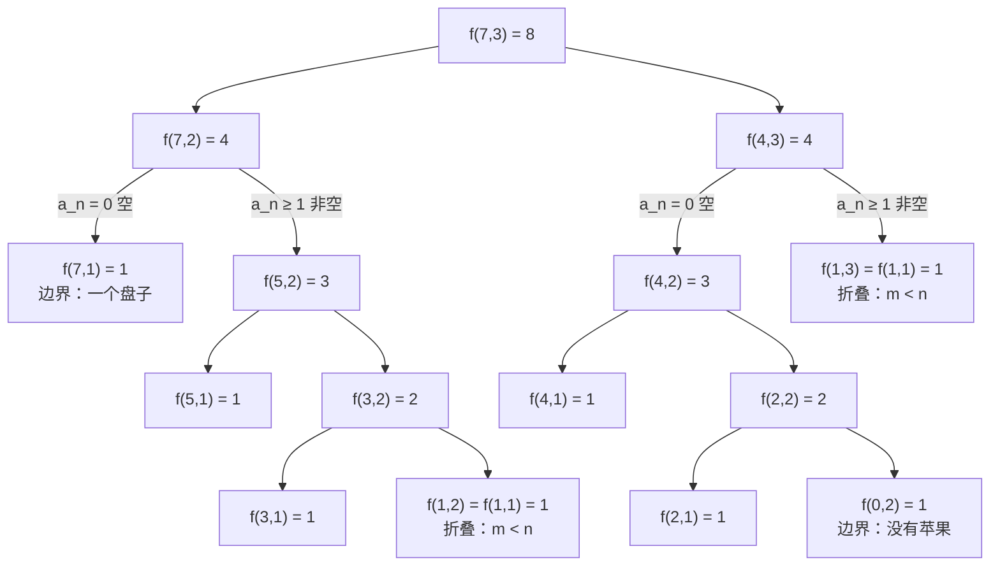

[[TOC]]

## 形式化题目

把 $M$ 个**同样的**苹果放进 $N$ 个**同样的**盘子里，允许有的盘子空着，求不同的分法数。由于苹果和盘子都没有区别，一个分法由"各盘子的苹果数"唯一决定——$5,1,1$ 与 $1,5,1$ 是同一种分法。

等价地说：求满足 $0 \leqslant a_1 \leqslant a_2 \leqslant \cdots \leqslant a_N$ 且 $\sum a_i = M$ 的非降序列个数，即把 $M$ 拆成**至多 $N$ 个部分**的整数拆分数 $p_{\leqslant N}(M)$。样例 $M=7, N=3$ 的答案是 $8$。

## 正解

### 思路

**第一步：把"无区别"翻译成计数规则。** 盘子无区别，所以一个分法与各盘苹果数的**多重集合**一一对应；为了说话方便，把多重集合按非降序排成序列 $0 \leqslant a_1 \leqslant \cdots \leqslant a_N$。暴力做法是 DFS 枚举所有和为 $M$ 的非降序列逐个数，在 $M, N \leqslant 10$ 下完全可过——但它和 DP 是同一个复杂度阶，暴露不出"最终解法消除的瓶颈"，本题真正的教学点在于：**怎么给方案做一个不重不漏的分类**。

**第二步：抓一个分类标准——最后一个盘子是否为空。** 设 $f(m, n)$ 为 $m$ 个苹果放进 $n$ 个盘子的方案数（即非降序列 $0 \leqslant a_1 \leqslant \cdots \leqslant a_n$、和为 $m$ 的个数）。按序列最后一项 $a_n$ 分两类：

- **$a_n = 0$（最后一个盘子空）**：剩下的 $a_1 \leqslant \cdots \leqslant a_{n-1}$ 是和为 $m$、长度为 $n-1$ 的任意非降序列，恰对应 $f(m, n-1)$ 种；
- **$a_n \geqslant 1$（最后一个盘子非空）**：由非降性此时**所有**项都 $\geqslant 1$，于是每项都拿走一个苹果，剩下的仍是合法非降序列；反之任何和为 $m-n$ 的序列各项加一也落回这一类。这是与 $f(m-n, n)$ 的双射。

两类互斥（$a_n$ 是否为零）且覆盖全部方案，所以：

$$f(m, n) = f(m, n-1) + f(m-n, n) \qquad (m \geqslant n \geqslant 2)$$

这里最值得注意的细节是第二类：直觉上"某个盘子非空"似乎只涉及一个盘子，但**非降序让"最后一项非空"自动强制全体非空**，这正是"每盘各垫一个苹果、参数变成 $m-n$"的依据。若误把第二类理解成"只有最后一个盘子非空"，$m=2,n=2$ 就会只数出 $(0,2)$ 而漏掉 $(1,1)$。

**第三步：处理 $m < n$ 与边界。** 当苹果数小于盘子数（$m < n$）时，至少有 $n-m$ 个盘子必然空着，多出来的盘子不起作用，与恰好 $m$ 个盘子等价：$f(m, n) = f(m, m)$（这也保证分类中 $m-n \geqslant 0$，参数永不变负）。两个边界是 $f(0, n) = 1$（全空一种）和 $f(m, 1) = 1$（全部放进一个盘子一种）。

**第四步：递推验证。** 用 $f(m, n) \mid_{m \leqslant 7,\ n \leqslant 4}$ 的小表过一遍（行是苹果数 $m$，列是盘子数 $n$；折线右上方的格子触发 $m<n$ 折叠 $f(m,m)$，加粗格是样例答案 $f(7,3)$）：

| $m \backslash n$ | $n=1$ | $n=2$ | $n=3$ | $n=4$ |
| --- | --- | --- | --- | --- |
| $m=0$ | 1 | 1 | 1 | 1 |
| $m=1$ | 1 | $=f(1,1)=1$ | $=1$ | $=1$ |
| $m=2$ | 1 | $f(2,1)+f(0,2)=2$ | $=2$ | $=2$ |
| $m=3$ | 1 | $f(3,1)+f(1,2)=2$ | $f(3,2)+f(0,3)=3$ | $=3$ |
| $m=4$ | 1 | $f(4,1)+f(2,2)=3$ | $f(4,2)+f(1,3)=4$ | $f(4,3)+f(0,4)=5$ |
| $m=5$ | 1 | 3 | 5 | 6 |
| $m=6$ | 1 | 4 | 7 | 9 |
| $m=7$ | 1 | 4 | **8** | 11 |

看两处转移落点：$f(4,3)$ 沿"空"走到左邻 $f(4,2)=3$、沿"非空"走到 $f(1,3)$（折叠为 $f(1,1)=1$），得 $4$；$f(7,3) = f(7,2) + f(4,3) = 4 + 4 = \mathbf{8}$，与样例一致。对角线以上（$n > m$）的格子全部折叠到对角线上，所以表的有效区域只有下三角加对角线。

**第五步：用样例复核分类的完备性。** $M=7, N=3$ 的 8 个方案按非零盘子数分组列出：

| 非零盘子数 | 方案（非降序） | 个数 |
| --- | --- | --- |
| 1 | $(7)$ | 1 |
| 2 | $(1,6),\ (2,5),\ (3,4)$ | 3 |
| 3 | $(1,1,5),\ (1,2,4),\ (1,3,3),\ (2,2,3)$ | 4 |

按本文的分类标准重新看：$a_3 = 0$ 的方案（前两组，共 4 个）对应 $f(7,2)$；$a_3 \geqslant 1$ 的方案（第三组各项减一得 $(0,0,4),(0,1,3),(0,2,2),(1,1,2)$，共 4 个）对应 $f(4,3)$。$4 + 4 = 8$，两条分类路线数出来的正好是同一批方案。

**实现上**，`main.py` 用 `@cache` 把四条规则直接翻译成记忆化递归：两个边界合一写成 `m == 0 or n == 1`，折叠写在分类转移之前（否则 $m<n$ 时 $m-n$ 会变负）。$m, n \leqslant 10$ 时状态总数只有 $11 \times 11 = 121$ 个，递归深度不超过 $m+n$ 的量级，远在 Python 默认递归上限之内。

### 代码

@include-code(./main.py, python)

### 复杂度

- 时间复杂度：$O(MN)$。状态 $(m, n)$ 至多 $11 \times 11 = 121$ 个，每个状态 $O(1)$ 转移；另有读入 $O(t)$。实测单个评测点约 $0.017$ s（限制 1000 ms）。
- 空间复杂度：$O(MN + t)$，即记忆化表与读入的 token 流，实测峰值内存 14.6 MB（限制 128 MB）。

## 总结

- 无区别对象的计数先翻译成**非降序列**（或多重集合），方案之间不因重排而重复。
- 分类计数的核心是**不重不漏**：按"最后一个盘子是否为空"二分，空类删尾项、非空类全体各减一，两个映射都是双射且两类互斥。
- 非降序下"$a_n \geqslant 1$"自动强制**全体非空**，这是"每盘垫一个、参数变 $m-n$"的正确性来源，也是本题最容易想错的一步。
- $m < n$ 时多余盘子必然空着，可折叠为 $f(m, m)$；它同时保证转移里 $m-n \geqslant 0$。
- 这套递推正是整数拆分数 $p_{\leqslant n}(m)$ 的标准形式：$f(m,n) = f(m,n-1) + f(m-n,n)$，边界 $f(0,n) = f(m,1) = 1$。

## 图示解析

样例 $f(7,3)$ 的完整递归展开树（`@cache` 下每个状态只算一次，叶子是边界或折叠）：

树上每条左箭头是"最后一个盘子空"（$n$ 减一），每条右箭头是"全体非空、各垫一个"（$m$ 减 $n$）。观察两件事：一是从根到任何叶子，$m+n$ 单调递减，递归必然终止；二是"非空"分支在折叠之后大量落进边界 $f(\cdot,1)=1$，说明越往下方案越受约束。根节点把左右两棵子树的和 $4+4$ 汇成答案 $8$，与上面按方案分组的枚举一一对应。
