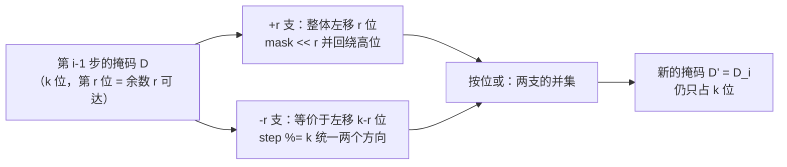

[[TOC]]

## 形式化题目

给定长度为 $n$ 的正整数序列 $a_1, a_2, \dots, a_n$ 与整数 $k$，为每个 $a_i$ 独立选择符号 $s_i \in \{+1, -1\}$，问是否存在一组选择使

$$\sum_{i=1}^{n} s_i a_i \equiv 0 \pmod{k}$$

判定后输出 `YES` 或 `NO`。模意义下 $0$、$-3$、$-6$ 都算 $3$ 的倍数，因此和的**正负无关**，只问它是否为 $k$ 的倍数。

约束：$2 < n < 10000$，$2 < k < 100$，$0 \leqslant a_i \leqslant 10000$（可重复）。

样例 $n = 3,\ k = 2,\ a = (1, 2, 4)$：$1$ 是唯一的奇数项，无论符号怎么取，和都是奇数，不可能被 $2$ 整除，输出 `NO`。

## 正解

### 思路

最直接的做法是枚举 $2^n$ 种符号方案逐个求和取模。$n$ 可以接近 $10000$，$2^{9999}$ 显然不可行。要砍掉方案数，必须先想清楚：**这些方案里有多少信息是重复的？**

**观察一：只看余数，不看数值。** 对 $s_i \in \{\pm 1\}$ 都有 $s_i a_i \equiv s_i (a_i \bmod k) \pmod k$，所以 $a_i$ 是 $7000$ 还是 $3$，只要模 $k$ 同余，对最终和是否为 $k$ 的倍数就毫无区别。把 $a_i$ 先归约到 $r_i = a_i \bmod k \in [0, k)$。

**观察二：只看可达集合，不看方案。** 处理完前 $i$ 个数后，$2^i$ 种符号方案算出的前缀和只可能落在 $k$ 个余数类里。既然后续步骤只关心"当前和的余数是多少"，那些余数相同的方案就完全等价、可以合并成一个状态。于是只需要保存一个集合：

$$D_i = \{\, \textstyle\sum_{j \leqslant i} s_j a_j \bmod k \;\big|\; s_j \in \{\pm 1\} \,\} \subseteq \mathbb{Z}_k$$

**观察三：集合只由"加一支"和"减一支"拼成。** 第 $i$ 个数要么加要么减，因此

$$D_0 = \{0\}, \qquad D_i = (D_{i-1} + r_i) \cup (D_{i-1} - r_i)$$

其中 $D + r$ 表示把集合每个元素在模 $k$ 下加 $r$。答案就是 $0 \in D_n$。

下表用 $k = 5,\ a = (3, 1, 9, 2)$ 演示这个 DP。行是处理完前 $i$ 个数，列是余数 $0 \dots 4$，单元格 $1$ 表示该余数在 $D_i$ 中可达；最右列是这一步用到的 $r_i = a_i \bmod 5$。

| $i$ | 余数 $0$ | 余数 $1$ | 余数 $2$ | 余数 $3$ | 余数 $4$ | $r_i$ |
| --- | --- | --- | --- | --- | --- | --- |
| $0$（空） | 1 | 0 | 0 | 0 | 0 | — |
| $1$ | 0 | 0 | 1 | 1 | 0 | $r_1 = 3$ |
| $2$ | 0 | 1 | 1 | 1 | 1 | $r_2 = 1$ |
| $3$ | 1 | 1 | 1 | 1 | 1 | $r_3 = 4$ |
| $4$ | 1 | 1 | 1 | 1 | 1 | $r_4 = 2$ |

读法：第 $i=0$ 行只有 $D_0 = \{0\}$；第 $i=1$ 行把 $\{0\}$ 平移 $\pm r_1 = \pm 3$，得到 $\{+3,\, -3 \equiv 2\} = \{2, 3\}$；第 $i=2$ 行把 $\{2,3\}$ 分别平移 $\pm r_2 = \pm 1$，得到 $\{1,2,3,4\}$——注意 $0$ 仍不可达，因为前两个数 $3,1$ 都是奇数，任意符号组合的和都是偶数个奇数之和，不可能 $\equiv 0 \pmod 5$。第 $i=3$ 行 $9 \equiv 4 \equiv -1$，把 $\{1,2,3,4\}$ 平移 $\pm 4$ 得到 $\{0,1,2,3,4\}$，$0$ 首次出现，故这个序列可被 $5$ 整除。整个 DP 中，第 $1$ 个数后的 2 种方案、第 $2$ 个数后的 4 种方案、第 $3$ 个数后的 8 种方案……都被压进了最多 $5$ 个格子。

**实现：把集合编码成 $k$ 位掩码。** 余数空间 $k < 100$ 极小，而"集合整体平移"正好可以写成位运算。令整数 `mask` 的第 $r$ 位为 $1$ 表示余数 $r$ 可达，则 $(D + r) \bmod k$ 就是**在 $k$ 位环上循环左移 $r$ 位**——最高位再加一位必须绕回第 $0$ 位，这正是环形回绕：

```
shift(mask, r) = ((mask << r) | (mask >> (k - r))) & ((1 << k) - 1)
```

`mask << r` 负责把第 $0 \dots k-1-r$ 位送到目标位置，`mask >> (k - r)` 把被挤出第 $k$ 位以上的部分绕回低位，两者按位或拼成循环移位，最后与 $(1 \ll k) - 1$ 取交，抹掉高位的残余。$-r$ 方向不必另写一套：先 `step %= k` 把 $-\!a$ 归约成 $k - (a \bmod k)$（Python 的 `%` 对负数返回非负，天然正确），两个方向就共用同一个函数。

于是每步转移只剩两次移位、一次按位或、一次按位与：

```python
for a in data:
    reach = shift_ring(reach, a, k, full) | shift_ring(reach, -a, k, full)
```

下面是环上平移的几何示意：



环上"前进 $r$ 步"与"后退 $r$ 步"是对称的两支，回绕点（余数 $k-1$ 的下一个是余数 $0$）必须由移位表达式中的右移项接住，这就是 `| (mask >> (k - step))` 的作用；漏掉它，最高位就会丢进掩码之外。

### 代码

`reach` 是掩码形式的 $D$，初值 `1` 对应 $D_0 = \{0\}$；`full` 是 $k$ 位封顶掩码；循环体两行分别对应 $+a_i$ 与 $-a_i$ 两支，最后查第 $0$ 位。

@include-code(./main.py, python)

### 复杂度

- 时间复杂度：$O(n \cdot k / w)$，$w$ 为机器字长。每个数做两次 $k$ 位整数的循环移位与按位或，CPython 按 $O(k/w)$ 处理，与标准 $O(nk)$ 的 C++ 写法同阶；对照朴素枚举的 $O(2^n \cdot n)$ 是指数级改善。
- 空间复杂度：$O(k / w)$，只存一个 $k$ 位掩码和常数个整数，与 $n$ 无关；相比二维 `dp[n][k]` 的 $O(nk)$ 省掉了整个数组。

## 总结

这道题的核心是**合并等价状态**：$2^n$ 种符号方案的前缀和只有 $k$ 种余数，因此只需维护"哪些余数可达"这个集合，DP 方程 $D_i = (D_{i-1} + a_i) \cup (D_{i-1} - a_i) \pmod k$ 一步到位，状态数从指数级降到 $k$。

两个容易踩的坑：

1. **只归约 $a_i$ 不够，还要归约符号方向。** `step %= k` 一次同时完成"$a_i$ 取模"和"$-\!a$ 折算成 $k - r$"，两个方向才能共用同一个循环移位；若直接对负数取模后当左移用，或忘了 `& full`，高位污染会让答案出错。
2. **判定的是第 $0$ 位，不是"掩码非零"。** `reach & 1` 才表示"存在和为 $k$ 倍数的方案"；写成 `reach != 0` 几乎恒真（随便一个余数可达就通过），是这类题最常见的错误。

实测真实数据 10 个评测点全部一致，单点约 $0.020$ s、峰值内存约 $15$ MB，相对 $1000$ ms / $128$ MB 的限制非常宽裕，Python 无超时风险。
