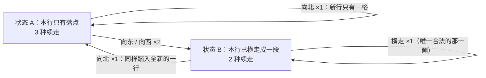

[[TOC]]

## 形式化题目

在无限大的方格棋盘 $\mathbb{Z}^2$ 上从起点 $(0,0)$ 出发走 $n$ 步。每一步的位移只能是
三个向量之一：北 $(0,1)$、东 $(1,0)$、西 $(-1,0)$——**没有向南**。走过的格子立刻塌陷，
之后不允许再次进入（起点在第一步之后就塌陷了）。

求满足"格子两两不同"的行走序列个数：只要有某一步不同，就视为两种不同方案。

## 正解

### 思路

**朴素做法及其瓶颈。** 最直接的想法是 DFS 枚举：维护一个"已踩格子"的集合，每步试北、
东、西三个邻居，不在集合里就继续，走满 $n$ 步就计数加一。这个做法是对的，但 DFS 的状态是
整片塌陷区域，不同历史会重复展开同一个落点却没有可复用的子结构；搜索树的规模随 $n$ 指数
增长（实测每层约 $× 2.41$，$n=15$ 时已 114 万个节点，$n=20$ 时近一亿个），且要枚举
$5.5\times 10^7$ 条完整路径——而答案本身就才这么大，枚举法在 Python 里必然超时。
所以关键不是写得快一点，而是把"塌陷区域的形状"换成它的**局部特征**。

**三条结构性性质。**

1. **行号单调。** 没有向南的走法，被踩过的行只能从第 $0$ 行开始连续地向北扩张，
   而最后一步的落点 $P_n$ 一定在最高的那一行 $h$ 上。
2. **最高行是一段连续区间。** 第一次踏入 $h$ 行只能是从 $h-1$ 行向北走上来；
   此后在 $h$ 行里只能横走。横走序列不能重复踩格，所以在一条直线上它必须单调
   （向东就回不了西），$h$ 行被踩的格子恰好是一段连续区间。
3. **落点是这段区间的端点。** 一旦离开 $h$ 行向北就再也回不来，所以 $h$ 行只在最后
   一次进入后的那段时间里被访问，落点是单调延伸的末端，即区间端点；区间只有一格时，
   它既是左端也是右端。

于是落点只有两种情形，而且**每种情形下能走的方向数是固定的**：

- **状态 A**：$h$ 行只踩了落点这一格。向北合法（$h+1$ 行从未被访问），
  向东、向西踩到的都是新格子，两个方向都合法——共 **3 种**走法。
- **状态 B**：$h$ 行除了落点还踩了别的格子。落点是端点，所以两个横向邻居里
  一个已被踩、一个是新格子，只能朝一个方向横走，再加向北——共 **2 种**走法。

把 $n=2$ 的全部走法画成搜索树，节点后面标注它属于哪一类（叶子共 $3+2+2=7$ 个）：

```text
起点 (0,0)  A
|- 北 (0,1)  A                             第 1 步：1 个 A、2 个 B
|- 东 (1,0)  B
`- 西 (-1,0) B

北 (0,1) A 的下一步（A 类：3 个方向全部合法）
|- 北 (0,2)  A
|- 东 (1,1)  B
`- 西 (-1,1) B

东 (1,0) B 的下一步（B 类：只剩 2 个方向，向西会踩回起点 (0,0)）
|- 北 (1,1)  A
`- 东 (2,0)  B

西 (-1,0) B 的下一步（同理，向东会踩回起点）
|- 北 (-1,1) A
`- 西 (-2,0) B
```

第 2 层叶子中 A 类 3 个、B 类 4 个，与下表一致。注意那个被剪掉的方向：它踩的正是
**本行已踩过的相邻格**，而向北永远踩进一整行没碰过的新格子。

**状态转移。** 只统计两类终点的方案数就够了，因为下一步的去向完全由类别决定：



向北永远把落点变成"新行的唯一一格"，因此 A、B 向北都回到 A；横走只会让本行多踩一格，
所以横向转移都留在 B。设 $a_k$ 为走 $k$ 步后落点为 A 的方案数、$b_k$ 为落点为 B 的方案数：

$$a_k = a_{k-1} + b_{k-1}, \qquad b_k = 2a_{k-1} + b_{k-1}$$

初值 $a_0 = 1$（只有起点，本行只有它自己）、$b_0 = 0$，答案 $f_n = a_n + b_n$。
对照一下前几步：

| $k$ | $a_k$ | $b_k$ | $f_k = a_k + b_k$ |
| --- | --- | --- | --- |
| 0 | 1 | 0 | 1 |
| 1 | 1 | 2 | 3 |
| 2 | 3 | 4 | 7 |
| 3 | 7 | 10 | 17 |
| 4 | 17 | 24 | 41 |

$f_2 = 7$ 与题面样例一致。（这三条性质不只是描述：对 $n \leqslant 11$ 的全部合法路径做过
遍历式校验，每次都满足"最高行是连续区间、落点是区间端点、A 类续走数 = 3、
B 类续走数 = 2"，且枚举总数等于 $a_n + b_n$。）

代码里把 $a_k$、$b_k$ 命名为 `fresh`、`walked`：前者表示终点所在行只有刚踏进来的它
自己，后者表示本行已经横走过一段；`fresh + walked` 就是 $f_n$。

熟悉递推的话还可以把两个状态消成一个：由
$f_k = a_k + b_k = 3a_{k-1} + 2b_{k-1} = 2f_{k-1} + a_{k-1}$，再把递推式
$a_{k-1} = a_{k-2} + b_{k-2} = f_{k-2}$ 代回去，就得到

$$f_k = 2f_{k-1} + f_{k-2}, \qquad f_0 = 1,\ f_1 = 3$$

这正是这道题常见的标准写法（$3, 7, 17, 41, \dots$）。不过两状态版本把"3 种走法 /
2 种走法"这个物理含义留在了代码里，更容易和上面的推导逐步对上，下面给出的就是它。

### 代码

@include-code(./main.py, python)

### 复杂度

- 时间复杂度：$O(n)$，循环 $n$ 次，每次只做常数次整数运算。
- 空间复杂度：$O(1)$，只保存两个状态。

## 总结

- 本题的塌陷规则让状态看起来是整片区域，但**没有向南的走法**迫使最高行只能被横走成
  一段连续区间，落点必是这段区间的端点，塌陷区域可以被压缩成两类局部状态。
- 两类终点各自的可走方向数是常数（3 和 2），于是计数变成 $O(n)$ 的线性递推
  $a_k = a_{k-1}+b_{k-1}$、$b_k = 2a_{k-1}+b_{k-1}$。
- 消去 $b$ 后得到的 $f_k = 2f_{k-1}+f_{k-2}$ 与常见标准解一致，但保留两个状态的写法和
  推导过程直接对应，可读性更好。
