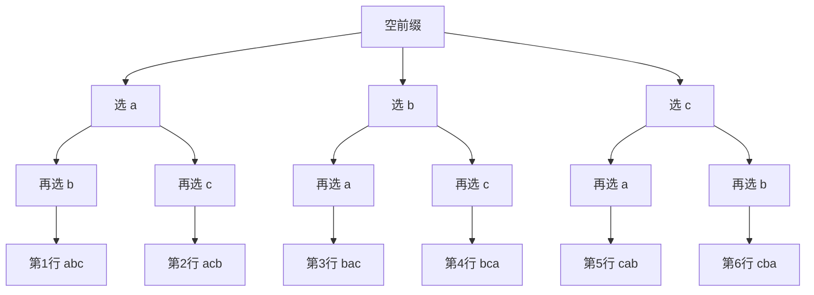

[[TOC]]

## 形式化题目

给定一个由互不相同的小写字母组成、且已按 `a < b < ... < z` 升序排好的字符串 $S = s_1 s_2 \ldots s_n$（$1 \leqslant n \leqslant 6$）。按**字典序从小到大**输出 $S$ 的全部 $n!$ 个排列，每行一个。

字典序：对等长字符串 $S = s_1 \ldots s_k$ 与 $T = t_1 \ldots t_k$，从左往右找第一处 $s_i \ne t_i$；若 $s_i < t_i$，则 $S$ 的序更小。样例输入 `abc`，输出 6 行：

```text
abc
acb
bac
bca
cab
cba
```

## 正解

### 思路

**朴素做法**：手写回溯 DFS——逐层填串：第 1 位、第 2 位……每位都按位置从小到大尝试还没用过的字母，填满 $n$ 位就输出（一本通参考解就是这么写的）。两个条件叠加出正确的顺序：输入已排序，所以同一层先试小字母；深度优先，所以走到底才输出。合起来，产出顺序恰好是字典序。

**这题有瓶颈吗？** 没有可剪的算法瓶颈：输出本身就有 $n!$ 行，$\Omega(n \cdot n!)$ 是任何算法的硬下界，$n \leqslant 6$ 时最多 720 行、4320 个字符。能省的只有多余开销——最常见的就是“先生成、再 `sorted()`”：排序要 $O(n \cdot n! \log n!)$ 次字符串比较，而这个顺序在**生成阶段**就能保证。

**为什么生成序就是字典序？** 把一个排列看成下标元组 $(i_0, i_1, \ldots, i_{n-1})$，拼出的串是 $s_{i_0}s_{i_1}\ldots s_{i_{n-1}}$。$S$ 升序且字符互异，所以 $i < j \iff s_i < s_j$——下标小的地方字母也小。于是两个元组的第一处不同分量处，下标小的那个串在该位的字母也小，**元组的字典序与串的字典序是同一个序**：

| 下标元组 | 拼出的排列 | 下标元组序名次 | 排列字典序名次 |
| --- | --- | --- | --- |
| $(0,1,2)$ | `abc` | 1 | 1 |
| $(0,2,1)$ | `acb` | 2 | 2 |
| $(1,0,2)$ | `bac` | 3 | 3 |
| $(1,2,0)$ | `bca` | 4 | 4 |
| $(2,0,1)$ | `cab` | 5 | 5 |
| $(2,1,0)$ | `cba` | 6 | 6 |

表中每行是一个下标元组和它拼出的排列，后两列分别是「元组按字典序排名」和「串按字典序排名」——两列处处相等，这正是不用排序的全部理由。

而 `itertools.permutations(s)` 产出元组的顺序正是字典序：第 0 位从小到大推进，第 0 位相同时第 1 位从小到大……，这正是回溯 DFS “每层升序尝试 + 深度优先”的展开。用样例 `abc` 走一遍这棵枚举树：



深度优先沿最左路径走到底（`abc`），回溯后才轮到兄弟分支（`acb`），所以叶子按图中顺序依次产出，恰好与样例逐行一致。

**问题？** 那还要自己写 DFS 吗？不用。`permutations` 已经把这棵枚举树封装好，输出用 `print(*..., sep='\n')` 一次完成——算法与参考解同阶，递归、标记数组、排序全部消失在一行表达式里。

### 代码

`permutations(s)` ↔ 参考解的回溯 `dfs`（逐位选未用字母、按下标升序尝试）；`map(''.join, ...)` 把元组拼成串；`print(*..., sep='\n')` 保证每行一个排列。输入串变量名 `s` 即题面的 $S$。

@include-code(./main.py, python)

### 复杂度

- 时间复杂度：$O(n \cdot n!)$——生成 $n!$ 个排列、每个拼接 $n$ 个字符并输出；$n = 6$ 时 720 行，实测约 0.02s。与参考解回溯 DFS（枚举节点总数 $\sum_{k=0}^{n-1} \frac{n!}{(n-k)!} < e \cdot n!$，每个叶子拼 $O(n)$）同阶。
- 空间复杂度：$O(n)$ 工作空间——`permutations` 是生成器，逐个产出，不存全量排列；一次性 `print` 展开的列表 $O(n \cdot n!)$ 即输出本身。峰值约 14.6MB，远低于 128MB。

## 总结

这题的考点只有两件事：**输出顺序为什么对**、**这一行为什么不用排序**。输入已排序这一前提，使“下标字典序 = 排列字典序”，于是“逐位升序尝试 + 深度优先”的生成序就是要求的输出序——顺序问题消解在生成阶段，`sorted()` 无事可做。Python 里这棵枚举树由 `itertools.permutations` 一行承担，`print(*..., sep='\n')` 负责每行一个；与手写回溯 DFS 同为 $O(n \cdot n!)$，只是把递归、标记数组和输出循环换成了表达式。
