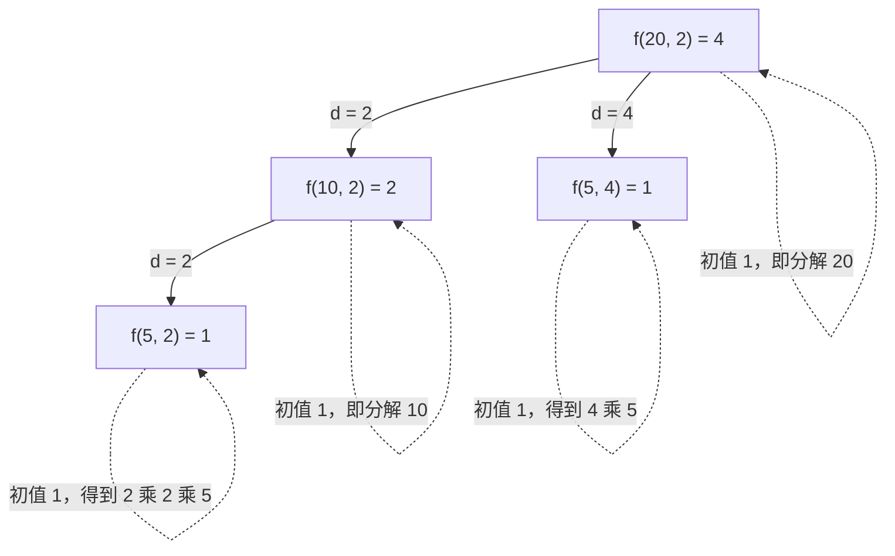

[[TOC]]

## 形式化题目

给定整数 $a > 1$，数出所有满足

$$a = a_1 \times a_2 \times \cdots \times a_k,\qquad 1 < a_1 \leqslant a_2 \leqslant \cdots \leqslant a_k$$

的分解种数。$k = 1$、$a_1 = a$ 这一种也算在内，所以答案至少为 $1$。

约束 $a_1 \leqslant a_2 \leqslant \cdots \leqslant a_k$ 说明只关心用了哪些因子、每个因子用几次，**不区分排列顺序**：$12 = 2 \times 6$ 与 $12 = 6 \times 2$ 是同一种分解。这一点是本题唯一的易错处。

样例：

| 输入 | 输出 | 说明 |
| --- | --- | --- |
| `2` | `1` | 只有 $2 = 2$ |
| `20` | `4` | $20$、$2 \times 10$、$2 \times 2 \times 5$、$4 \times 5$ |

## 正解

### 思路

**朴素做法：逐位猜因子。** 按定义一位一位地枚举因子，维护"已经用了哪些因子"和"下一个因子的下界"。设还剩 $n$ 没分解、下界为 $lo$，则从 $lo$ 扫到 $n$ 试每个约数作为下一个因子，递归下去；扫到乘积恰好等于 $a$ 就记一种。

它是对的，但有两处明显浪费：

1. **枚举范围太大**：每层都从 $lo$ 扫到 $n$，而 $a$ 最大可到 $32767$；
2. **重复子问题**：同一组 $(n, lo)$ 会被不同的外层分支反复重算。

**优化一：用非降序把枚举范围砍到 $\sqrt{n}$。**

设当前这一位选了因子 $d$，那么剩下 $n/d$ 的所有因子都必须 $\geqslant d$，于是必须有 $d \leqslant n/d$，即

$$d \leqslant \lfloor\sqrt{n}\rfloor .$$

这一步一石二鸟：**它同时完成了去重**——每个无序分解恰好对应唯一的非降序写法，所以按首因子分类不会重复计数，也不需要 `set`。

**优化二：记忆化消掉重复子问题。** 状态就是 $(n, lo)$ 这一对，交给 `functools.cache` 即可。

**优化三：单因子用初值收掉。** "不再往下拆"这一支正好对应题面的 $a = a$，不需要进循环，直接把结果初值设成 $1$。

于是得到递推式

$$f(n, lo) = 1 + \sum_{\substack{d = lo \\ d \leqslant \lfloor\sqrt{n}\rfloor \\ d \mid n}} f(n/d,\; d)$$

各项含义：初值 $1$ 是单因子分解；求和范围由非降序推出；$d \mid n$ 保证 $d$ 是真因子；把下界传给 $n/d$ 时收紧成 $d$，是去重的全部机制。答案即 $f(a, 2)$，因为合法因子最小是 $2$。

下面用 $a = 20$ 走一遍递归，看这 $4$ 种分解是如何被各数一次的：

图中实线是"继续往下拆"的递归调用，虚线是每个状态固定的初值 $1$。注意根节点枚举的首因子只到 $\lfloor\sqrt{20}\rfloor = 4$：$d = 5$ 不枚举，否则会得到 $5 \times 4$，与 $4 \times 5$ 重复。另外 $f(5, 2)$ 和 $f(5, 4)$ 虽然 $n$ 相同，但 $lo$ 不同，是两个不同的状态，不能合并。

把每个状态的"初值 + 各分支"逐项列出来，就能手算复核 $f(20, 2) = 4$：

| 状态 | 初值 $1$ | 可行的首因子 $d$ | 分支贡献 | 合计 |
| --- | --- | --- | --- | --- |
| $f(5, 2)$ | $1$ | 无（$\lfloor\sqrt5\rfloor = 2$，$2 \nmid 5$） | $0$ | $1$ |
| $f(10, 2)$ | $1$ | $d = 2$ | $f(5, 2) = 1$ | $2$ |
| $f(5, 4)$ | $1$ | 无（$\lfloor\sqrt5\rfloor = 2 < lo = 4$） | $0$ | $1$ |
| $f(20, 2)$ | $1$ | $d = 2,\ d = 4$ | $f(10,2) + f(5,4) = 3$ | $\mathbf{4}$ |

三条分支分别对应 $20 = 2 \times 10$、$20 = 4 \times 5$、$20 = 2 \times 2 \times 5$，加上初值的 $20$ 本身，正好 $4$ 种。

### 代码

@include-code(./main.py, python)

### 复杂度

记忆化状态为 $(n, lo)$，$n$ 取 $a$ 的约数，状态数上界 $O(d(a)^2)$（$d(a)$ 为约数个数，$a < 32768$ 时 $d(a) \leqslant 96$）；每个状态枚举因子花 $O(\sqrt{a})$，故

$$O\big(d(a) \cdot \sqrt{a}\big) \text{ 时间},\qquad O\big(d(a)^2\big) \text{ 空间},$$

递归栈深度不超过 $\log_2 32767 \approx 15$。多组数据共享同一个 `cache`，实际代价比逐组求和更低。实测 10 组真实数据整批 $0.019$ s、峰值 $14.7$ MB，限制为 $1000$ ms / $128$ MB。

## 总结

本题的模型可以一句话概括：**用非降序把"无序分解"规范化成唯一写法，再按首因子分类做记忆化递推。**

- 非降序 $a_1 \leqslant a_2 \leqslant \cdots \leqslant a_k$ 是去重的钥匙：它让每个多重集只有一种写法，所以不需要 `set` 去重，也不会重复计数。
- 由非降序立刻得到首因子 $d \leqslant n/d$，也就是 $d \leqslant \lfloor\sqrt n\rfloor$，枚举量从 $O(n)$ 降到 $O(\sqrt n)$。
- 初值 $1$ 是题面"$a = a$ 也是一种分解"的直接翻译，把单因子分支从循环里摘了出去。
- 递归深度不超过 $15$，不需要调整递归上限；`@cache` 就足以处理多组数据。

同样的算法在 C++ 里落地时，把 `count` 写成 `long long dfs(int n, int lo)`，用 `unordered_map<long long, long long>`（键为 `n * 32768LL + lo`）或直接开二维数组做记忆化即可；枚举 `for (int d = lo; d * d <= n; ++d) if (n % d == 0)` 时要用 `d * d <= n` 避免浮点误差。注意 `d * d` 在 `int` 下对本题范围安全，但写成 `long long` 更稳妥。

## 图示解析

本题的递归结构已在 `### 思路` 中给出（$f(20, 2)$ 的枚举树 + 状态转移表），两者合起来展示了三件事：

1. **实线分支**是继续拆分，**虚线自环**是每个状态固定的单因子初值 $1$；
2. 根节点只枚举到 $\lfloor\sqrt{20}\rfloor = 4$，验证了平方根剪枝，也说明为什么不会数出 $5 \times 4$；
3. $f(5, 2)$ 与 $f(5, 4)$ 的 $n$ 相同、$lo$ 不同，是两个独立状态——这正是记忆化键必须带上 $lo$ 的原因。
