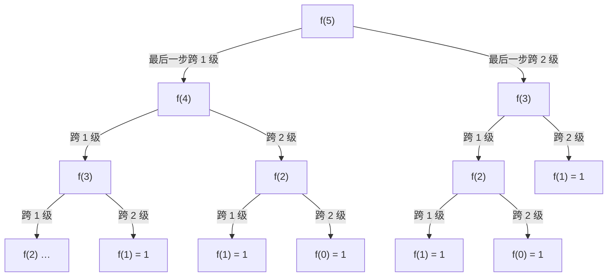

[[TOC]]

## 形式化题目

给定正整数 $N$（$1 \leqslant N \leqslant 30$），求由若干个 $1$ 和 $2$ 组成、各项之和恰好为 $N$ 的**有序序列**个数。每次询问一行输入、一行输出，输入读到 EOF 为止。

记答案为 $f(N)$。有序是指 $1,2$ 与 $2,1$ 算两种不同序列，例如 $N = 3$ 时合法序列为
$\{1,1,1\},\ \{1,2\},\ \{2,1\}$，共 $3$ 种。

样例输入：

```
5
8
10
```

样例输出：

```
8
34
89
```

## 正解

### 思路

题目只有一档约束（$N \leqslant 30$）、多组询问，递推本身就是最直接也最短的正确解法，按直接正解型组织。

**从"最后一步"分类。** 站在第 $N$ 级楼顶回头看，最后一步只有两种可能：

1. 从第 $N-1$ 级**跨 1 级**上来，那么它前面的部分是"走完 $N-1$ 级"的任意合法方案，有 $f(N-1)$ 种；
2. 从第 $N-2$ 级**跨 2 级**上来，它前面的部分是"走完 $N-2$ 级"的任意合法方案，有 $f(N-2)$ 种。

这两类方案的最后一步不同，所以**没有公共元素**（不重）；而任何合法方案的最后一步必然是 $1$ 级或 $2$ 级（不漏）。分拆计数相加：

$$f(N) = f(N-1) + f(N-2)$$

**边界。** $f(1) = 1$（只能走一步 1 级），$f(0) = 1$（一步都不走，即"已站在楼顶"这一种情况）。这样 $f(2) = f(1) + f(0) = 2$，正是 $\{1,1\}$ 与 $\{2\}$ 两种。这正是斐波那契递推，$f(N) = \mathrm{Fib}(N+1)$。

下面的状态依赖图展示 $f(5)$ 如何按"最后一步"拆成两条互斥的分支，每个状态又递归拆解：



图中每个结点按"最后一步"分成左（跨 1 级）、右（跨 2 级）两个子问题，`f(1)`、`f(0)` 是边界直接返回 $1$。注意 $f(3)$ 出现了两次、$f(2)$ 出现了三次——这正是**记忆化**要消除的重复：走完 $n$ 级的方案数只由 $n$ 决定，与前缀无关，算过一次就存进 `@cache`，之后直接命中。没有记忆化的纯递归会把这棵二叉树完整展开，$2^{N}$ 量级的结点里绝大多数是重复子问题。

用递推式把样例 $N = 5$ 逐级展开，每一行都能和"枚举方案数"核对：

| $n$ | 递推计算 | $f(n)$ | 人工核对 |
| --- | --- | --- | --- |
| $0$ | 边界 | $1$ | 空序列 $\{\}$ |
| $1$ | 边界 | $1$ | $\{1\}$ |
| $2$ | $f(1) + f(0) = 1 + 1$ | $2$ | $\{11\},\ \{2\}$ |
| $3$ | $f(2) + f(1) = 2 + 1$ | $3$ | $\{111\},\ \{12\},\ \{21\}$ |
| $4$ | $f(3) + f(2) = 3 + 2$ | $5$ | 五种序列 |
| $5$ | $f(4) + f(3) = 5 + 3$ | $8$ | 与样例输出一致 |

表格前两行是边界值，之后每行等于前两行之和；末列的枚举结果与 $f(n)$ 逐行吻合，样例输出 $8$ 出现在最后一行。继续递推可得 $f(8) = 34$、$f(10) = 89$，与样例完全一致。

**多组询问。** 代码里的 `ways(n)` 就是正文中的 $f(n)$：同一个 $N$ 可能重复出现（真实数据里 $18$ 一组出现 3 次），`@cache` 保证每个不同的 $N$ 只真正计算一次，每组询问只是查一次表。

### 代码

@include-code(./main.py, python)

### 复杂度

- 时间复杂度：$O(\max N + Q)$——$30$ 个状态每个 $O(1)$ 转移，$Q$ 次询问查表；若不做记忆化，纯递归是 $O(2^N)$ 个重复结点。
- 空间复杂度：$O(\max N)$——缓存与递归栈深度均不超过 $30$。

## 总结

1. 按**最后一步**跨 1 级还是 2 级分两类，两类互斥且完备，直接得到递推
   $f(N) = f(N-1) + f(N-2)$；
2. 边界 $f(0) = f(1) = 1$，这正是斐波那契数列；
3. 用 `@cache` 记忆化消除重复子问题，多组询问共享同一张递推表。

这道题是"分步计数"思想的最小样例：当方案的后缀只由"剩余规模"决定时，计数函数天然满足递推，暴力枚举里的重复展开就被一张表替代了。
