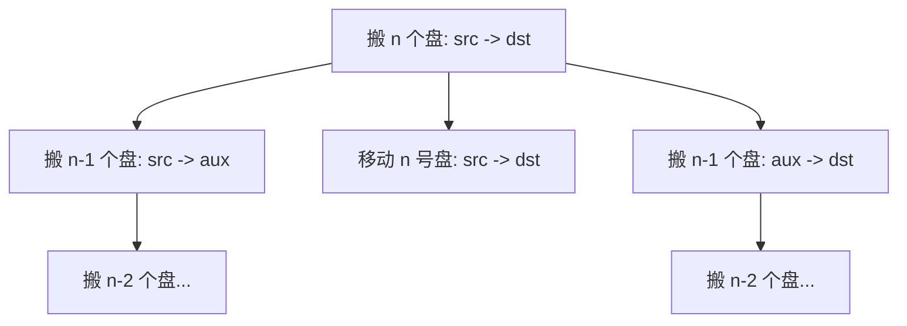

[[TOC]]

## 形式化题目

给定三根柱子与 $n$ 个编号为 $1,2,\dots,n$ 的盘子，盘子初始时按“小盘在上、大盘在下”叠在源柱 $\text{src}$ 上。每次只能移动某柱最上面的一个盘子到另一柱，且任何时刻大盘都不能压在小盘上。给定源柱、目的柱、辅助柱三个单字符名字，要求输出把全部盘子从源柱 $\text{src}$ 移到目的柱 $\text{dst}$ 的每一步。

移动一步的格式为：

```text
src->id->dst
```

其中 `id` 是被移动盘子的编号。

## 正解

### 思路

本题是著名的汉诺塔问题。要把 $n$ 个盘子从 $\text{src}$ 移到 $\text{dst}$，关键观察是：**最大的 $n$ 号盘必须先被上面的 $n-1$ 个盘“解放”出来**。

因此可以用递归分治：

1. 把上面的 $n-1$ 个盘子从 $\text{src}$ 借助 $\text{dst}$ 移到 $\text{aux}$；
2. 把最大的 $n$ 号盘从 $\text{src}$ 直接移到 $\text{dst}$；
3. 再把 $n-1$ 个盘子从 $\text{aux}$ 借助 $\text{src}$ 移到 $\text{dst}$。

当 $n=1$ 时，只有一个盘子，直接输出 `src->1->dst` 即可。递归的每一步都保证目标柱上已有的盘子比当前移动的盘子大，所以不会发生“大盘压小盘”。

用函数 `hanoi(n, src, aux, dst)` 表示“把第 $1\sim n$ 号盘从 `src` 柱借助 `aux` 柱移到 `dst` 柱”，则递归关系如下：

```text
hanoi(n, src, aux, dst)
├── hanoi(n-1, src, dst, aux)   # 把 n-1 个盘搬到辅助柱
├── 输出 src -> n -> dst        # 搬最大的 n 号盘
└── hanoi(n-1, aux, src, dst)   # 把 n-1 个盘搬到目的柱
```

### 代码

@include-code(./main.py, python)

### 复杂度

设移动 $n$ 个盘子的步数为 $T(n)$，则：

$$
T(n) = 2T(n-1) + 1, \quad T(1) = 1
$$

解得：

$$
T(n) = 2^n - 1
$$

由于每步都必须输出，算法的时间复杂度与输出规模同阶，为 $O(2^n)$。递归深度最多为 $n$，额外栈空间为 $O(n)$。

## 总结

汉诺塔问题展示了递归分治的典型结构：**把障碍移走、处理核心元素、再合并**。`hanoi(n, src, aux, dst)` 通过两次规模为 $n-1$ 的子调用，把原问题化归到最小情况，是理解递归和分治思想的经典模型。

## 图示解析

这张图展示递归分治的结构：搬 $n$ 个盘的问题拆成搬 $n-1$ 个盘、搬最大盘、再搬 $n-1$ 个盘，直到 $n=1$ 直接输出。



图后说明：每个节点都是一个与原问题结构相同的子问题，只是柱子角色在递归中轮换。读者可以顺着这个结构，手动模拟 $n=2$ 或 $n=3$ 的完整移动过程。
