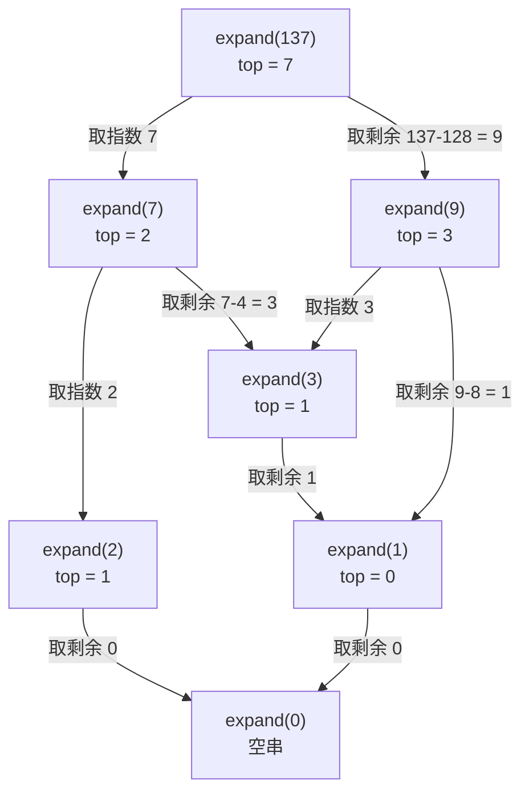

[[TOC]]

## 形式化题目

给定正整数 $n$（$n \leqslant 20000$）。把 $n$ 写成若干 **2 的幂**之和，再按下述规则把和式翻译成不含空格的字符串：

- 项 $2^1$ 写成 `2`；项 $2^0$ 写成 `2(0)`；
- 项 $2^k\ (k \geqslant 2)$ 写成 `2(` $+$ $k$ 的同一形式表示 $+$ `)`，即**指数自身也要继续展开**；
- 项之间用 `+` 连接。

例如 $137 = 2^7 + 2^3 + 2^0$，先写成 `2(7)+2(3)+2(0)`，再把指数 $7 = 2^2+2^1+2^0$、
$3 = 2^1+2^0$ 继续展开，最终得到 `2(2(2)+2+2(0))+2(2+2(0))+2(0)`。

## 正解

### 思路

**朴素想法。** 按题面直译：找出 $n$ 中最大的那个 2 的幂 $2^i$，写出这一项，
再对剩余部分 $n - 2^i$ 重复；而对指数的展开要做**完全相同**的事。

写下来就会发现，指数 $i$ 的展开规则与 $n$ 的展开规则一模一样，都是"拆成 2 的幂之和，
每一项再展开它的指数"。所以不需要写第二个函数，直接让同一个函数递归调用自己：
展开 $n$ 时遇到最高位下标 $i$，就调用 `expand(i)`。**本题的全部难点就这一句：
"展开指数"不是新问题，而是同一个子问题。**

还有一种常见写法是逐步取二进制位：

```python
bits = []
while n:
    bits.append(n % 2)
    n //= 2
```

它没有错，但要多一个列表、一趟循环和一次顺序整理；而"取最高位"这件事，
Python 的整数本身就有现成的答案。

**关键观察一：最高位一步就能拿到。** `bit_length()` 返回二进制的位数，减一就是最高位下标
$\lfloor \log_2 n \rfloor$，等价于 `std.cpp` 里 `while (p <= n) p *= 2;` 那个循环的结论，
但只需要一次调用。随后 `1 << i` 是这一项的值，`n - (1 << i)` 是去掉它之后的剩余——
剩余部分的所有 1 位都在 $i$ 以下，继续同样处理即可，等价于把二进制里所有 1 位从高到低取出来。

**关键观察二：只有指数 0 和 1 是特例。** 于是三种写法可以并列写在一个条件表达式里：

| `top` | 这一项的写法 | 原因 |
| --- | --- | --- |
| $0$ | `2(0)` | $2^0$ 必须显式写出来，不能简化成 `1` |
| $1$ | `2` | 题面约定 $2^1$ 直接写 `2`，不带括号 |
| $\geqslant 2$ | `2(` + `expand(top)` + `)` | 指数自身继续用 0、2 表示展开 |

**关键观察三：把"空"当成零元。** 令 `expand(0)` 返回空串，那么余项的拼接就变成一句
`head + f'+{tail}' * bool(tail)`：余项为空时 `bool(tail)` 是 `False`，字符串乘 `False`
得到空串，不必再写一个 `if` 分支。

下面这张递归展开图用 $137$ 展示参数的走向。根节点是 `expand(137)`，每个子节点都是
一次递归调用，箭头旁边注明是"取指数"还是"取剩余"。



可以看到每个节点的参数都严格小于父节点（$137 \to 7 \to 2$、$137 \to 9 \to 3$），
所以递归必然结束；`expand(0)` 是叶子，返回空串，正是"这一层没有余项"的信号。
最长的链是沿"取剩余"一路下降的那条（如 $32767 \to 16383 \to 8191 \to \cdots$），
每步至少抹掉一个二进制位，所以深度不超过 $O(\log n)$。
不同分支上的同一个参数（图里出现两次的 `expand(3)` 是两次独立调用）会算出同样的结果，
但本题规模下重复计算无足轻重，所以不加记忆化。

样例 $137$ 的分层拆解如下，每一行是"某一层的输入 → 它贡献的字符串"：

| 层 | 输入 | 该输入的最高位 | 贡献的字符串 |
| --- | --- | --- | --- |
| 0（根） | $137$ | $7$ | `2(` $+$ $7$ 的表示 $+$ `)` 与余项 $9$ 的表示相加 |
| 1 | $7$ | $2$ | `2(2)+2+2(0)`：$7=2^2+2^1+2^0$ |
| 1 | $9$ | $3$ | `2(2+2(0))` $+$ `2(0)`：$9=2^3+2^0$ |
| 2 | $2$ | $1$ | `2`（指数 1 的特例） |
| 2 | $3$ | $1$ | `2+2(0)`：$3=2^1+2^0$ |
| 3 | $1$ | $0$ | `2(0)`（指数 0 的特例） |

把各层算出的字符串代回根节点：指数 $7$ 的表示 `2(2)+2+2(0)` 放进 `2(...)` 得到第一项；
余项 $9 = 2^3 + 2^0$，其中指数 $3$ 的表示是 `2+2(0)`、最后那一项 $2^0$ 写成 `2(0)`；
三者用 `+` 连起来恰好是样例输出 `2(2(2)+2+2(0))+2(2+2(0))+2(0)`。

**正确性要点。** $n$ 的二进制表示唯一，所以项集合没有选择余地；贪心每次取最高位，
取走的正是二进制中为 1 的位，剩余部分的 1 位都在其下方，因此不重不漏；递归的两个参数
$i$ 与 $n - 2^i$ 都严格小于 $n$（$n \geqslant 2$），所以递归一定终止。

### 代码

@include-code(./main.py, python)

### 复杂度

- **时间**：单次 `expand(x)` 只做常数次整数运算，调用次数等于"反复取 popcount"的层数
  加上各层的项数；对 $n \leqslant 20000$ 实际只有个位数到几十次调用，
  保守上界 $O(\log^2 n)$（与输出串长度同阶）。
- **空间**：递归深度 $O(\log n)$，输出串与拼接副本 $O(\log^2 n)$；本题实测峰值内存
  约 $14.5$ MB，远低于 $128$ MB 限制。

## 总结

- **识别同构子问题**：题目要求"指数也要用 0、2 表示"，这不是新的子任务，
  而是和展开 $n$ 完全相同的规则，所以一个递归函数就能同时处理数值和指数两层。
- **用位运算直接表达结构**：`x.bit_length() - 1` 一次给出最高位下标，
  `x - (1 << top)` 一次给出剩余部分，省掉了"循环找最高位"和"逐位取余"两套样板。
- **特例与零元**：$2^0$ 必须写 `2(0)`、$2^1$ 直接写 `2`，这两种情况用条件表达式并列表达；
  把 `expand(0)` 定义成空串后，余项的 `+` 拼接不再需要分支。
- **终止性来自参数的严格下降**：$n - 2^i < 2^i \leqslant n$ 且 $i < n$（$n \geqslant 2$），
  每层递归至少抹掉最高位，所以递归深度为 $O(\log n)$；实测在 $n \leqslant 20000$
  范围内最深不超过 $15$ 层栈帧（出现在 $16383$、$32767$ 这类全 1 位数字沿“取剩余”
  分支逐位下降时）。
