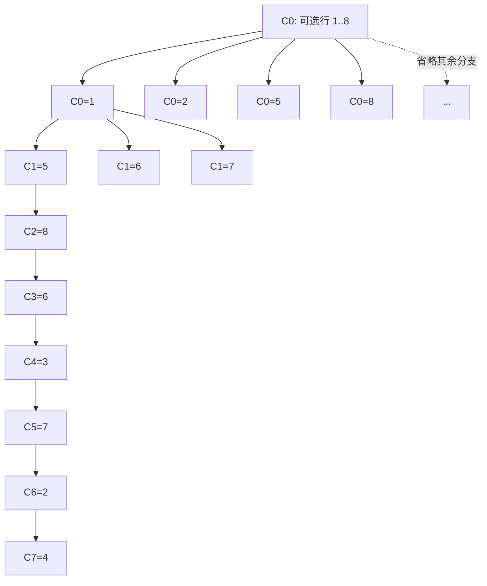

[[TOC]]

## 形式化题目

在 $8 \times 8$ 的棋盘上放置 8 个皇后，要求任意两个皇后都不在同一行、同一列、
同一对角线上，求**全部**解并按固定顺序输出。

因为共有 8 列、8 个皇后，且不同列是硬性约束，"每列恰好一个皇后"自动成立。
于是可以把一个解压缩成一个长度为 8 的序列

$$q_0\, q_1 \cdots q_7, \qquad q_c = \text{第 } c \text{ 列皇后所在的行号} \;(0 \leqslant q_c \leqslant 7),$$

它必须满足

$$
\{q_0, \dots, q_7\} = \{0, 1, \dots, 7\}, \qquad
|q_{c_1} - q_{c_2}| \neq |c_1 - c_2| \quad (\forall\, c_1 \neq c_2).
$$

第一个条件等价于"不同行"（"不同列"由下标 $c$ 本身保证），
第二个条件排除了两条对角线上的互相攻击。**输入为空文件，输出是固定的一段文本**：
对每个解先打印一行 `No. k`（$k$ 从 1 开始连续编号），再打印 8 行棋盘，
第 $r$ 行第 $c$ 列为 `1` 当且仅当 $q_c = r$。

以数据中的第一个解为例，$q = (0,4,7,5,2,6,1,3)$（行号 0 起），即列 0 的皇后在第 1 行、
列 1 的皇后在第 5 行、列 2 的皇后在第 8 行……棋盘为

```text
1 0 0 0 0 0 0 0
0 0 0 0 0 0 1 0
0 0 0 0 1 0 0 0
0 0 0 0 0 0 0 1
0 1 0 0 0 0 0 0
0 0 0 1 0 0 0 0
0 0 0 0 0 1 0 0
0 0 1 0 0 0 0 0
```

## 正解

### 思路

**朴素做法。** 逐列放置皇后，用二维布尔数组记录"被攻击的格子"：`vis[0][r]` 表示第 $r$ 行
被占，`vis[1][r+c]`、`vis[2][r-c+7]` 表示两条对角线被占。
每列枚举 0..7 行，三个 `vis` 都没标记就落子、递归，返回时清掉标记。
完整代码结构就是标准回溯，规模上界 $8^8 = 16\,777\,216$ 个候选排列。

**瓶颈在哪？** 慢并不是主要问题，真正的问题是每层状态被摊成了很多个格子：

1. 判断"能放哪些行"要 `for r in range(8)` 扫满 8 次，哪怕只有 1 行可用；
2. 对角线下标要现算（`r+c`、`r-c+7`），`+7` 这种偏移量纯粹是为了防越界；
3. 回溯时必须反向清零三个标记，写错了就不对称。

这三点的根源是同一句话：**每层的状态被拆成了 8 个独立的布尔值，而不是一个整体。**

**优化一：把"哪些行被占"压成一个 8 位整数。** 用 `cols` 的第 $r$ 位表示第 $r$ 行已被占用，
那么"本列所有合法行"就是

$$
\texttt{avail} = \underbrace{11111111_2}_{\text{8 行全满}} \;\&\; \sim(\texttt{cols} \mid d_1 \mid d_2),
$$

其中 $d_1$、$d_2$ 是两条对角线的占位掩码。判断可用行不再需要循环，只有一次位运算。

**优化二：两条对角线各用一个掩码，跨列时整体移位。** 棋盘内的两条对角线各由一个恒定值刻画。

| $r \backslash c$ | 0 | 1 | 2 | 3 | 4 | 5 | 6 | 7 |
| :-: | :-: | :-: | :-: | :-: | :-: | :-: | :-: | :-: |
| **0** | 7 / 0 | 6 / 1 | 5 / 2 | 4 / 3 | 3 / 4 | 2 / 5 | 1 / 6 | 0 / 7 |
| **1** | 8 / 1 | 7 / 2 | 6 / 3 | 5 / 4 | 4 / 5 | 3 / 6 | 2 / 7 | 1 / 8 |
| **2** | 9 / 2 | 8 / 3 | 7 / 4 | 6 / 5 | 5 / 6 | 4 / 7 | 3 / 8 | 2 / 9 |
| **3** | 10 / 3 | 9 / 4 | 8 / 5 | 7 / 6 | 6 / 7 | 5 / 8 | 4 / 9 | 3 / 10 |
| **4** | 11 / 4 | 10 / 5 | 9 / 6 | 8 / 7 | 7 / 8 | 6 / 9 | 5 / 10 | 4 / 11 |
| **5** | 12 / 5 | 11 / 6 | 10 / 7 | 9 / 8 | 8 / 9 | 7 / 10 | 6 / 11 | 5 / 12 |
| **6** | 13 / 6 | 12 / 7 | 11 / 8 | 10 / 9 | 9 / 10 | 8 / 11 | 7 / 12 | 6 / 13 |
| **7** | 14 / 7 | 13 / 8 | 12 / 9 | 11 / 10 | 10 / 11 | 9 / 12 | 8 / 13 | 7 / 14 |

这张表给出每个格子 $(r, c)$ 的两个编号，格式是"副对角线编号 / 主对角线编号"。
**左上到右下**的斜线上 $r - c + 7$ 恒定（表里每加一列、加一行仍相等的那条），
**左下到右上**的斜线上 $r + c$ 恒定。两格能互相攻击当且仅当二者的任一编号相同：
$r - c$ 相同是同副对角线，$r + c$ 相同是同主对角线。

关键在于跨列时的变化：从第 $c$ 列走到第 $c+1$ 列，
同一根副对角线上的格行号都**加 1**，同一根主对角线上的格行号都**减 1**。
所以只需把掩码整体移位，不需要记录列号：

$$
d_1' = (d_1 \mid \texttt{bit}) \ll 1, \qquad
d_2' = (d_2 \mid \texttt{bit}) \gg 1 ,
$$

其中 `bit` 是本列选中行的单比特。右移时超出棋盘的高位会被下一层的
`& 11111111` 自动丢掉，不需要额外处理。

**优化三：`avail & -avail` 取最低可行行。** 反复取 `avail` 的最低位，枚举完就把它从
`avail` 里异或掉：

```python
while avail:
    bit = avail & -avail
    avail ^= bit
```

这样每层只枚举真正可用的行（空集直接跳过），而且**低位 = 行号小**，
恰好给出了数据要求的"行号升序"顺序。

**优化四：回溯不再需要撤销代码。** 三个掩码是函数的参数，每层拿到的都是一份新的值，
递归返回后上一层的 `cols / d1 / d2` 原封不动，因此一行清理代码都不用写。
递归函数用生成器产出每个完整解，`list(queens(0, 0, 0))` 一次拿齐 92 个解。

下面对数据里第一个解 $q = (1,5,8,6,3,7,2,4)$（行号 1 起）逐列追踪，
`cols / d1 / d2` 是从高位到低位的 8 位二进制（高位 = 行号 1），
`avail` 是本列还能落在哪些行，最后一列记录本列在选中行之前试过、
但深入下去无解而回退的行号。

| 列 $c$ | `cols` 行占用 | `d1` 副对角线 | `d2` 主对角线 | `avail` 可用行 | 本列之前回退掉的行 | 本列选中行 |
| :-: | :-: | :-: | :-: | :-: | :-: | :-: |
| 0 | `00000000` | `00000000` | `00000000` | `11111111` | 无 | 1 |
| 1 | `00000001` | `00000010` | `00000000` | `11111100` | 3, 4 | 5 |
| 2 | `00010001` | `00100100` | `00001000` | `11000010` | 2, 7 | 8 |
| 3 | `10010001` | `01001000` | `01000100` | `00100010` | 2 | 6 |
| 4 | `10110001` | `11010000` | `00110010` | `00001100` | 无 | 3 |
| 5 | `10110101` | `10101000` | `00011011` | `01000000` | 无 | 7 |
| 6 | `11110101` | `11010000` | `00101101` | `00000010` | 无 | 2 |
| 7 | `11110111` | `10100100` | `00010111` | `00001000` | 无 | 4 |

读这张表的要点有三处。

第一，`avail` 的 0 位可以直接读出冲突来源。第 0 列八位全是 1，所以取最低位得到行 1；
到第 1 列时 `cols` 已占行 1（`...0001`）、`d1` 左移成 `...0010`，
两者相或后低两位为 1，取反并截断低 8 位后 `avail` 的低两位就变成 0——
行 1 因同行冲突、行 2 因副对角线冲突，都被一次位运算筛掉。

第二，“仅当前列合法”不等于“最终能成解”。第 1 列的 `avail` 是行 3～8，
其中行 3、4 在本列并不冲突，放下后也确实能继续往下走几层，
但这两支最多只能填满前 7 列，第 8 列（$c = 7$）的 `avail` 恒为 0；
这种下游死路只能靠递归返回才能发现，也正是回溯的代价所在。

第三，越靠后候选越少。按实际搜索统计，处理 $c = 6$ 这一列的 550 个节点里，
有 532 个只剩 0 或 1 个候选；到 $c = 7$ 时，312 个节点里只有 92 个还剩 1 个候选，
其余 220 个已经无路可走。这也解释了为什么尽管前几层分支很多，
整棵树也只有 2 056 次落子尝试。

**输出顺序从哪来？** 题目没有给顺序规则，但判题是逐行比对的，所以顺序本身就是答案的一部分。
只能由搜索树的前序遍历决定：第一层是"第 0 列的行号"、第二层是"第 1 列的行号"……最内层是
"第 7 列的行号"，每层按行号从小到大尝试。真实数据的开头三个解可以印证这一点：

| 编号 | 列 0 | 列 1 | 列 2 | 列 3 | 列 4 | 列 5 | 列 6 | 列 7 |
| --- | :-: | :-: | :-: | :-: | :-: | :-: | :-: | :-: |
| No. 1 | 1 | 5 | 8 | 6 | 3 | 7 | 2 | 4 |
| No. 2 | 1 | 6 | 8 | 3 | 7 | 4 | 2 | 5 |
| No. 3 | 1 | 7 | 4 | 6 | 8 | 2 | 5 | 3 |
| No. 92 | 8 | 4 | 1 | 3 | 6 | 2 | 7 | 5 |

前三个解的第 0 列都固定在第 1 行，而第 1 列依次是 5、6、7，严格递增；
直到"第 0 列 = 第 1 行"的分支全部走完，第 0 列才换成第 2 行。
所以枚举顺序是**列优先、每层行号升序**，用 `bit = avail & -avail` 正好实现。

### 代码

Python 版：

@include-code(./main.py, python)

C++ 版（同一算法）：

@include-code(./main.cpp, cpp)

### 复杂度

- **时间**：搜索树的每个节点对应一次落子尝试，因为 `cols` 强制各行互不相同，
  节点数不超过 $\sum_{k=0}^{8} \frac{8!}{(8-k)!} = O(n!)$。
  加上对角线剪枝，实际只发生 **2 056 次落子尝试**、产出 92 个解，
  每个节点的代价是与 $n$ 无关的常数次位运算，实测 17 ms（限时 1000 ms）。
- **空间**：递归深度为 8，每层只保存三个整数，$O(n)$；保存全部 92 个解需要
  $O(\text{解数} \times n)$。输出本身有 828 行、13 147 字节，
  实测峰值内存约 15 MB（限时 128 MB）。
- **与 C++ 解法的关系**：`main.cpp` 是同一算法的 C++ 版本：读入为空，
  同样用三个掩码按列回溯、边搜边输出，不需要 `vis` 数组，复杂度同为 $O(n!)$。
  Python 版本靠掩码把常数压下来后同样快，本题不存在 Python 特有的 TLE 风险。

## 总结

- **先压缩状态，再谈优化**：把"8 个格子的布尔值"换成一个 8 位整数，
  三类冲突（行、两条对角线）就都变成一次位与，循环和显式撤销一起消失。
- **对角线随列号移位**：$r - c$ 型对角线跨列时行号整体加 1，$r + c$ 型整体减 1，
  于是"记列号 + 算下标"被替换成一次 `<< 1` / `>> 1`，这是本题位运算写法的核心技巧。
- **枚举顺序也是答案的一部分**：本题输出顺序必须与判题数据一致，
  它由搜索树的前序遍历与每层的枚举方向共同决定；
  `avail & -avail` 在"取最低可行行"的同时顺手实现了"行号升序"。
- **不可变参数让回溯免费**：每层递归拿到的都是新的掩码值，
  返回即恢复上一层状态，不需要任何清理代码。
- 八皇后共有 92 个解，其中 12 个在旋转与镜像下互不等价；
  本题只要求按固定顺序输出全部 92 个，不要求去重。

## 图示解析

这张图展示输出顺序是怎么从搜索树里长出来的：根节点开始按第 0 列分行，
实线标出数据里 No. 1～No. 3 走过的分支，虚线后面省略其余分支。



先看 `C0=1` 这个分支：它的三个子节点 `C1=5`、`C1=6`、`C1=7` 按行号从小到大排列，
正对应 No. 1、No. 2、No. 3 三个解；只有这一层全部走完，才会回到根节点换 `C0=2`，
这就是 No. 5 的第 0 列变成第 2 行的原因。再顺着实线往下看，每一层的分支都被上一层的
掩码缩小：越靠后的列，`avail` 为 0 的节点越多（函数在这里直接返回上一层，
不再往下展开），真正能走到第 8 列的只有 92 条路径——
这也是整棵树加起来只有 2 056 次落子尝试的原因。
