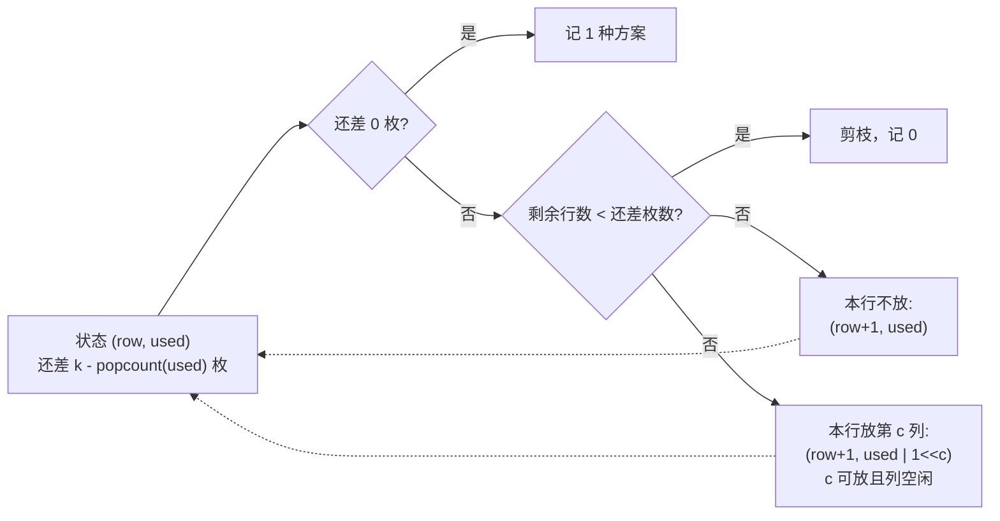

[[TOC]]

## 形式化题目

给定一个 $n \times n$ 的棋盘，部分格子可放棋子（记作 `#`），其余格子不可放（记作 `.`）。
在可放格子中选出 $k$ 个**互不相同**的格子组成一个集合，要求集合中任意两个格子
**不同行、也不同列**。求这样的集合个数 $C$。

棋子彼此没有区别，所以只数"选了哪些格子"：$(0,0)$ 与 $(1,1)$ 两枚棋子在两行之间
交换位置不算新方案；而先把哪一枚放上去、后放哪一枚同样与答案无关。

题面样例的两个棋盘：

| 样例 | 棋盘 | $k$ | 答案 |
| --- | --- | --- | --- |
| 1 | $(0,0)$、$(1,1)$ 可放 | 1 | 2 |
| 2 | $(0,3),(1,2),(2,1),(3,0)$ 可放 | 4 | 1 |

第二个样例里四个 `#` 恰好分布在四条不同的行、四条不同的列上，
放 4 枚棋子只能全占，所以答案只能是 1；这也说明"行列不冲突"是本题唯一的约束。

形式化地：设可放格子集合为 $H \subseteq \{0,\dots,n-1\}^2$，要求

$$
C = \Bigl|\Bigl\{\, S \subseteq H \;:\; |S| = k,\ \forall\,(r_1,c_1),(r_2,c_2) \in S,\ (r_1,c_1) \neq (r_2,c_2):\ r_1 \neq r_2 \ \text{且}\ c_1 \neq c_2 \,\Bigr\}\Bigr|
$$

## 正解

### 思路

**朴素做法的瓶颈。** 最直接的想法是"组合 + 校验"：先把所有 `#` 收进一个列表
（共 $m$ 个），用 `combinations` 枚举 $\binom{m}{k}$ 个格子组合，再逐个检查有没有两格同行或同列。
满棋盘 $n = 8$ 时 $m = 64$，$\binom{64}{8} \approx 4.4 \times 10^9$，
即使剪枝也跑不完一组数据。瓶颈在于把行列约束当成了**事后校验**的条件，
于是大量注定冲突的部分选择仍被枚举。

**观察一：按行决策，让行约束自动成立。** 棋子互不同行，等价于**每一行最多放一枚**。
那就不要"先选格子再校验行"，而是让决策过程本身就按行推进：第 $0$ 行做出选择，
第 $1$ 行做出选择……第 $n-1$ 行做出选择。每一行的选择只有两种：

- 这一行不放棋子；
- 这一行放一枚棋子，即选定一个列号 $c$。

所有行决定完毕后，得到的格子集合必然满足"不同行"；反过来任何合法方案也能唯一地
翻译成"每行放不放、放则放哪一列"。行约束从此不必检查，搜索空间也从"格子组合"
缩小到"每行一个决策"。

**观察二：未来只取决于"哪些列被占了"。** 处理到第 $row$ 行时，能否把棋子放在列 $c$，
只取决于两件事：$(row, c)$ 是不是 `#`，以及列 $c$ 是否已被上面的行占用。
至于"列 $c$ 具体被哪一行占的"，对后续决策毫无影响。既然 $n \leqslant 8$，
就把列的占用情况压成一个 $n$ 位二进制掩码 `used`：第 $c$ 位为 1 表示列 $c$ 已被占，
一共只有 $2^n \leqslant 256$ 种可能。

顺带还有一个好处：每一列最多放一枚棋子，所以**已经放了几枚恰好等于 `used` 里 1 的个数**，
不必再传"已放枚数"这个参数。

**状态与转移。** 记

$$
\text{count}(row, used) = \text{第 } row \text{ 行及以下，把剩余棋子放完的方案数},
\qquad \text{剩余枚数} = k - \operatorname{popcount}(used)
$$

令 $S(row, used)$ 为第 $row$ 行中「格子可放且列号未被占用」的列号集合，即
$S(row, used) = \{\, c \mid (row, c) \text{ 可放且 } c \notin used \,\}$，则

$$
\text{count}(row, used) =
\underbrace{\text{count}(row+1, used)}_{\text{本行不放}}
\;+\;
\sum_{c \in S(row, used)} \underbrace{\text{count}(row+1, used \cup \{c\})}_{\text{本行在第 } c \text{ 列放一枚}}
$$

两个边界负责截断搜索：

- $\operatorname{popcount}(used) = k$：棋子已经放完，**这一条路径记 1 种方案**；
- $n - row < k - \operatorname{popcount}(used)$：剩余可供放棋子的**行数**已经不够摆满剩余棋子，
  返回 0（`#` 太少时 $S$ 为空，转移自然只剩"不放"一条边，最终也会被这条剪枝收掉）。

状态取值表（样例 1：$n = 2$、$k = 1$，`used` 写成两位二进制，第 0 位代表列 0）：

| 状态 $(row, used)$ | 还差枚数 | $S(row, used)$ | $\text{count}$ | 说明 |
| --- | --- | --- | --- | --- |
| $(0, 00)$ | 1 | $\{0\}$ | **2** | 根状态，它的值就是答案 |
| $(1, 00)$ | 1 | $\{1\}$ | 1 | 第 0 行不放时的局面 |
| $(1, 01)$ | 0 | — | 1 | 第 0 行已放列 0：棋子放完，记 1 |
| $(2, 00)$ | 1 | — | 0 | 没有行了但还差 1 枚：剪枝记 0 |
| $(2, 10)$ | 0 | — | 1 | 棋子放完，记 1 |

读表的走向是 $\text{count}(0,00) = \text{count}(1,00) + \text{count}(1,01) = 1 + 1 = 2$，
而 $\text{count}(1,00) = \text{count}(2,00) + \text{count}(2,10) = 0 + 1 = 1$：
每个状态的值只由下一行（$row+1$）的状态决定，所以这是一张按行号递减就能填完的表；
反过来，$S$ 较大时不同父状态会指向同一个 $(row, used)$，那种情况下只需算一次。

以下流程图是转移式的算法视角：一个状态 (row, used) 先判两个边界，再从两类出边走回下一层状态：



两条虚线回到状态节点，表示两类分支都递归到下一行；"放第 $c$ 列"是一条边展开成
对 $S(row, used)$ 中每个 $c$ 求和。出口只有两个：记 1（成功）和记 0（剪枝）。

**样例推演。** 样例 1（$n = 2$、$k = 1$，棋盘 `#.` / `.#`）的完整决策树：

```text
起点 count(row=0, 还差1, used=00)
  |- 第0行不放: count(row=1, 还差1, used=00)
    |- 第1行不放: count(row=2, 还差1, used=00)     -> 还差 1 枚却没行了, 记 0
    |- 第1行放第1列: count(row=2, 还差0, used=10)  -> 记 1
  |- 第0行放第0列: count(row=1, 还差0, used=01)    -> 记 1
```

合计 $1 + 1 = 2$，对应方案 $\{(0,0)\}$ 与 $\{(1,1)\}$，与样例输出一致。
样例 2（$n = 4$、$k = 4$）中每一行只有唯一的 `#`，第 0 行一旦"不放"就凑不满 4 枚，
于是全部行都必须放，只剩一条路径，答案 $1$。

**实现对应。** `solve()` 读入时把每一行的 `#` 压成一个 $n$ 位列掩码并组成 `rows` 元组，
于是"$(row,c)$ 可放"就是 `rows[row] >> c & 1`；
`count(rows, row, k, used)` 用 `@cache` 记忆化上面那条转移式：
`rest = k - used.bit_count()` 是还差枚数，`free = rows[row] & ~used` 一次位运算
把"本行可放"和"列还空闲"合起来，两个边界写成早返回；
每组数据结束后 `count.cache_clear()`，避免不同组棋盘共用缓存键而互相干扰。

### 代码

@include-code(./main.py, python)

### 复杂度

- 时间：状态数为 $(n+1) \cdot 2^n$ 个，每个状态枚举至多 $n$ 列，共 $O(n^2 2^n)$；
  满棋盘 $n = 8$ 时实测状态数分别为 $k = 1$ 的 73 个、$k = 4$ 的 908 个、$k = 8$ 的 511 个，
  都远低于上界，单组耗时不到 1 ms。
- 空间：记忆化表 $O(n 2^n)$ 个整数，递归深度 $O(n)$。

## 总结

- 本题的约束是"棋子两两不同行且不同列"，其中**行约束可以靠决策顺序免费满足**：
  按行推进，每行只决定"放不放、放哪列"，就不会出现两枚棋子同行。
- 剩下的列约束是"已经用过哪些列"，与顺序无关，因此可以压成 $n$ 位掩码当作状态；
  $n \leqslant 8$ 让 $2^n$ 小到可以整表记忆化。这正是**状态压缩搜索**的典型用法：
  把"未来还需要知道的历史"压成一个可哈希的小对象，重复到达时直接复用结果。
- 剪枝 $n - row < k - \operatorname{popcount}(used)$ 之所以成立，是因为每行至多一枚，
  剩余行数不够就意味着后面无论如何都摆不满。
- 若把规模放大到 $n \geqslant 15$，$2^n$ 记忆化会失效，此时应改成"按行滚动 + 字典只保留
  当前可达状态"的方案；但绝不能退回 $\binom{m}{k}$ 的组合枚举。

## 图示解析

这张图串起本题从建模到得到答案的主线：

```text
不规则棋盘 + 放 k 枚棋子
`- 约束: 两两不同行、不同列
   `- 按行决策 -> 行约束自动成立
      `- 状态 = (处理到第 row 行, 列占用掩码 used)
         |- 本行不放  -> count(row+1, used)
         |- 本行放列c -> count(row+1, used | 1<<c)   ((row,c) 是 # 且列 c 空闲)
         `- 出口: used 中有 k 个 1 -> 记 1 种方案
                 剩余行数不足       -> 记 0
```

先看"按行决策"这一步如何消掉行约束，再看状态为什么只需记录列占用，
最后顺着两类出边检查：放棋子的分支只落在 `#` 且未被占用的列上，
不放的分支让搜索继续向后推进，两条出口分支合起来才是完整答案。
