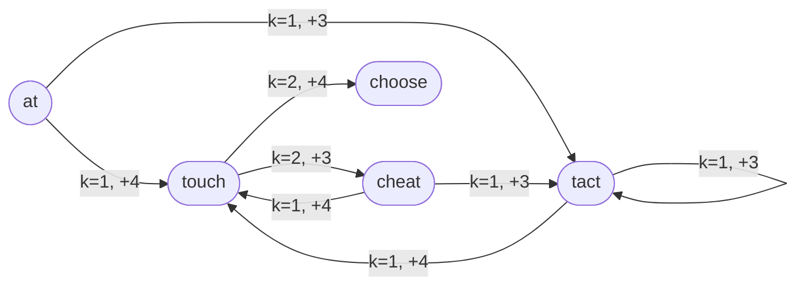

[[TOC]]

## 形式化题目

给定 $n$ 个单词和一个开头字母，用这些单词拼一条“龙”：

- 第一个单词必须以开头字母开头；
- 相邻单词 $A \to B$ 能相连 $\Leftrightarrow$ 存在整数 $k$（$1 \leqslant k < \min(|A|, |B|)$），使 $A$ 的后 $k$ 个字符等于 $B$ 的前 $k$ 个字符。相连时重合部分合为一部分（题面示例：`beast` + `astonish` → `beastonish`），因此龙长 $= \sum |w_i| - \sum k_i$；
- $k$ 不能达到任一词的长度，否则一词整段落在另一词里，构成题面禁止的包含关系（示例：`at` 与 `atide` 的 $k = 2 = |at|$，不能相连）；
- 每个单词最多出现两次。

求能拼出的最长龙的长度。样例中 5 个单词 `at / touch / cheat / choose / tact`、开头字母 `a`，输出 `23`，对应这条拼法（每步列出接上的词、采用的重叠和新增长度）：

| 步骤 | 接上的词 | 重叠 $k$ | 重叠内容 | 新增长度 | 龙长 |
| --- | --- | --- | --- | --- | --- |
| 起步 | `at` | — | — | 2 | 2 |
| 1 | `touch` | 1 | `t` | 4 | 6 |
| 2 | `cheat` | 2 | `ch` | 3 | 9 |
| 3 | `tact` | 1 | `t` | 3 | 12 |
| 4 | `tact` | 1 | `t` | 3 | 15 |
| 5 | `touch` | 1 | `t` | 4 | 19 |
| 6 | `choose` | 2 | `ch` | 4 | 23 |

注意 `touch` 以 `ch` 结尾、`cheat` 与 `choose` 以 `ch` 开头，所以能以 $k = 2$ 进入这两个词；`touch` 和 `tact` 各出现两次，恰好用满“最多两次”的额度。龙长 $= 31 - 8 = 23$：7 次用词的长度和为 31（5 个不同单词，`touch`、`tact` 各用两次），再减去 6 次重叠吃掉的 8 个字符。

## 正解

### 思路

**朴素想法**：把接龙看成“逐层选词”的序列枚举——DFS 回溯，状态是（最后一个词、各词已用次数 `used[]`、当前龙长），每步挑一个 `used < 2` 且能接上的词接上，走到无词可接就更新答案；重叠 $k$ 每次现场从 1 扫到 $\min(|A|,|B|) - 1$ 逐字符比较。这就是数据仓参考实现 `std.cpp` 的思路，C++ 能过，但它暴露了三个瓶颈：

1. 同一条边每次走到都重做 $O(L^2)$ 字符比较；
2. 同一对词若有多个合法 $k$（如 `abababab → abababc` 合法 $k \in \{2,4,6\}$），会开出多个分支，可它们接完后的状态完全一样；
3. 状态数是指数级（深度可达 $2n = 40$、每层分支 $\leqslant n$），Python 直接跑全量枚举有超时风险。

**第一刀：预处理最小合法重叠。** 固定一对 $A \to B$，设合法重叠 $x < y$：本次新增 $|B| - x$ 严格更大，而接完之后后续能接什么只取决于“最后一个词是 $B$”和 `used[]`，与刚才重叠多少无关。所以每对词只需保留**最小**合法正重叠，取大 $k$ 的方案永远能被取小 $k$ 的方案严格更优地替代。于是预处理出增益表 `gain[i][j] = |B| - k_min`（接不上记 `None`），前两个瓶颈一次消掉——多重叠分支塌缩成唯一转移，字符串比较只做一遍。（数据验证：若改成强制取最大重叠，`dcjl1` 只能得到 11 而期望 19。）

**第二刀：上界剪枝。** 任意后续词 $w$ 每次接上至少被重叠吃掉 1 个字符，单次贡献 $\leqslant |w| - 1$，每词还能接 $2 - used[w]$ 次，因此

$$slack = \sum_w (2 - used[w]) \cdot (|w| - 1)$$

是剩余可增长量的上界。进入一个状态先更新 `ans`，若 `cur + slack <= ans`，这枝再怎么拼也超不过当前最优，整枝剪掉。配合每层候选按增益**降序**枚举（先走接得长的分支抬高 `ans`），剪枝命中率最高。

**模型**：以单词为节点、最小重叠为有向边（边权为增益）的有向图上，求首字母受限、每点访问不超过 2 次的最长路径。下图是样例的接龙关系图，标出了 $k$ 与增益，最优路线 `at → touch → cheat → tact → tact → touch → choose` 就在其中：

图中 `choose` 没有出边（其余词都不以 `e` 开头，也没有词的前缀能与 `choose` 的后缀重合），是天然的终点；`tact` 有自环，`tact → touch → cheat → tact` 构成环，所以图上有环、`used[]` 有 $3^n$ 种取值，既不是 DAG 最长路也没法 DP 记忆化——只能搜索 + 剪枝。深度最多 40，Python 默认递归上限足够。

### 代码

@include-code(./main.py, python)

### 复杂度

- 预处理：$O(n^2 L^2)$，$n, L \leqslant 20$，可忽略；
- 搜索：最坏仍是指数量级（深度 $\leqslant 2n$、每层分支 $\leqslant n$），与无剪枝的参考实现在同一阶；剪枝、降序枚举只减少访问的分支，不改变枚举范围。实测 9 组真实数据单组约 0.03 s，远小于 1000 ms 限制；
- 空间：$O(n^2)$ 增益表 + $O(n)$ 辅助数组 + $O(2n)$ 递归栈，远小于 128 MB。

## 总结

本题是“有向图上带次数限制的最长路径搜索”，两个关键点：**能不能接**由“后缀等于前缀且 $k$ 严格小于两词长度”判定，排除整词包含；**一对词只记一种重叠**，最小合法重叠让本次新增最长、后续状态不变，把多重叠分支塌缩成唯一转移。剩下就是带 `used[]` 回溯的 DFS，再加一层“剩余长度上界”剪枝——`slack` 按每词剩余次数乘以单次最大贡献估算，追不上当前最优就整枝放弃，配合增益降序先抬高 `ans`。实测数据仓 9 组评测点全部输出一致，单组约 0.03 s。
