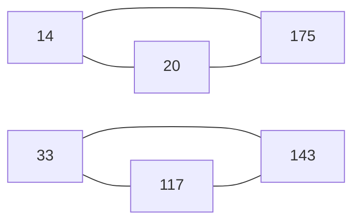

[[TOC]]

## 形式化题目

给定 $n$ 个正整数 $a_1, a_2, \dots, a_n$，求一个划分
$S_1 \sqcup S_2 \sqcup \cdots \sqcup S_k = \{1, 2, \dots, n\}$，使得每个组 $S_j$ 内部
**任意两个元素对应的数互质**：

$$
\forall\, p \neq q \in S_j:\quad \gcd(a_p, a_q) = 1
$$

要求最小化组数 $k$。

约束：$1 \leqslant n \leqslant 10$，$a_i \leqslant 10000$，数值可以重复。

### 样例

输入为 $6$ 个数 $14, 20, 33, 117, 143, 175$。下面这张图画出了它们之间的冲突关系
（两个数不互质就连一条边）。

凡是连了边的两个数都不能同组。观察这张图：第一组三角形是因为
$\gcd(14,20)=2$、$\gcd(14,175)=7$、$\gcd(20,175)=5$，三个数两两都不互质；
第二组三角形同理（$\gcd(33,117)=3$、$\gcd(33,143)=11$、$\gcd(117,143)=13$）。
答案 $3$ 组的划分之一是 $\{14, 33\},\ \{20, 117\},\ \{143, 175\}$ ——
三个三角形各自只需要分到不同颜色的两个点，剩下一个点可以和另一个三角形里的点同色。
读者可以逐个核对这 $3$ 对都互质。

## 正解

### 思路

**朴素做法的瓶颈。** 最直接的办法是把数一个一个放进组里：对当前数，先尝试已有的每一组
（能放的条件是与组内每个数都互质），都放不进去就新开一组；由于"放哪一组"有多个选择，
必须回溯把所有分支试完，才能取到最小答案。这个枚举是正确的，但它把大量的重复情况算了
很多遍 —— 同一个下标集合 $\{a_2, a_5, a_7\}$ 在不同搜索分支里被反复检查合法性、反复展开，
而且搜索树没有任何结构可以利用，规模随 $n$ 阶乘式增长。

**换一个视角：组只由集合决定。** 注意"一组数是否合法"只取决于这个集合本身：只要集合内
两两互质就合法，与这些数是按什么顺序、在搜索的哪一步被放进来的完全无关。这说明可以把
"组"从搜索过程里彻底剥离出来，抽象成一个**下标集合**。

于是把所有下标当成点，把"两个数不互质"当成一条边，得到一张**冲突图** $G$：

$$
i \sim j \iff \gcd(a_i, a_j) > 1
$$

此时"组内两两互质"恰好就是"组内没有 $G$ 的边"，即组是 $G$ 的一个**独立集**。
而"把全部点划分成 $k$ 个组"正是"给 $G$ 找一个 $k$-染色"的定义。结论：

> 答案 $=$ 冲突图 $G$ 的最小染色数（每种颜色对应一组）。

这一步把"分组方案"的枚举换成了"集合覆盖"的枚举，重复子问题立刻显形：只要记住
"覆盖某个集合最少要几组"，就不用再关心之前是怎么走到这个集合的。

**预计算独立集。** 用位掩码表示下标集合。对每个 $i$ 先算出与它冲突的下标掩码
`full[i]`。一个集合 $S$ 是否独立，可以拿它的最低位 $v$ 归纳：

$$
S \text{ 独立} \iff S \setminus \{v\} \text{ 独立} \ \wedge\ full[v] \cap (S \setminus \{v\}) = \varnothing
$$

从空集（恒独立）开始按掩码从小到大递推，$O(2^n)$ 就把 $2^n$ 个集合的合法性全部算完。

**子集 DP。** 设 $f(S)$ 为覆盖集合 $S$ 所需的最少组数：

$$
f(\varnothing) = 0, \qquad
f(S) = 1 + \min\{\, f(S \setminus T) \;:\; \varnothing \neq T \subseteq S,\ T \text{ 独立} \,\}
$$

枚举 $T$ 时只保留包含 $S$ 最低位的那些：最优划分中必定有一组包含这个点，把它拎出来作为
"第一组"不会漏掉任何最优解，但能显著减少枚举量。用 `t = (t - 1) & S` 枚举 $S$ 的全部子集。

以样例为例，取几个关键状态看 DP 表怎么长出来（$f$ 的单位是"组数"）：

| 集合 $S$ | 独立？ | 最优的 $T$ | $f(S)$ |
| --- | --- | --- | --- |
| $\varnothing$ | 是 | — | $0$ |
| $\{14\}$ | 是 | $\{14\}$ | $1 + f(\varnothing) = 1$ |
| $\{14, 20\}$ | 否 | $\{14\}$ | $1 + f(\{20\}) = 2$ |
| $\{14, 33\}$ | 是 | $\{14,33\}$ | $1 + f(\varnothing) = 1$ |
| $\{14, 20, 175\}$ | 否 | $\{14\}$ | $1 + f(\{20,175\}) = 3$ |
| 全集 $\{14,20,33,117,143,175\}$ | 否 | $\{14,33\}$ | $1 + f(\{20,117,143,175\}) = 3$ |

最后一行是本题的关键：$f$ 不能只看“这一组能塞多少个数”，而必须把所有合法 $T$ 都试一遍。
以全集为例，取 $T = \{14, 33\}$ 时剩下 $\{20, 117, 143, 175\}$ 只需 $2$ 组（表中已验证），
而换一个 $T$ 未必能达到同样的效果 —— 所以 $\min$ 不能省。

### 代码

@include-code(./main.py, python)

### 复杂度

- 冲突掩码 $O(n^2 \log V)$，其中 $V \leqslant 10^4$ 是数值上界；
- 独立集表 $O(2^n)$；
- 子集枚举与 DP 合计 $O(3^n)$（$\sum_{S} 2^{|S|} = 3^n$），记忆化保证每个状态只算一次；
- 总时间 $O(n^2 \log V + 3^n)$，$n = 10$ 时 $3^{10} = 59049$；
- 空间 $O(3^n)$：`independent` 占 $2^n$ 字节，`ind_subsets` 存下全部子集共 $3^n$ 个整数
  （$n = 10$ 时约 $5.9$ 万个，可接受）。

## 总结

关键在于把"怎么分组"翻译成"给冲突图染色"：不互质连边，一组就是独立集，答案就是最小染色数。
有了这个模型，原本靠回溯硬搜的问题变成 $2^n$ 个子集上的覆盖 DP，每个状态只依赖集合本身，
重复子问题被完全消除。$n \leqslant 10$ 保证 $O(3^n)$ 足够快；数值范围小，冲突关系直接用
`math.gcd` 两两比较即可，不需要分解质因数。
