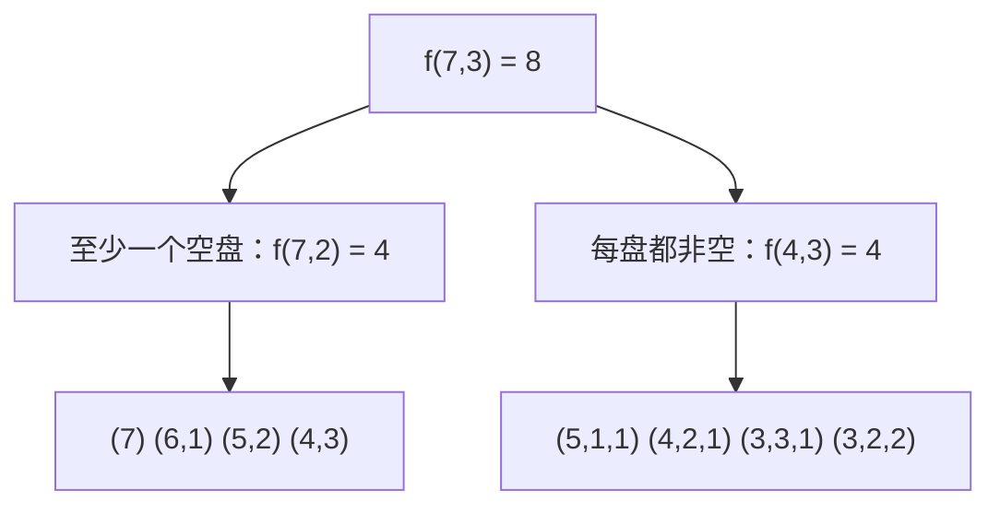

[[TOC]]

## 形式化题目

给定 $M$ 个**相同**的苹果与 $N$ 个**相同**的盘子，允许有些盘子空着，
问把苹果全部放进盘子里的分法数 $K$。

由于盘子相同，$\{5,1,1\}$ 与 $\{1,5,1\}$ 是同一种分法，
因此一种分法只能由一个**非增**序列刻画：

$$a_1 \geqslant a_2 \geqslant \cdots \geqslant a_N \geqslant 0, \qquad \sum_{i=1}^{N} a_i = M .$$

其中 $a_i$ 是"某个盘子里的苹果数"，第 $i$ 项与第 $i$ 个盘子无关——排序只是为了让表示唯一。
于是要求的就是**整数的分拆数**：

$$K = p(M;\ \text{部分数} \leqslant N),$$

即把 $M$ 拆成**不超过 $N$ 个正整数之和**的方案数。两种表示可以互相还原：非增序列去掉末尾的一串 $0$
就得到拆分的加数列表（按从大到小排列），反过来把加数按非增顺序填进序列、后面补 $0$ 就回到原序列。

输入为 $t$ 组询问，每组给出 $M, N$，逐组输出 $K$；$0 \leqslant t \leqslant 20$，$1 \leqslant M, N \leqslant 10$。

## 正解

### 思路

**朴素做法。** 逐盘决定苹果数，并强制"后面的盘不多于前面的盘"：
`dfs(当前盘下标, 上一盘苹果数, 剩余苹果数)`，走到最后一盘时若剩余苹果数不超过上一盘就记一种方案。
这条强制去重正是题目里"盘子相同"的那句话——它一次性排除了所有重排：
比如 $7$ 分给 $3$ 个盘时只会产出 $(4,3,0)$，不会再出现 $(3,4,0)$。

这个搜法对本题规模（$M, N \leqslant 10$，答案最大 $K = p(10;\leqslant 10) = 42$）本身跑得飞快，
真正的问题是**同一个状态被反复重算**：子问题的规模完全由「还剩多少苹果」+「还剩几个盘」
这两个量决定，而不同的搜索分支会反复走到同一对值。
实测这个朴素 DFS 算 $f(10,10)$ 要展开 **853 次调用**，
而不同的「剩余苹果数 + 剩余盘数」组合只有 **100 个**：
以退化状态（剩 $0$ 个苹果、$1$ 个盘）为例，它在这棵递归树里被算到了 41 次。
瓶颈不是规模，而是"重复"——把每个状态只算一次就够了。

**关键观察：按"有没有空盘"给分法分类。** 记 $f(m, n)$ 为"$m$ 个苹果进 $n$ 个盘"的分法数，
则任何一种分法都恰好落进下面两类之一：

| 类别 | 特征 | 与哪个子问题一一对应 |
| :-: | --- | --- |
| 至少一个空盘 | 至少有一个 $a_i = 0$ | 把 $M$ 个苹果放进 $N-1$ 个盘（多出来的空盘直接删掉），方案数 $f(M, N-1)$ |
| 每个盘都非空 | 所有 $a_i \geqslant 1$ | 每盘先各放 $1$ 个，再把剩下的 $M-N$ 个放进 $N$ 个盘（仍可空），方案数 $f(M-N, N)$ |

两类互不相交又覆盖全部方案，两边的对应关系都是双射（删掉一个空盘 / 每盘各减 $1$ 后可逆），
所以直接相加：

$$f(m, n) = f(m, n-1) + f(m-n, n) \qquad (1 \leqslant n \leqslant m).$$

这就是整数分拆的经典递推。它每算一个 $f(m, n)$ 只用两个已经更小的参数，
所以把 $m$ 从小到大、$n$ 从小到大扫一遍，整张表就能无循环依赖地填完——
这也正是 C++ 版不写递归、直接递推打表的原因。

**边界。** 几个退化情况必须单独定死，否则递推没有终点：

- $f(0, n) = 1$：苹果已经放完，剩下的盘子只能全空着，这算一种分法（0 个苹果时 $a_i$ 全为 0）；
- $f(m, 0) = 0$（$m > 0$）：一个盘子都没有，苹果无处可放；
- 当 $n > m$ 时不必让递推下降到 $n = 0$：已经"每盘非空"的支路会算出 $f(m-n, n)$ 这种负数下标，
  而事实上盘子多于苹果时，多出来的 $n - m$ 个盘子**必然**空着，
  这些格子在非增序列里就是末尾的一串 $0$，所以

$$f(m, n) = f(m, m) \qquad (n > m).$$

加上这一条，$n > m$ 的支路被一次性砍掉，递归范围只剩正方形 $m, n \leqslant 10$。

**状态数决定写法。** 状态只有 $(m, n)$ 两个参数、各自不超过 $10$，
所以不需要任何优化技巧，直接把全部 $11 \times 11$ 个状态打出来即可：

- Python 版用 `functools.cache` 记忆化递归，天然只算到用得到的那些状态；
- C++ 版直接从小到大递推填 `dp[m][n]` 二维表，之后每组询问是一次数组取值。

下面用样例 $M = 7, N = 3$ 走一遍：$f(7, 3) = f(7, 2) + f(4, 3) = 4 + 4 = 8$。

读这张图要抓住两点。第一，左支的 4 种里都至少有一个 $0$，右支的 4 种每一项都 $\geqslant 1$，
两列拼起来刚好是不重不漏的 8 种，这正是"分类相加"的直接体现。
第二，右支的 4 种把每项都减 $1$ 后得到 $(4,0,0)$、$(3,1,0)$、$(2,2,0)$、$(2,1,1)$，
恰好是 $f(4,3)$ 的全部方案——这就是"每盘各减 $1$"是可逆双射的具体样貌。

下表是 $m \leqslant 7$、$n \leqslant 3$ 时的局部递推结果，行是苹果数 $m$、列是盘子数 $n$，
单元格即 $f(m, n)$；表格可以直接按公式逐格验算。

| $m \backslash n$ | **0** | **1** | **2** | **3** |
| :-: | :-: | :-: | :-: | :-: |
| **0** | 1 | 1 | 1 | 1 |
| **1** | 0 | 1 | 1 | 1 |
| **2** | 0 | 1 | 2 | 2 |
| **3** | 0 | 1 | 2 | 3 |
| **4** | 0 | 1 | 3 | 4 |
| **5** | 0 | 1 | 3 | 5 |
| **6** | 0 | 1 | 4 | 7 |
| **7** | 0 | 1 | 4 | 8 |

三点观察：$n = 0$ 那一列除了 $m = 0$ 全是 $0$；$n = 1$ 那一列全是 $1$（只能全放在这一个盘里）；
$n \geqslant m$ 之后每行数值不再增长，正是 $f(m,n) = f(m,m)$ 的表现——
表中 $m = 2$ 那一行往右看，$n = 2$ 与 $n = 3$ 都是 $2$（$n$ 再大也还是 $2$）。
样例要的 $f(7, 3) = 8$ 就落在表右下角。

### 代码

Python 版：

@include-code(./main.py, python)

C++ 版（同一算法）：

@include-code(./main.cpp, cpp)

### 复杂度

- **时间**：预处理填满 $11 \times 11$ 的表，每个状态 $O(1)$，所以是 $O(M_{\max} N_{\max})$（本题 $100$ 次加法）；
  之后每组询问 $O(1)$。总计 $O(M_{\max} N_{\max} + t)$。Python 版用 `cache` 记忆化，
  只会展开实际被询问的状态，上界同样是 $O(M_{\max} N_{\max})$。
- **空间**：$O(M_{\max} N_{\max})$ 的状态表（本题 $121$ 个整数），无递归以外的额外开销；
  Python 记忆化递归深度上界 $O(M + N)$。
- **实测**：C++ 编译后 10 个测试点单点 $\leqslant 0.010$ s / 峰值 8.4 MB，
  Python 单点 $\leqslant 0.019$ s / 峰值 14.6 MB（限时 1000 ms / 64 MB），
  两种实现在 10 个测试点上逐字节输出一致。

## 总结

- **"盘子相同"就是去重约定**：它把分法与"非增序列"一一对应，于是题目从"放球"变成了整数分拆；
  如果盘子是不同的，答案会变成隔板法组合数 $\binom{M+N-1}{N-1}$，$7,3$ 就该是 $36$ 而不是 $8$。
- **分类的依据要能反向还原**：按"至少一个空盘 / 每盘非空"分，两类都能由子问题可逆地构造出来
  （删空盘、每盘减 $1$），所以既能相加也不会重复计数，这是本题唯一的推导步骤。
- **边界定死两头**：$f(0, n) = 1$、$f(m, 0) = 0$，再加上 $n > m \Rightarrow f(m, n) = f(m, m)$
  的剪枝，递推就能稳稳落地；少了任何一条都会出现负数下标或漏算空盘方案。
- **范围小就别硬套技巧**：状态只有 $O(MN)$ 个且都很小，直接打表 + 每组 $O(1)$ 查询是最清楚的写法；
  Python 侧用 `cache` 记忆化就能达到同样的复杂度。
- **读入细节**：$t = 0$ 是题面允许的合法输入，此时**不能输出任何字符**（连换行都不能多），
  代码里用 `if out:` 守住这一条。
