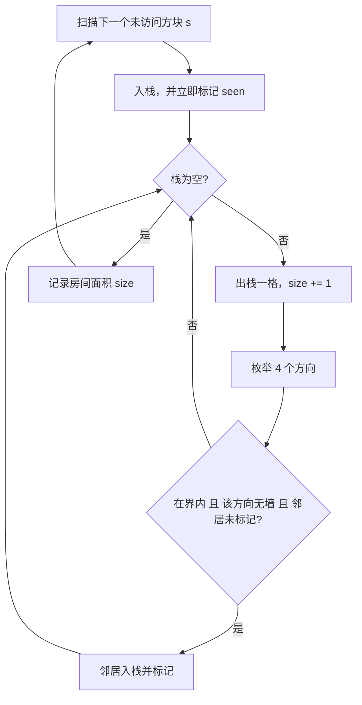

[[TOC]]

## 形式化题目

给定一个 $m\times n$ 的方格矩阵，第 $r$ 行第 $c$ 列的方块（下标从 0 开始）带一个整数 $P_{r,c}\in[0,15]$。$P$ 是四条边的墙位之和：$1$ 表示西墙、$2$ 表示北墙、$4$ 表示东墙、$8$ 表示南墙；某一位为 1 就说明该方块那一侧有墙。室内的墙被相邻两格各描述一次，例如 $(r,c)$ 的南墙也在 $(r+1,c)$ 的北墙中出现。

两个共享一条边、且该公共边上没有墙的方块属于同一个**房间**；房间就是这样的关系生成的等价类。要求给出房间的总数，以及面积（方块数）最大的房间的面积。

### 样例解读

样例为 $m=4$、$n=7$，输入方块编号与它带的墙如下（`N`/`S`/`W`/`E` 依次对应北/南/西/东）。例如左上角 $(0,0)$ 的 $11=8+2+1$，意思是南、北、西三面有墙，只有东面开口，所以它只能和右边的 $(0,1)$ 连通。

| 行\列 | $c=0$ | $c=1$ | $c=2$ | $c=3$ | $c=4$ | $c=5$ | $c=6$ |
| --- | :---: | :---: | :---: | :---: | :---: | :---: | :---: |
| $r=0$ | 11（NSW） | 6（NE） | 11（NSW） | 6（NE） | 3（NW） | 10（NS） | 6（NE） |
| $r=1$ | 7（NWE） | 9（SW） | 6（NE） | 13（SWE） | 5（WE） | 15（NSWE） | 5（WE） |
| $r=2$ | 1（W） | 10（NS） | 12（SE） | 7（NWE） | 13（SWE） | 7（NWE） | 5（WE） |
| $r=3$ | 13（SWE） | 11（NSW） | 10（NS） | 8（S） | 10（NS） | 12（SE） | 13（SWE） |

按上表走一遍连通关系，得到 5 个房间（相同数字表示同一个房间）：

| 行\列 | $c=0$ | $c=1$ | $c=2$ | $c=3$ | $c=4$ | $c=5$ | $c=6$ |
| --- | :---: | :---: | :---: | :---: | :---: | :---: | :---: |
| $r=0$ | 1 | 1 | 2 | 2 | 3 | 3 | 3 |
| $r=1$ | 1 | 1 | 1 | 2 | 3 | 4 | 3 |
| $r=2$ | 1 | 1 | 1 | 5 | 3 | 5 | 3 |
| $r=3$ | 1 | 5 | 5 | 5 | 5 | 5 | 3 |

各房间的面积依次是 $9,3,8,1,7$，因此房间数为 $5$，最大面积为 $9$，与样例输出一致。注意房间 4 只有 $(1,5)$ 一格：它的 $P=15$ 表示四面全是墙，于是它自己单独构成一个面积为 1 的房间——**"有墙"不等于"不是房间"**。

## 正解

### 思路

**朴素做法与它的瓶颈。** 看到"房间有多大"，最直接的反应是"从一个方块出发数一数能走到多少个方块"。如果按走法来枚举，这个思路有两个致命问题：其一，只要允许走回已经走过的格子，网格里的环（一个 $2\times2$ 的空心方块就够了）会让人在环里无限打转，搜索永远结束不了；其二，即使加上"不重复走同一格"的限制，从一个方块到另一个方块的不同路径条数仍随格子数指数增长，而题目只要一个面积数字，一条路径都不需要输出——路径枚举做的功绝大部分是白做的。

**观察一：墙就是边的存在性。** 每个方块的四位二进制恰好对应它的四条边，位为 1 表示那一侧有墙。于是"能不能从这一格走到相邻那一格"可以直接用一次按位与判断：从 $(r,c)$ 朝方向 $d$ 走可行，当且仅当 $P_{r,c}$ 在该方向的位上为 0。方向、下标增量与墙位的对照如下（表里也标出了这一位代表的物理墙）：

```text
                 (r-1, c)   北 · 墙位 2
                      ▲
                      │
   (r, c-1) 西 ◀── (r, c) ──▶ (r, c+1) 东
      墙位 1          │            墙位 4
                      ▼
                 (r+1, c)   南 · 墙位 8
```

判断时只查**当前格自己**那一侧就足够。题面说"室内的墙被定义两次"，正是为了保证 $(r,c)$ 的东墙与 $(r,c+1)$ 的西墙永远同时有或同时没有；只查一侧既省掉对邻居的越界访问，也不会漏判。

**观察二：题目就是求连通分量。** 把每个方块看成一个顶点，两个相邻且公共边无墙的方块之间连一条无向边，那么：

- 房间 $\leftrightarrow$ 连通分量；
- 房间面积 $\leftrightarrow$ 分量里的顶点数；
- 答案 $\leftrightarrow$ 连通分量的个数与最大分量大小。

这一步把一个几何问题变成了图论里最基础的操作，不需要最短路、不需要回溯，任何一次遍历都够用。

**观察三：一个格子只需要被展开一次。** 格子 $x$ 第一次被处理时，"从 $x$ 出发还能到哪些格子"就已经确定；之后再从别的路径绕回 $x$ 重新展开，得到的仍是同一批邻居。于是加一个 `seen` 数组，**一入栈就标记**，保证每个格子最多被展开一次。指数级的路径枚举被压成对图的一次线性扫描。

**做法（洪水填充）。** 依次扫描每个方块，遇到未访问的就从它出发做一次填充，把这个连通分量整个标记掉，同时统计它的大小：

1. 外层按编号升序扫描，跳过已标记的方块；
2. 遇到未标记的 $s$，置 `seen[s]=1`，把 $s$ 压入栈，`size=0`；
3. 反复出栈一格、`size` 加一，枚举 4 个方向：在界内、当前格那一侧没有墙、且邻居未标记时，标记邻居并压栈；
4. 栈空时该分量的面积就是 `size`，记入 `sizes`；
5. 回到第 1 步。最终 `len(sizes)` 是房间数，`max(sizes)` 是最大面积。

下图把上面这段洪水填充的控制流程画出来，重点看外层"扫描下一个未访问方块"与内层"栈空为止"这两层循环如何嵌套：



读者应该注意到：每次回到 `A` 时选择的一定是全新的、从未被标记过的方块，因此每个房间只会在 `H` 处被记录一次；`F` 的三个条件必须同时成立才压栈，其中"该方向无墙"来自按位与判断，"邻居未标记"则依赖标记发生在压栈之前。整张图只有两层循环，没有任何回溯分支——这正是观察三把指数级路径枚举压成线性扫描的结果。

**为什么用迭代而不是递归。** Python 的默认递归深度约 1000，而最坏情况（$50\times50$ 全连通）的填充深度可达 2500，递归会直接爆栈；用 `sys.setrecursionlimit` 把限制抬高属于掩盖问题而不是解决问题。所以代码用显式列表当栈：`pop` 取出当前格，`append` 压入新格子，标记与压入同时发生。

实现上还有两个细节：格子用一维编号 `id = r * n + c` 表示，于是 `seen` 可以用 `mn` 字节的 `bytearray`（天然是 $O(mn)$ 空间，没有哈希开销），地址还原用 `divmod(id, n)`；越界判断必须写在数组访问之前——`in_range and ... and not seen[nr * n + nc]` 靠 `and` 的短路顺序避免越界，因为 Python 的负下标不会报错，只会悄悄取到别的行。

### 代码

@include-code(./main.py, python)

### 复杂度

- 时间复杂度：$O(mn)$。每个格子最多被压栈、出栈各一次（标记发生在压栈之前），每次出栈只检查 4 个方向，方向检查是常数次整数比较和按位与；外层扫描同样是 $O(mn)$。$m,n\leqslant 50$ 时上界为 2500 次出栈、约 $10^4$ 次邻居检查。
- 空间复杂度：$O(mn)$。`seen` 是 $mn$ 字节，显式栈最坏保存 $mn$ 个下标，`sizes` 最坏保存 $mn$ 个面积（全封闭城堡时每个房间面积都是 1）。
- 与 C++ 参考实现（四方向 BFS + `vis` 数组）复杂度同阶，没有暴力回退。实测 8 组真实数据全部通过，最大测例 $50\times50$ 用时 0.017 s、峰值约 15 MB，远低于 1000 ms / 128 MB 的限制。

## 总结

- **几何转图论**：房间就是连通分量，面积就是分量大小；把"墙"看成"这条边不存在"是本模型的关键。
- **方向查一侧即可**：公共墙被两侧同时定义，所以只看当前格的墙位就能判断能否走过去，省掉邻居侧的越界处理。
- **入栈即标记**：`seen` 必须在压栈前置位，否则同一个格子会被反复压入，复杂度和内存都会失控。
- **先判界再取下标**：`in_range and ... and not seen[...]` 的顺序不能换，Python 的负下标是静默错误而不是异常。
- **用迭代代替递归**：最坏填充深度可达 2500，超出 Python 默认递归深度，显式栈是唯一稳妥的写法。
