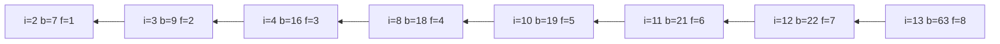

[[TOC]]

## 形式化题目

给定 $n$ 个两两不同的整数 $b(1), b(2), \dots, b(n)$。求下标序列
$i_1 < i_2 < \dots < i_k$，使

$$b(i_1) \leqslant b(i_2) \leqslant \dots \leqslant b(i_k)$$

并让 $k$ 尽可能大。答案不唯一时可取任意一组最优解。

## 正解

### 思路

**朴素做法不行。** 最直接的想法是枚举所有 $2^n$ 个子序列、逐个检查是否不下降。在题面给的 $n \leqslant 200$ 下，$n = 14$ 时 $2^{14} = 16384$ 还能忍，$n = 200$ 时是 $2^{200} \approx 1.6\times 10^{60}$，完全不可行。瓶颈不在"检查"，而在"枚举"这一动作把「选了哪几个位置」当成了状态。

**换一个状态。** 一条不下降子序列去掉末尾元素后，剩下的仍是不下降子序列，所以可以把整条子序列压缩成两个量：**末尾的下标** $i$ 和**当前长度**。于是定义

$$f_i = \text{以第 } i \text{ 个元素结尾的最长不下降子序列长度}$$

状态数立刻从 $2^n$ 降到 $n$。要算 $f_i$，就从它前面挑一个能接上的末尾 $j$（要求 $j < i$ 且 $b(j) \leqslant b(i)$），接上之后长度为 $f_j + 1$，在所有合法的 $j$ 里取最大；一个都接不上时 $b(i)$ 自己成列，长度为 1：

$$f_i = 1 + \max\{f_j : j < i,\ b(j) \leqslant b(i)\}, \qquad \text{答案} = \max_i f_i$$

从小到大枚举 $i$，右边用到的 $f_j$ 都已算好，符合无后效性。注意题目是**不下降**（允许相等），所以比较用 $\leqslant$ 而不是 $<$。

用题面样例 $b = (13, 7, 9, 16, 38, 24, 37, 18, 44, 19, 21, 22, 63, 15)$ 走一遍 DP：

| $i$ | 1 | 2 | 3 | 4 | 5 | 6 | 7 | 8 | 9 | 10 | 11 | 12 | 13 | 14 |
| --- | --- | --- | --- | --- | --- | --- | --- | --- | --- | --- | --- | --- | --- | --- |
| $b(i)$ | 13 | 7 | 9 | 16 | 38 | 24 | 37 | 18 | 44 | 19 | 21 | 22 | 63 | 15 |
| 满足 $b(j) \leqslant b(i)$ 的 $j$ | — | — | 2 | 1,2,3 | 1–4 | 1–4 | 1,2,3,4,6 | 1–4 | 1–8 | 1–4,8 | 1–4,8,10 | 1–4,8,10,11 | 1–12 | 1,2,3 |
| $f_i$ | 1 | 1 | **2** | **3** | 4 | 4 | 5 | **4** | 6 | **5** | **6** | **7** | **8** | 3 |

表的每一列是一个状态：第二行是元素值，第三行是**所有**合法的前驱下标，第四行是取最大值后的 $f_i$（加粗列属于最终的答案链）。例如 $i = 13$（$b = 63$）时合法的 $j$ 有 1..12，其中 $f_{12} = 7$ 最大，于是 $f_{13} = 8$；$i = 8$（$b = 18$）的合法前驱只有 1..4，所以 $f_8 = 1 + \max(1,1,2,3) = 4$。最后的 $\max_i f_i = 8$ 就是答案。

**顺手记下方案。** 求长度和输出方案可以共用同一张 $f$ 表：只要求在转移**刷新最大值**的那一刻，把来源下标写进前驱数组 `pre[i]`。回溯时从取到 $\max f$ 的下标 $best$ 出发沿 `pre` 往回走、把访问到的元素倒着输出即可：

```text
若 b[j] <= b[i] 且 f[j] + 1 > f[i]:
    f[i] = f[j] + 1; pre[i] = j

k = best
while k >= 0:
    输出 b[k]; k = pre[k]      # 得到的是逆序，最后整体倒过来
```

回溯为什么一定合法：`pre[i]` 满足 $pre[i] < i$ 且 $f_{pre[i]} = f_i - 1$，所以沿 `pre` 每走一步下标严格变小、长度恰好减 1，走 $f_{best}$ 步后必然停在某个没有前驱的元素上，链长正好是 $f_{best}$；而每一步都通过了 $b(pre) \leqslant b(i)$ 的检查，取出的值序列天然不下降。样例的前驱链如下（箭头方向是 `pre` 的方向）：



从末尾顺着箭头读回去是 `i = 13, 12, 11, 10, 8, 4, 3, 2`，对应的值正是题面举出的那条答案 `7 9 16 18 19 21 22 63`。

!!! warning 输出的第二行与前缀大小写
    按题面要求，输出应有第二行，即一条最优方案的元素序列（样例中是 `7 9 16 18 19 21 22 63`），
    且本题开启特殊评测、答案不唯一。但本仓库归档的参考答案（`data/problem*.out`）
    **只有长度这一行**：`problem1.out` 的全部内容就是 `Max=19` 加一个换行。
    要让程序输出与归档答案逐行一致，就只能打印这一个长度行，多打一行反而对不上。
    这里补充两点事实：题面样例的前缀是小写 `max=`，归档答案却是大写 `Max=`（代码以归档为准）；
    而方案输出的做法已经在上面推导完毕，需要时把 `pre` 与回溯两段加回 `main.py` 即可。

### 代码

@include-code(./main.py, python)

### 复杂度

- 时间复杂度：$O(n^2)$。双重循环共约 $\frac{n(n-1)}{2}$ 次比较，$n = 200$ 时不到 2 万次。
- 空间复杂度：$O(n)$。只存输入序列与 $f$ 表（要输出方案时再加一个长度 $n$ 的 `pre`）。

## 总结

最长不下降子序列的关键一步是**把"以谁结尾"写进状态**：只有固定了末尾元素，才谈得上"下一个元素能不能接上"，递推才成立。这一步把指数级的子序列枚举压成了 $n$ 个状态、$\Theta(n^2)$ 次转移的线性 DP。
求长度与求方案共用同一张 $f$ 表——转移成功时记一个前驱，回溯时倒序输出即可，不需要第二遍 DP，也不改变复杂度。
本题的数据规模（$n \leqslant 200$）让 $O(n^2)$ 的朴素 DP 就是正解；当 $n$ 升到 $10^5$ 且只问长度时，才需要换成"$f$ 值分桶 + 二分找桶内最小末尾"的 $O(n\log n)$ 贪心写法。
