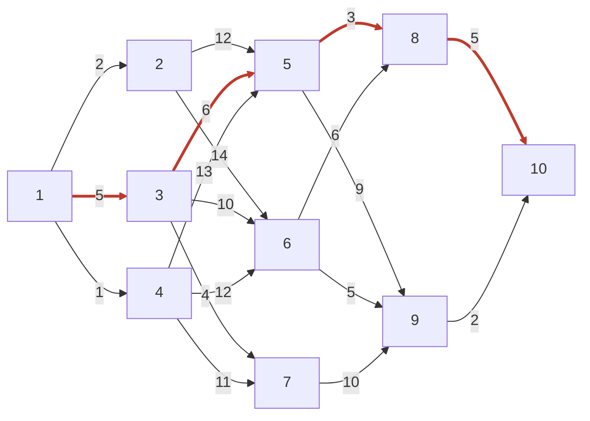

[[TOC]]

## 形式化题目

给定 $N$（$N \leqslant 20$）个城市与一个 $N \times N$ 费用矩阵：$w_{i,j}$ 表示从城市 $i$
直通城市 $j$ 的费用，0 表示两点间没有直通边。所有可行方向都是**从编号小的城市指向编号大的
城市**（题面配图 $A \to E$ 的单向路网即此语义），这些边构成一张有向无环图。
求一条从城市 1 到城市 $N$ 的路径，使总费用最小；既要给出这个最小费用，也要给出路径经过的城市序列。

样例的 10 城路网如下，边上的数字是费用，红色加粗的四条边标出最优路线 $1 \to 3 \to 5 \to 8 \to 10$：

观察三点：每条边的箭头都指向编号更大的城市，所以图中**不可能有环**；每条边都有自己的费用，
不能按"边数最少"贪心；最优路线的费用是 $5+6+3+5=19$，并不是每一步都挑当前最便宜的边
（第 1 步最便宜的是 $1 \to 2$ 费用 2，走它反而更差）。

## 正解

### 思路

**朴素做法**是从 1 出发 DFS 枚举所有能到达 $N$ 的路径，逐条求和取最小。但路径条数随长度
指数增长：稠密矩阵下 $N=20$ 有 $2^{18}$ 条路径，每条还要 $O(N)$ 求和，最坏
$O(N \cdot 2^{N-2})$，零余量。

**瓶颈在于后缀被重复计算**：不同的前缀到达同一个城市 $j$ 之后，"$j \to N$ 怎么走最便宜"
是同一件事——它只取决于 $j$，与怎么到达 $j$ 无关（无后效性），却在枚举中被每条前缀各算一遍。
既然每个子问题的答案唯一，就把它存下来；而"存下来"的顺序由图的结构决定：

所有边 $i \to j$ 都满足 $i < j$，**编号本身就是一份拓扑序**。从大到小计算时，
城市 $i$ 的所有后继 $j$ 的答案已经就绪，于是按最优化原理写出状态转移：

$$f(N) = 0, \qquad f(i) = \min_{j > i,\ w_{i,j} \neq 0} \bigl(w_{i,j} + f(j)\bigr)$$

`f(i)` 表示"从 $i$ 到 $N$ 的最小费用"，0 费用表示没有直通边、直接跳过。
答案是 $f(1)$；同时记录取得最小值的那个 $j$（记作 `go[i]`），路径也就一起拿到了。
因为转移只依赖 $O(N)$ 个后继，总转移次数 $\sum_{i=1}^{N-1}(N-i) = O(N^2)$。

用样例自下而上走一遍。下表每行对应一个城市 $i$（按 $i$ 从大到小排列，正是计算顺序）：
第二列是该城市全部候选 $w_{i,j} + f(j)$（0 费用的无边项不列），
第三列是取到的最小值 $f(i)$，第四列是取得该最小值的后继 `go[i]`（1 起编号）：

| $i$ | 候选 $w_{i,j} + f(j)$ | $f(i)$ | 下一站 `go[i]` |
| --- | --- | --- | --- |
| 10 | （终点） | 0 | — |
| 9 | $2+0$ | 2 | 10 |
| 8 | $5+0$ | 5 | 10 |
| 7 | $10+2$ | 12 | 9 |
| 6 | $6+5=11,\ 5+2=7$ | **7** | 9 |
| 5 | $3+5=8,\ 9+2=11$ | **8** | 8 |
| 4 | $13+8=21,\ 12+7=19,\ 11+12=23$ | **19** | 6 |
| 3 | $6+8=14,\ 10+7=17,\ 4+12=16$ | **14** | 5 |
| 2 | $12+8=20,\ 14+7=21$ | 20 | 5 |
| 1 | $2+20=22,\ 5+14=19,\ 1+19=20$ | **19** | 3 |

这张表暴露了**贪心为什么不行**：每行比较的都是"已含后续最优"的 $f(j)$，不是原始费用。
第 1 行最便宜的直连边 $1 \to 2$ 只要 2，接上 $f(2)=20$ 总账 22；反而费用 5 的 $1 \to 3$
接上 $f(3)=14$ 得到全局最小的 19。DP 比较的是"边费 + 后续最优"这个整体。

最后从 1 沿 `go` 回溯：$1 \to 3 \to 5 \to 8 \to 10$，费用 $5+6+3+5=19$，
与样例输出 `minlong=19` / `1 3 5 8 10` 完全一致。

转移用严格小于 `w + f[j] < best`：费用相同时保留先扫到的（编号更小的）后继，
同一输入的输出路径因此唯一、可复现。

### 代码

@include-code(./main.py, python)

### 复杂度

- 时间复杂度：$O(N^2)$。外层从 $N-1$ 倒推到 1，内层扫描 $j > i$ 的候选，
  共 $\frac{N(N-1)}{2}$ 次转移；回溯再花 $O(N)$。
- 空间复杂度：$O(N^2)$（费用矩阵本身）+ $O(N)$（`f`、`go` 与路径）。
  $N \leqslant 20$ 时矩阵仅 400 个整数。10 组真实数据实测最慢 0.019s、峰值 14.7MB，
  远低于 1000ms / 128MB 限制。

## 总结

- 所有边都朝编号增大方向 $\Rightarrow$ 图无环，编号即拓扑序，从大到小一次扫过就是逆拓扑序 DP，
  不需要 Bellman-Ford 的 $N-1$ 轮松弛，也不需要 Dijkstra 的优先队列。
- 状态 $f(i)$ 只依赖编号更大的后继，`f(N)=0` 是递推起点；`go[i]` 把最优决策与最优值
  一起记录，回溯 $O(N)$ 直接输出路径。
- 贪心"每步走最便宜的边"会错：要比较的是 $w_{i,j} + f(j)$（含后续最优的总账），
  而不是 $w_{i,j}$ 本身。
- 费用矩阵里的 0 兼作"没有边"的标记，转移条件 `if w and ...` 一句同时表达
  "有边"与"更优"；严格 `<` 保证平手时路径稳定可复现。
